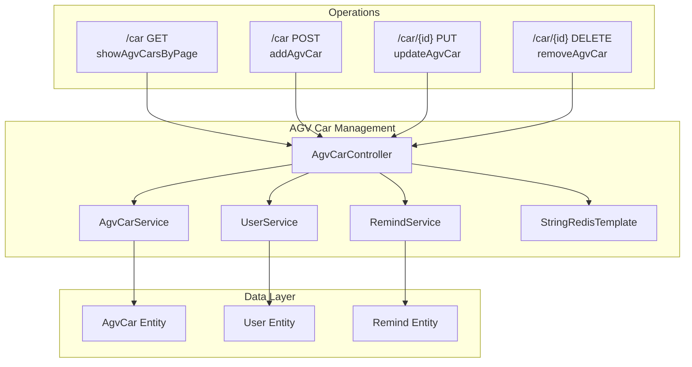
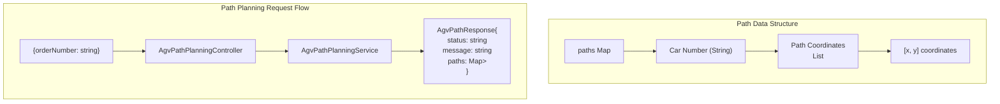
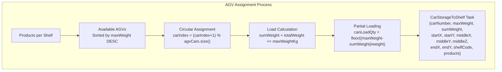
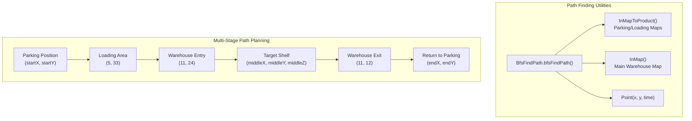
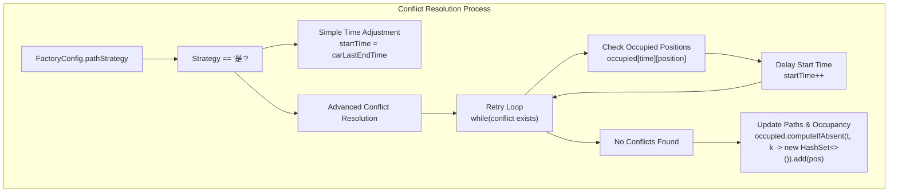

# AGV Automation

> **Relevant source files**
> * [src/main/java/com/xhz/yuncang/controller/AgvCarController.java](https://github.com/yanzhe-Xiao/yuncang/blob/a4a28616/src/main/java/com/xhz/yuncang/controller/AgvCarController.java)
> * [src/main/java/com/xhz/yuncang/controller/AgvPathPlanningController.java](https://github.com/yanzhe-Xiao/yuncang/blob/a4a28616/src/main/java/com/xhz/yuncang/controller/AgvPathPlanningController.java)
> * [src/main/java/com/xhz/yuncang/controller/InboundOrderController.java](https://github.com/yanzhe-Xiao/yuncang/blob/a4a28616/src/main/java/com/xhz/yuncang/controller/InboundOrderController.java)

This document covers the Automated Guided Vehicle (AGV) automation system within the yuncang warehouse management platform. The AGV system provides intelligent vehicle management, path planning, and automated warehouse operations including inbound/outbound processing with collision avoidance.

For general warehouse operations, see [Warehouse Operations](/yanzhe-Xiao/yuncang/doc/warehouse-operations). For system configuration settings, see [Factory Configuration](/yanzhe-Xiao/yuncang/doc/Factory-Configuration).

## System Overview

The AGV automation system consists of three main components: vehicle fleet management, intelligent path planning, and automated order processing. The system manages AGV vehicles through their complete lifecycle from dispatch to task completion, with real-time coordination to prevent collisions and optimize warehouse throughput.

## AGV Fleet Management

### Vehicle Management Controller

The `AgvCarController` provides comprehensive CRUD operations for the AGV fleet with role-based security controls requiring admin or operator permissions.



**AGV Car Entity Fields:**

* `carNumber`: Unique vehicle identifier
* `status`: Current state (`CAR_STATUS_FREE`, `CAR_STATUS_ONGOING`, `CAR_STATUS_REPAIR`)
* `batteryLevel`: Power level (0-100%)
* `maxWeight`: Maximum cargo capacity
* `locationX`, `locationY`: Current position coordinates
* `startX`, `startY`: Home position
* `endX`, `endY`, `endZ`: Target destination
* `sku`, `quantity`: Current cargo information

The controller enforces business rules such as preventing deletion of vehicles in `ONGOING` or `REPAIR` status and maintains audit trails through the `RemindService`.

Sources: [src/main/java/com/xhz/yuncang/controller/AgvCarController.java L52-L344](https://github.com/yanzhe-Xiao/yuncang/blob/a4a28616/src/main/java/com/xhz/yuncang/controller/AgvCarController.java#L52-L344)

### Vehicle Status Management

AGV vehicles maintain state through predefined status constants:

| Status | Constant | Description |
| --- | --- | --- |
| Free | `CAR_STATUS_FREE` | Available for assignment |
| Ongoing | `CAR_STATUS_ONGOING` | Currently executing task |
| Repair | `CAR_STATUS_REPAIR` | Under maintenance |

Status transitions are managed automatically during task execution and prevent inappropriate operations like deleting active vehicles.

Sources: [src/main/java/com/xhz/yuncang/controller/AgvCarController.java L327-L328](https://github.com/yanzhe-Xiao/yuncang/blob/a4a28616/src/main/java/com/xhz/yuncang/controller/AgvCarController.java#L327-L328)

## Path Planning System

### Planning Service Architecture

The `AgvPathPlanningController` provides order-based path planning through the `/api/agv/plan-path` endpoint.



The service returns structured path data where each AGV receives a sequence of coordinate points representing the optimal route for the given order.

Sources: [src/main/java/com/xhz/yuncang/controller/AgvPathPlanningController.java L30-L92](https://github.com/yanzhe-Xiao/yuncang/blob/a4a28616/src/main/java/com/xhz/yuncang/controller/AgvPathPlanningController.java#L30-L92)

 [src/main/java/com/xhz/yuncang/controller/AgvPathPlanningController.java L105-L183](https://github.com/yanzhe-Xiao/yuncang/blob/a4a28616/src/main/java/com/xhz/yuncang/controller/AgvPathPlanningController.java#L105-L183)

## Automated Inbound Processing

### Intelligent Shelf Allocation

The inbound order processing system demonstrates sophisticated AGV automation through the `/path/{id}` endpoint, which orchestrates the complete inbound workflow.

```mermaid
flowchart TD

START["InboundOrder"]
VALIDATE["Validate Order Status<br>(STATUS_ORDER_TOSTART)"]
SHELVES["Load All Shelves<br>shelfInventoryService.getAllShelves()"]
SORT["Sort by Distance<br>Math.abs(x-beginX)*MOVE_DIFFER_X<br>+Math.abs(y-beginY)*MOVE_DIFFER_Y<br>+Math.abs(z-beginZ)*MOVE_DIFFER_Z"]
ALLOCATE["Allocate Products to Shelves<br>Weight-based Algorithm"]
AGVS["Load Available AGVs<br>agvCarService.findAll()"]
ASSIGN["Assign AGVs to Tasks<br>CarStorageToShelf"]
PATHFIND["Generate Paths<br>BfsFindPath.bfsFindPath()"]
CONFLICT["Resolve Conflicts<br>Collision Avoidance"]
EXECUTE["Update Database<br>Order, Inventory, Shelves"]

subgraph subGraph0 ["Inbound Automation Workflow"]
    START
    VALIDATE
    SHELVES
    SORT
    ALLOCATE
    AGVS
    ASSIGN
    PATHFIND
    CONFLICT
    EXECUTE
    START --> VALIDATE
    VALIDATE --> SHELVES
    SHELVES --> SORT
    SORT --> ALLOCATE
    ALLOCATE --> AGVS
    AGVS --> ASSIGN
    ASSIGN --> PATHFIND
    PATHFIND --> CONFLICT
    CONFLICT --> EXECUTE
end
```



The allocation algorithm prioritizes shelves by proximity to the entry point `(beginX=11, beginY=24)` using weighted distance calculations with configurable movement costs.

Sources: [src/main/java/com/xhz/yuncang/controller/InboundOrderController.java L361-L417](https://github.com/yanzhe-Xiao/yuncang/blob/a4a28616/src/main/java/com/xhz/yuncang/controller/InboundOrderController.java#L361-L417)

 [src/main/java/com/xhz/yuncang/controller/InboundOrderController.java L409-L417](https://github.com/yanzhe-Xiao/yuncang/blob/a4a28616/src/main/java/com/xhz/yuncang/controller/InboundOrderController.java#L409-L417)

### AGV Task Assignment

The system assigns cargo to AGVs using a sophisticated load balancing algorithm:



AGVs are assigned in round-robin fashion with load optimization, supporting partial loads when vehicle capacity is insufficient for complete shelf assignments.

Sources: [src/main/java/com/xhz/yuncang/controller/InboundOrderController.java L527-L626](https://github.com/yanzhe-Xiao/yuncang/blob/a4a28616/src/main/java/com/xhz/yuncang/controller/InboundOrderController.java#L527-L626)

## Multi-Stage Path Planning

### Complex Route Generation

The path planning system generates multi-stage routes with the following sequence:

1. **Parking → Loading Area**: Vehicle moves from parking position to loading zone
2. **Loading Interaction**: 2-second loading time (`Constants.INTERACTION`)
3. **Loading Area → Warehouse Entry**: Transit to main warehouse area
4. **Warehouse Entry → Shelf**: Navigate to target shelf location
5. **Vertical Movement**: Z-axis time cost (`middleZ * 2` seconds)
6. **Shelf → Warehouse Exit**: Return journey to exit point
7. **Warehouse Exit → Parking**: Return to original parking position



Each stage uses appropriate map configurations through `BfsFindPath.InMapToProduct()` and `BfsFindPath.InMap()` methods with time-coordinated waypoints.

Sources: [src/main/java/com/xhz/yuncang/controller/InboundOrderController.java L642-L729](https://github.com/yanzhe-Xiao/yuncang/blob/a4a28616/src/main/java/com/xhz/yuncang/controller/InboundOrderController.java#L642-L729)

 [src/main/java/com/xhz/yuncang/controller/InboundOrderController.java L1182-L1269](https://github.com/yanzhe-Xiao/yuncang/blob/a4a28616/src/main/java/com/xhz/yuncang/controller/InboundOrderController.java#L1182-L1269)

## Collision Avoidance System

### Conflict Resolution Algorithm

The system implements sophisticated collision avoidance controlled by the `FactoryConfig.pathStrategy` setting:



The collision avoidance system maintains a temporal-spatial occupancy map `Map<Integer, Set<String>>` where each time slot tracks occupied positions as `"x,y"` strings.

Sources: [src/main/java/com/xhz/yuncang/controller/InboundOrderController.java L758-L832](https://github.com/yanzhe-Xiao/yuncang/blob/a4a28616/src/main/java/com/xhz/yuncang/controller/InboundOrderController.java#L758-L832)

 [src/main/java/com/xhz/yuncang/controller/InboundOrderController.java L1297-L1371](https://github.com/yanzhe-Xiao/yuncang/blob/a4a28616/src/main/java/com/xhz/yuncang/controller/InboundOrderController.java#L1297-L1371)

### Path Optimization

For the preview mode (`/in/{id}` endpoint), the system provides path merging for vehicles with multiple tasks:

| Feature | Implementation |
| --- | --- |
| **Path Merging** | Combines multiple `CarStorageToShelf` tasks per vehicle |
| **Duplicate Removal** | Eliminates redundant waypoints at task boundaries |
| **Weight Aggregation** | Sums cargo weights across merged tasks |
| **Endpoint Updates** | Maintains final destination coordinates |

Sources: [src/main/java/com/xhz/yuncang/controller/InboundOrderController.java L1373-L1404](https://github.com/yanzhe-Xiao/yuncang/blob/a4a28616/src/main/java/com/xhz/yuncang/controller/InboundOrderController.java#L1373-L1404)

## Data Structures and Relationships

### Core AGV Data Models

```css
#mermaid-8e14caid1ru{font-family:ui-sans-serif,-apple-system,system-ui,Segoe UI,Helvetica;font-size:16px;fill:#333;}@keyframes edge-animation-frame{from{stroke-dashoffset:0;}}@keyframes dash{to{stroke-dashoffset:0;}}#mermaid-8e14caid1ru .edge-animation-slow{stroke-dasharray:9,5!important;stroke-dashoffset:900;animation:dash 50s linear infinite;stroke-linecap:round;}#mermaid-8e14caid1ru .edge-animation-fast{stroke-dasharray:9,5!important;stroke-dashoffset:900;animation:dash 20s linear infinite;stroke-linecap:round;}#mermaid-8e14caid1ru .error-icon{fill:#dddddd;}#mermaid-8e14caid1ru .error-text{fill:#222222;stroke:#222222;}#mermaid-8e14caid1ru .edge-thickness-normal{stroke-width:1px;}#mermaid-8e14caid1ru .edge-thickness-thick{stroke-width:3.5px;}#mermaid-8e14caid1ru .edge-pattern-solid{stroke-dasharray:0;}#mermaid-8e14caid1ru .edge-thickness-invisible{stroke-width:0;fill:none;}#mermaid-8e14caid1ru .edge-pattern-dashed{stroke-dasharray:3;}#mermaid-8e14caid1ru .edge-pattern-dotted{stroke-dasharray:2;}#mermaid-8e14caid1ru .marker{fill:#999;stroke:#999;}#mermaid-8e14caid1ru .marker.cross{stroke:#999;}#mermaid-8e14caid1ru svg{font-family:ui-sans-serif,-apple-system,system-ui,Segoe UI,Helvetica;font-size:16px;}#mermaid-8e14caid1ru p{margin:0;}#mermaid-8e14caid1ru .entityBox{fill:#ffffff;stroke:#dddddd;}#mermaid-8e14caid1ru .relationshipLabelBox{fill:#dddddd;opacity:0.7;background-color:#dddddd;}#mermaid-8e14caid1ru .relationshipLabelBox rect{opacity:0.5;}#mermaid-8e14caid1ru .labelBkg{background-color:rgba(221, 221, 221, 0.5);}#mermaid-8e14caid1ru .edgeLabel .label{fill:#dddddd;font-size:14px;}#mermaid-8e14caid1ru .label{font-family:ui-sans-serif,-apple-system,system-ui,Segoe UI,Helvetica;color:#333;}#mermaid-8e14caid1ru .edge-pattern-dashed{stroke-dasharray:8,8;}#mermaid-8e14caid1ru .node rect,#mermaid-8e14caid1ru .node circle,#mermaid-8e14caid1ru .node ellipse,#mermaid-8e14caid1ru .node polygon{fill:#ffffff;stroke:#dddddd;stroke-width:1px;}#mermaid-8e14caid1ru .relationshipLine{stroke:#999;stroke-width:1;fill:none;}#mermaid-8e14caid1ru .marker{fill:none!important;stroke:#999!important;stroke-width:1;}#mermaid-8e14caid1ru :root{--mermaid-font-family:"trebuchet ms",verdana,arial,sans-serif;}assigned_tocontains_pathAgvCarLongidPKStringcarNumberUKStringstatusIntegerbatteryLevelStringskuLongquantityDoublelocationXDoublelocationYDoublestartXDoublestartYDoubleendXDoubleendYDoubleendZStringuserIdFKDoublemaxWeightCarStorageToShelfStringcarNumberDoublemaxWeightDoublesumWeightIntegerstartXIntegerstartYIntegermiddleXIntegermiddleYIntegermiddleZIntegerendXIntegerendYStringshelfCodeStringpositionIntegerdispatchTimeList<SalesOrderDetailAddDTO>productsList<Point>pathsPointIntegerxIntegeryIntegertime
```

The `CarStorageToShelf` class serves as the primary task coordination structure, bridging AGV capabilities with warehouse operations and maintaining complete path history with temporal coordinates.

Sources: [src/main/java/com/xhz/yuncang/entity/AgvCar.java](https://github.com/yanzhe-Xiao/yuncang/blob/a4a28616/src/main/java/com/xhz/yuncang/entity/AgvCar.java)

 [src/main/java/com/xhz/yuncang/vo/path/CarStorageToShelf.java](https://github.com/yanzhe-Xiao/yuncang/blob/a4a28616/src/main/java/com/xhz/yuncang/vo/path/CarStorageToShelf.java)

 [src/main/java/com/xhz/yuncang/vo/path/Point.java](https://github.com/yanzhe-Xiao/yuncang/blob/a4a28616/src/main/java/com/xhz/yuncang/vo/path/Point.java)