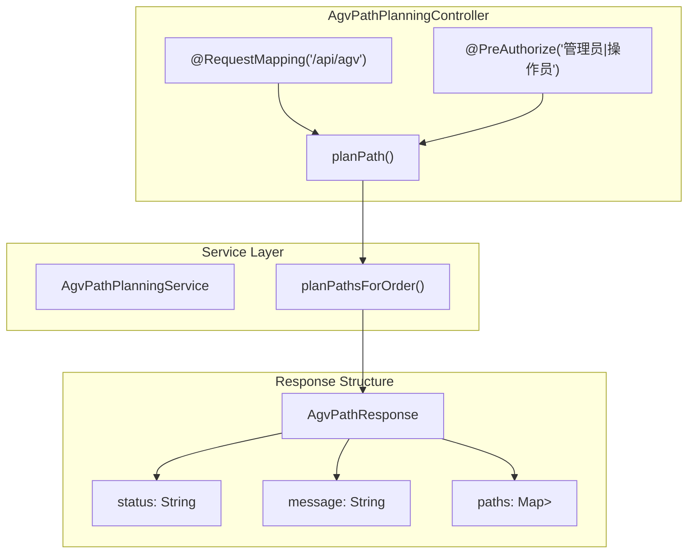
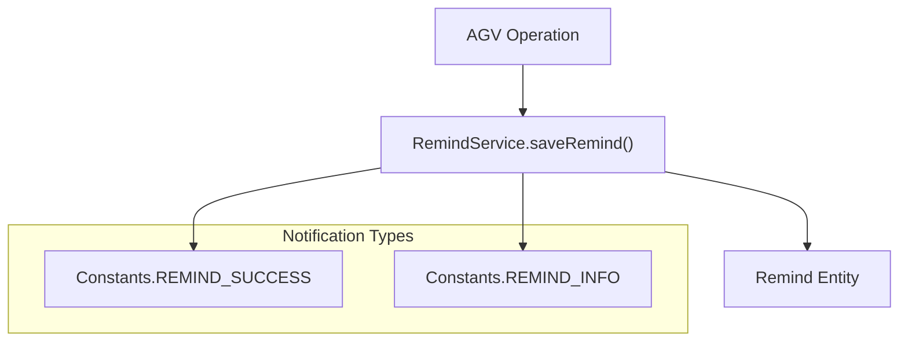

# AGV Management APIs

> **Relevant source files**
> * [src/main/java/com/xhz/yuncang/controller/AgvCarController.java](https://github.com/yanzhe-Xiao/yuncang/blob/a4a28616/src/main/java/com/xhz/yuncang/controller/AgvCarController.java)
> * [src/main/java/com/xhz/yuncang/controller/AgvPathPlanningController.java](https://github.com/yanzhe-Xiao/yuncang/blob/a4a28616/src/main/java/com/xhz/yuncang/controller/AgvPathPlanningController.java)

This document covers the REST API endpoints for managing Automated Guided Vehicles (AGVs) in the yuncang warehouse management system. The AGV Management APIs provide comprehensive functionality for AGV lifecycle management and path planning operations.

For information about AGV data models and database relationships, see [Core Entities](/yanzhe-Xiao/yuncang/5.1-core-entities). For details about warehouse automation workflows, see [AGV Automation](/yanzhe-Xiao/yuncang/4.3-agv-automation).

## Overview

The AGV Management APIs consist of two main controllers that handle different aspects of AGV operations:

* **AGV Car Management**: CRUD operations for individual AGV vehicles
* **AGV Path Planning**: Route calculation and optimization for order fulfillment

All AGV management operations require either administrator (`管理员`) or operator (`操作员`) role permissions and use JWT-based authentication.

```

```

Sources: [src/main/java/com/xhz/yuncang/controller/AgvCarController.java L1-L344](https://github.com/yanzhe-Xiao/yuncang/blob/a4a28616/src/main/java/com/xhz/yuncang/controller/AgvCarController.java#L1-L344)

 [src/main/java/com/xhz/yuncang/controller/AgvPathPlanningController.java L1-L184](https://github.com/yanzhe-Xiao/yuncang/blob/a4a28616/src/main/java/com/xhz/yuncang/controller/AgvPathPlanningController.java#L1-L184)

## AGV Car Management Controller

The `AgvCarController` provides full lifecycle management for AGV vehicles including creation, retrieval, updates, and deletion operations.

### Security Configuration

```

```

Sources: [src/main/java/com/xhz/yuncang/controller/AgvCarController.java L53](https://github.com/yanzhe-Xiao/yuncang/blob/a4a28616/src/main/java/com/xhz/yuncang/controller/AgvCarController.java#L53-L53)

### API Endpoints

| Method | Endpoint | Description | Request Body | Response |
| --- | --- | --- | --- | --- |
| GET | `/car` | Paginated AGV car listing | None | Paginated `AgvCarInfoVo` list |
| POST | `/car` | Create new AGV car | `AgvCarAddDTO` | Success/Error status |
| PUT | `/car/{id}` | Update existing AGV car | `AgvCarInfoDTO` | Success/Error status |
| DELETE | `/car/{id}` | Delete AGV car | None | Success/Error status |

### GET /car - List AGV Cars

Retrieves a paginated list of AGV cars with optional filtering by car number.

**Query Parameters:**

* `current` (default: 1): Current page number
* `pageSize` (default: 10): Records per page
* `carNumber` (optional): Car number filter (partial match)

**Response Format:**

```
{
  "prev": -1,
  "next": 2,
  "total": 25,
  "list": [AgvCarInfoVo objects]
}
```

**Error Conditions:**

* Page number < 1: Returns 400 "页数小于 1"
* Page number > max pages: Returns 400 "页数大于最大页数"
* No AGV cars found: Returns 200 with reminder notification

Sources: [src/main/java/com/xhz/yuncang/controller/AgvCarController.java L100-L160](https://github.com/yanzhe-Xiao/yuncang/blob/a4a28616/src/main/java/com/xhz/yuncang/controller/AgvCarController.java#L100-L160)

### POST /car - Create AGV Car

Creates a new AGV car with default values for optional fields.

**Request Body (`AgvCarAddDTO`):**

* `carNumber` (required): Unique car identifier
* `locationX` (required): Initial X coordinate
* `locationY` (required): Initial Y coordinate
* `maxWeight` (optional): Maximum carrying capacity

**Default Values Applied:**

* Status: `Constants.CAR_STATUS_FREE` (idle)
* Battery level: 100%
* End coordinates: (0,0)
* SKU: empty string
* Quantity: 0

**Validation Rules:**

* Car number cannot be empty
* Car number must be unique
* Current user must exist

Sources: [src/main/java/com/xhz/yuncang/controller/AgvCarController.java L190-L235](https://github.com/yanzhe-Xiao/yuncang/blob/a4a28616/src/main/java/com/xhz/yuncang/controller/AgvCarController.java#L190-L235)

### PUT /car/{id} - Update AGV Car

Updates an existing AGV car while preserving unchanged fields.

**Path Parameters:**

* `id`: AGV car ID to update

**Request Body (`AgvCarInfoDTO`):**

* `carNumber`: Car number (validated but not actually changed)
* `locationX`: New X coordinate
* `locationY`: New Y coordinate
* `maxWeight`: New maximum weight capacity

**Validation Rules:**

* Car number cannot be empty
* AGV car must exist
* New car number cannot conflict with existing cars

Sources: [src/main/java/com/xhz/yuncang/controller/AgvCarController.java L260-L307](https://github.com/yanzhe-Xiao/yuncang/blob/a4a28616/src/main/java/com/xhz/yuncang/controller/AgvCarController.java#L260-L307)

### DELETE /car/{id} - Delete AGV Car

Removes an AGV car from the system with status-based restrictions.

**Path Parameters:**

* `id`: AGV car ID to delete

**Deletion Restrictions:**

* Cannot delete cars with status `Constants.CAR_STATUS_ONGOING` (running)
* Cannot delete cars with status `Constants.CAR_STATUS_REPAIR` (under repair)

Sources: [src/main/java/com/xhz/yuncang/controller/AgvCarController.java L322-L343](https://github.com/yanzhe-Xiao/yuncang/blob/a4a28616/src/main/java/com/xhz/yuncang/controller/AgvCarController.java#L322-L343)

## AGV Path Planning Controller

The `AgvPathPlanningController` handles route calculation and optimization for AGV operations based on order requirements.

### Controller Configuration



Sources: [src/main/java/com/xhz/yuncang/controller/AgvPathPlanningController.java L30-L32](https://github.com/yanzhe-Xiao/yuncang/blob/a4a28616/src/main/java/com/xhz/yuncang/controller/AgvPathPlanningController.java#L30-L32)

 [src/main/java/com/xhz/yuncang/controller/AgvPathPlanningController.java L105-L129](https://github.com/yanzhe-Xiao/yuncang/blob/a4a28616/src/main/java/com/xhz/yuncang/controller/AgvPathPlanningController.java#L105-L129)

### POST /api/agv/plan-path - Plan AGV Paths

Calculates optimal AGV routes for a specific order.

**Request Body:**

```json
{
  "orderNumber": "ORDER-12345"
}
```

**Response Body (`AgvPathResponse`):**

```json
{
  "status": "成功|失败|错误",
  "message": "Detailed status message",
  "paths": {
    "CAR001": [[0,0], [1,0], [2,0]],
    "CAR002": [[0,1], [1,1], [2,1]]
  }
}
```

**Response Status Codes:**

* 200 OK: Successful path planning
* 400 Bad Request: Order not found, no available AGV, or no valid path
* 500 Internal Server Error: System error during planning

**Path Data Structure:**

* Key: Car number (String)
* Value: Array of coordinate points (List<int[]>)
* Each coordinate point: `[x, y]` integer array
* Points ordered by movement sequence

Sources: [src/main/java/com/xhz/yuncang/controller/AgvPathPlanningController.java L79-L92](https://github.com/yanzhe-Xiao/yuncang/blob/a4a28616/src/main/java/com/xhz/yuncang/controller/AgvPathPlanningController.java#L79-L92)

## Data Transfer Objects

### AgvCarAddDTO

Used for creating new AGV cars via POST requests.

**Required Fields:**

* `carNumber`: String - Unique identifier
* `locationX`: Double - Initial X position
* `locationY`: Double - Initial Y position

**Optional Fields:**

* `maxWeight`: Double - Maximum carrying capacity

### AgvCarInfoDTO

Used for updating existing AGV cars via PUT requests.

**Fields:**

* `carNumber`: String - Car identifier
* `locationX`: Double - Current X position
* `locationY`: Double - Current Y position
* `maxWeight`: Double - Maximum weight capacity

### AgvCarInfoVo

View object returned by GET requests containing complete AGV car information.

**Fields Include:**

* `id`, `carNumber`, `status`, `userId`
* `batteryLevel`, `maxWeight`
* `locationX`, `locationY` (current position)
* `startX`, `startY` (origin position)
* `endX`, `endY`, `endZ` (destination)
* `sku`, `quantity` (current cargo)
* `createTime`, `updateTime`

Sources: [src/main/java/com/xhz/yuncang/controller/AgvCarController.java L132-L150](https://github.com/yanzhe-Xiao/yuncang/blob/a4a28616/src/main/java/com/xhz/yuncang/controller/AgvCarController.java#L132-L150)

## Integration Points

### Notification System

All AGV management operations generate system notifications via `RemindService`:



**Notification Events:**

* AGV car creation success
* AGV car update success
* AGV car deletion success
* Empty AGV car list warning

Sources: [src/main/java/com/xhz/yuncang/controller/AgvCarController.java L118-L120](https://github.com/yanzhe-Xiao/yuncang/blob/a4a28616/src/main/java/com/xhz/yuncang/controller/AgvCarController.java#L118-L120)

 [src/main/java/com/xhz/yuncang/controller/AgvCarController.java L228-L230](https://github.com/yanzhe-Xiao/yuncang/blob/a4a28616/src/main/java/com/xhz/yuncang/controller/AgvCarController.java#L228-L230)

### User Context Integration

AGV operations utilize `UserHolder.getUser()` to retrieve current user context for:

* Setting `userId` field on new AGV cars
* Including user information in notification messages
* Audit trail for AGV management operations

Sources: [src/main/java/com/xhz/yuncang/controller/AgvCarController.java L197-L198](https://github.com/yanzhe-Xiao/yuncang/blob/a4a28616/src/main/java/com/xhz/yuncang/controller/AgvCarController.java#L197-L198)

 [src/main/java/com/xhz/yuncang/controller/AgvCarController.java L298](https://github.com/yanzhe-Xiao/yuncang/blob/a4a28616/src/main/java/com/xhz/yuncang/controller/AgvCarController.java#L298-L298)

### Redis Integration

The `StringRedisTemplate` is injected for caching operations, though specific cache usage is not implemented in the current controller methods.

Sources: [src/main/java/com/xhz/yuncang/controller/AgvCarController.java L70-L71](https://github.com/yanzhe-Xiao/yuncang/blob/a4a28616/src/main/java/com/xhz/yuncang/controller/AgvCarController.java#L70-L71)