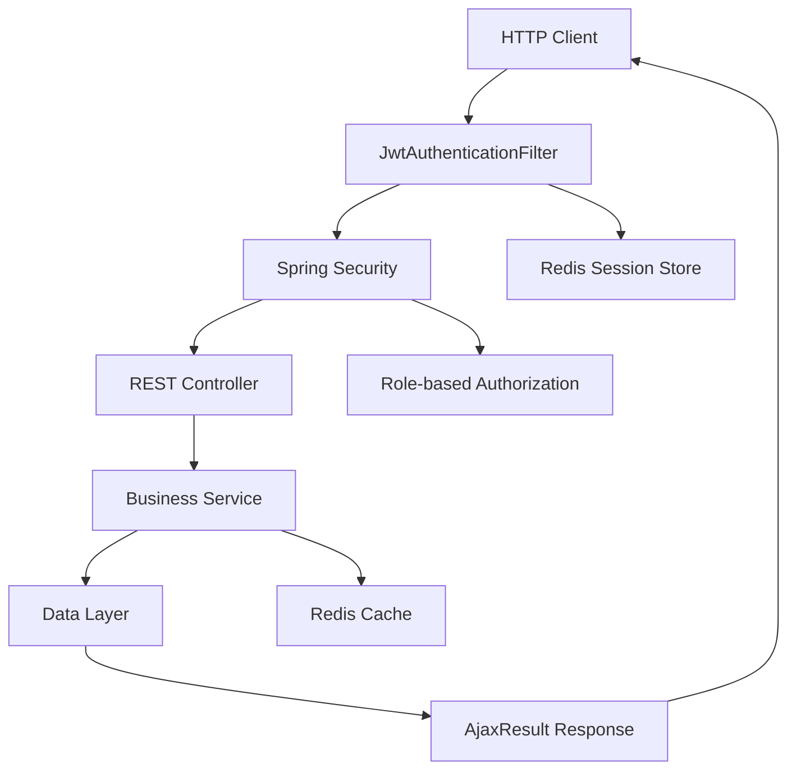
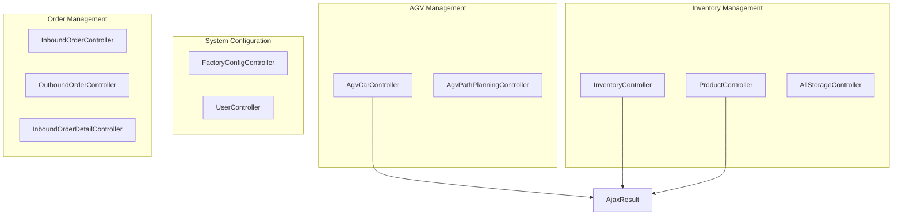
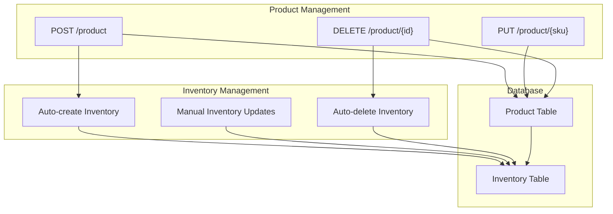

# API Reference

> **Relevant source files**
> * [src/main/java/com/xhz/yuncang/controller/AgvCarController.java](https://github.com/yanzhe-Xiao/yuncang/blob/a4a28616/src/main/java/com/xhz/yuncang/controller/AgvCarController.java)
> * [src/main/java/com/xhz/yuncang/controller/InventoryController.java](https://github.com/yanzhe-Xiao/yuncang/blob/a4a28616/src/main/java/com/xhz/yuncang/controller/InventoryController.java)
> * [src/main/java/com/xhz/yuncang/controller/ProductController.java](https://github.com/yanzhe-Xiao/yuncang/blob/a4a28616/src/main/java/com/xhz/yuncang/controller/ProductController.java)

This document provides comprehensive documentation for the yuncang warehouse management system REST API endpoints. The API enables management of inventory, products, AGV cars, and related warehouse operations through HTTP requests.

For detailed information about warehouse operations workflow, see [Warehouse Operations](/yanzhe-Xiao/yuncang/4-warehouse-operations). For database schema details, see [Database Schema](/yanzhe-Xiao/yuncang/5-database-schema). For system configuration, see [System Administration](/yanzhe-Xiao/yuncang/6-system-administration).

## API Architecture Overview

The yuncang system exposes a RESTful API built on Spring Boot with JWT-based authentication. All endpoints follow standard HTTP methods and return JSON responses wrapped in the `AjaxResult` format.

### API Request Flow



Sources: [src/main/java/com/xhz/yuncang/controller/AgvCarController.java L1-L344](https://github.com/yanzhe-Xiao/yuncang/blob/a4a28616/src/main/java/com/xhz/yuncang/controller/AgvCarController.java#L1-L344)

 [src/main/java/com/xhz/yuncang/controller/InventoryController.java L1-L303](https://github.com/yanzhe-Xiao/yuncang/blob/a4a28616/src/main/java/com/xhz/yuncang/controller/InventoryController.java#L1-L303)

 [src/main/java/com/xhz/yuncang/controller/ProductController.java L1-L422](https://github.com/yanzhe-Xiao/yuncang/blob/a4a28616/src/main/java/com/xhz/yuncang/controller/ProductController.java#L1-L422)

### Controller Architecture



Sources: [src/main/java/com/xhz/yuncang/controller/AgvCarController.java L52-L54](https://github.com/yanzhe-Xiao/yuncang/blob/a4a28616/src/main/java/com/xhz/yuncang/controller/AgvCarController.java#L52-L54)

 [src/main/java/com/xhz/yuncang/controller/InventoryController.java L45-L46](https://github.com/yanzhe-Xiao/yuncang/blob/a4a28616/src/main/java/com/xhz/yuncang/controller/InventoryController.java#L45-L46)

 [src/main/java/com/xhz/yuncang/controller/ProductController.java L51-L52](https://github.com/yanzhe-Xiao/yuncang/blob/a4a28616/src/main/java/com/xhz/yuncang/controller/ProductController.java#L51-L52)

## Authentication and Authorization

All API endpoints require JWT-based authentication. The system uses role-based access control with the following roles:

* **管理员** (Administrator): Full system access
* **操作员** (Operator): Warehouse operations access
* **消费者** (Consumer): Limited read-only access

### Authentication Headers

```yaml
Authorization: Bearer <JWT_TOKEN>
Content-Type: application/json
```

Role-based authorization is enforced using Spring Security's `@PreAuthorize` annotations:

```
@PreAuthorize("hasRole('管理员') or hasRole('操作员')")
```

Sources: [src/main/java/com/xhz/yuncang/controller/AgvCarController.java L53](https://github.com/yanzhe-Xiao/yuncang/blob/a4a28616/src/main/java/com/xhz/yuncang/controller/AgvCarController.java#L53-L53)

 [src/main/java/com/xhz/yuncang/controller/InventoryController.java L47](https://github.com/yanzhe-Xiao/yuncang/blob/a4a28616/src/main/java/com/xhz/yuncang/controller/InventoryController.java#L47-L47)

 [src/main/java/com/xhz/yuncang/controller/ProductController.java L160](https://github.com/yanzhe-Xiao/yuncang/blob/a4a28616/src/main/java/com/xhz/yuncang/controller/ProductController.java#L160-L160)

## Common Response Format

All API endpoints return responses wrapped in the `AjaxResult` format:

### Success Response

```
{
  "success": true,
  "code": 200,
  "message": "Success message",
  "data": { /* Response data */ }
}
```

### Error Response

```json
{
  "success": false,
  "code": 400,
  "message": "Error message",
  "data": null
}
```

### Pagination Response

```
{
  "success": true,
  "code": 200,
  "message": "Success",
  "data": {
    "prev": 1,
    "next": 3,
    "total": 150,
    "list": [ /* Array of items */ ]
  }
}
```

Sources: [src/main/java/com/xhz/yuncang/controller/AgvCarController.java L153-L159](https://github.com/yanzhe-Xiao/yuncang/blob/a4a28616/src/main/java/com/xhz/yuncang/controller/AgvCarController.java#L153-L159)

 [src/main/java/com/xhz/yuncang/controller/InventoryController.java L137-L142](https://github.com/yanzhe-Xiao/yuncang/blob/a4a28616/src/main/java/com/xhz/yuncang/controller/InventoryController.java#L137-L142)

 [src/main/java/com/xhz/yuncang/controller/ProductController.java L132-L137](https://github.com/yanzhe-Xiao/yuncang/blob/a4a28616/src/main/java/com/xhz/yuncang/controller/ProductController.java#L132-L137)

## AGV Car Management APIs

The `AgvCarController` provides endpoints for managing Automated Guided Vehicles in the warehouse system.

### GET /car - List AGV Cars

**Authorization**: `管理员`, `操作员`

**Parameters**:

* `current` (optional): Page number, default 1
* `pageSize` (optional): Items per page, default 10
* `carNumber` (optional): Filter by car number (partial match)

**Response**: Paginated list of `AgvCarInfoVo` objects

```json
{
  "data": {
    "prev": 1,
    "next": 3, 
    "total": 25,
    "list": [
      {
        "id": "1",
        "carNumber": "AGV001",
        "status": "空闲",
        "batteryLevel": 95,
        "maxWeight": 100.0,
        "locationX": 10.5,
        "locationY": 20.3
      }
    ]
  }
}
```

### POST /car - Create AGV Car

**Authorization**: `管理员`, `操作员`

**Request Body**: `AgvCarAddDTO`

```json
{
  "carNumber": "AGV001",
  "locationX": 10.5,
  "locationY": 20.3,
  "maxWeight": 100.0
}
```

**Response**: Success/error message

### PUT /car/{id} - Update AGV Car

**Authorization**: `管理员`, `操作员`

**Parameters**:

* `id`: AGV car ID

**Request Body**: `AgvCarInfoDTO` with updated fields

**Response**: Success/error message

### DELETE /car/{id} - Delete AGV Car

**Authorization**: `管理员`, `操作员`

**Parameters**:

* `id`: AGV car ID

**Constraints**: Cannot delete cars with status `运行中` or `维修中`

**Response**: Success/error message

Sources: [src/main/java/com/xhz/yuncang/controller/AgvCarController.java L100-L160](https://github.com/yanzhe-Xiao/yuncang/blob/a4a28616/src/main/java/com/xhz/yuncang/controller/AgvCarController.java#L100-L160)

 [src/main/java/com/xhz/yuncang/controller/AgvCarController.java L190-L235](https://github.com/yanzhe-Xiao/yuncang/blob/a4a28616/src/main/java/com/xhz/yuncang/controller/AgvCarController.java#L190-L235)

 [src/main/java/com/xhz/yuncang/controller/AgvCarController.java L260-L307](https://github.com/yanzhe-Xiao/yuncang/blob/a4a28616/src/main/java/com/xhz/yuncang/controller/AgvCarController.java#L260-L307)

 [src/main/java/com/xhz/yuncang/controller/AgvCarController.java L322-L343](https://github.com/yanzhe-Xiao/yuncang/blob/a4a28616/src/main/java/com/xhz/yuncang/controller/AgvCarController.java#L322-L343)

## Inventory Management APIs

The `InventoryController` handles warehouse inventory tracking and management operations.

### POST /inventory/getBySku - Get Inventory by SKU

**Authorization**: `管理员`, `操作员`

**Request Body**:

```json
{
  "sku": "PROD001"
}
```

**Response**: `Inventory` object or 404 error

### POST /inventory/batch - Batch Query Inventories

**Authorization**: `管理员`, `操作员`

**Request Body**: `InventoryListDTO`

```json
{
  "sku": ["PROD001", "PROD002", "PROD003"]
}
```

**Response**: Array of `InventoryDTO` objects

```json
{
  "data": [
    {
      "sku": "PROD001",
      "quantity": 150
    },
    {
      "sku": "PROD002", 
      "quantity": 75
    }
  ]
}
```

### GET /inventory/products/all - Get All Products with Inventory

**Parameters**:

* `current` (optional): Page number, default 1
* `pageSize` (optional): Items per page, default 200

**Response**: Paginated list with available quantities (excluding pending orders)

### POST /inventory/add - Add Inventory Record

**Authorization**: `管理员`, `操作员`

**Request Body**: `InventoryDTO`

```json
{
  "sku": "PROD001",
  "quantity": 100
}
```

**Response**: Success/error message

### POST /inventory/delete - Delete Inventory by SKU

**Authorization**: `管理员`, `操作员`

**Request Body**:

```json
{
  "sku": "PROD001"
}
```

**Response**: Success/error message

### GET /inventory/inventories/{pageNo} - List Inventories by Page

**Authorization**: `管理员`, `操作员`

**Parameters**:

* `pageNo`: Page number (starting from 1)

**Response**: `PageVo<InventoryInfoVo>` with pagination data

Sources: [src/main/java/com/xhz/yuncang/controller/InventoryController.java L60-L69](https://github.com/yanzhe-Xiao/yuncang/blob/a4a28616/src/main/java/com/xhz/yuncang/controller/InventoryController.java#L60-L69)

 [src/main/java/com/xhz/yuncang/controller/InventoryController.java L86-L92](https://github.com/yanzhe-Xiao/yuncang/blob/a4a28616/src/main/java/com/xhz/yuncang/controller/InventoryController.java#L86-L92)

 [src/main/java/com/xhz/yuncang/controller/InventoryController.java L104-L143](https://github.com/yanzhe-Xiao/yuncang/blob/a4a28616/src/main/java/com/xhz/yuncang/controller/InventoryController.java#L104-L143)

 [src/main/java/com/xhz/yuncang/controller/InventoryController.java L191-L207](https://github.com/yanzhe-Xiao/yuncang/blob/a4a28616/src/main/java/com/xhz/yuncang/controller/InventoryController.java#L191-L207)

 [src/main/java/com/xhz/yuncang/controller/InventoryController.java L224-L239](https://github.com/yanzhe-Xiao/yuncang/blob/a4a28616/src/main/java/com/xhz/yuncang/controller/InventoryController.java#L224-L239)

 [src/main/java/com/xhz/yuncang/controller/InventoryController.java L262-L301](https://github.com/yanzhe-Xiao/yuncang/blob/a4a28616/src/main/java/com/xhz/yuncang/controller/InventoryController.java#L262-L301)

## Product Management APIs

The `ProductController` manages the product catalog with both consumer and administrative views.

### GET /product - List Products (Consumer View)

**Authorization**: Public access

**Parameters**:

* `current` (optional): Page number, default 1
* `pageSize` (optional): Items per page, default 10
* `name` (optional): Filter by product name (partial match)

**Response**: Paginated list of `ProductInfoVo` objects

```json
{
  "data": {
    "prev": 1,
    "next": 3,
    "total": 45,
    "list": [
      {
        "id": "1",
        "sku": "PROD001", 
        "name": "Product Name",
        "description": "Product description",
        "weight": 2.5,
        "length": 10.0,
        "width": 5.0,
        "height": 3.0
      }
    ]
  }
}
```

### GET /goods/{pageNo} - List Goods (Admin View)

**Authorization**: `管理员`, `操作员`

**Parameters**:

* `pageNo`: Page number (starting from 1)

**Response**: `PageVo<GoodsInfoVo>` with detailed product information

### PUT /product/{sku} - Update Product

**Authorization**: `管理员`, `操作员`

**Parameters**:

* `sku`: Product SKU

**Request Body**: `ProductInfoDTO` with updated fields

```json
{
  "name": "Updated Product Name",
  "description": "Updated description", 
  "weight": 3.0,
  "length": 12.0,
  "width": 6.0,
  "height": 4.0
}
```

**Response**: Success/error message

### POST /product - Create Product

**Authorization**: `管理员`, `操作员`

**Request Body**: `ProductAddDTO`

```json
{
  "sku": "PROD001",
  "name": "New Product",
  "description": "Product description",
  "weight": 2.5,
  "length": 10.0,
  "width": 5.0,
  "height": 3.0
}
```

**Response**: Success/error message

**Note**: Automatically creates corresponding inventory record with quantity 0

### DELETE /product/{id} - Delete Product

**Authorization**: `管理员`, `操作员`

**Parameters**:

* `id`: Product ID

**Constraints**: Can only delete products with 0 inventory quantity

**Response**: Success/error message

**Note**: Also deletes corresponding inventory record

Sources: [src/main/java/com/xhz/yuncang/controller/ProductController.java L88-L138](https://github.com/yanzhe-Xiao/yuncang/blob/a4a28616/src/main/java/com/xhz/yuncang/controller/ProductController.java#L88-L138)

 [src/main/java/com/xhz/yuncang/controller/ProductController.java L160-L203](https://github.com/yanzhe-Xiao/yuncang/blob/a4a28616/src/main/java/com/xhz/yuncang/controller/ProductController.java#L160-L203)

 [src/main/java/com/xhz/yuncang/controller/ProductController.java L231-L262](https://github.com/yanzhe-Xiao/yuncang/blob/a4a28616/src/main/java/com/xhz/yuncang/controller/ProductController.java#L231-L262)

 [src/main/java/com/xhz/yuncang/controller/ProductController.java L288-L323](https://github.com/yanzhe-Xiao/yuncang/blob/a4a28616/src/main/java/com/xhz/yuncang/controller/ProductController.java#L288-L323)

 [src/main/java/com/xhz/yuncang/controller/ProductController.java L341-L372](https://github.com/yanzhe-Xiao/yuncang/blob/a4a28616/src/main/java/com/xhz/yuncang/controller/ProductController.java#L341-L372)

## API Data Flow

### Product and Inventory Relationship



Sources: [src/main/java/com/xhz/yuncang/controller/ProductController.java L305-L318](https://github.com/yanzhe-Xiao/yuncang/blob/a4a28616/src/main/java/com/xhz/yuncang/controller/ProductController.java#L305-L318)

 [src/main/java/com/xhz/yuncang/controller/ProductController.java L357-L367](https://github.com/yanzhe-Xiao/yuncang/blob/a4a28616/src/main/java/com/xhz/yuncang/controller/ProductController.java#L357-L367)

## Error Handling

### Common Error Codes

| Code | Description | Common Causes |
| --- | --- | --- |
| 400 | Bad Request | Invalid parameters, missing required fields |
| 401 | Unauthorized | Invalid or missing JWT token |
| 403 | Forbidden | Insufficient permissions for operation |
| 404 | Not Found | Resource does not exist |
| 500 | Internal Server Error | Database errors, service failures |

### Error Response Examples

**Validation Error**:

```json
{
  "success": false,
  "code": 400,
  "message": "信息不完整",
  "data": null
}
```

**Resource Not Found**:

```json
{
  "success": false,
  "code": 404,
  "message": "库存记录不存在",
  "data": null
}
```

**Authorization Error**:

```json
{
  "success": false,
  "code": 403,
  "message": "Access Denied",
  "data": null
}
```

Sources: [src/main/java/com/xhz/yuncang/controller/AgvCarController.java L107](https://github.com/yanzhe-Xiao/yuncang/blob/a4a28616/src/main/java/com/xhz/yuncang/controller/AgvCarController.java#L107-L107)

 [src/main/java/com/xhz/yuncang/controller/InventoryController.java L65-L67](https://github.com/yanzhe-Xiao/yuncang/blob/a4a28616/src/main/java/com/xhz/yuncang/controller/InventoryController.java#L65-L67)

 [src/main/java/com/xhz/yuncang/controller/ProductController.java L238](https://github.com/yanzhe-Xiao/yuncang/blob/a4a28616/src/main/java/com/xhz/yuncang/controller/ProductController.java#L238-L238)

## Rate Limiting and Performance

### Pagination Standards

* Default page size: 10 items
* Maximum page size: 200 items (for bulk operations)
* Page numbers start from 1
* Invalid page numbers return 400 Bad Request

### Caching Strategy

The system uses Redis for:

* JWT token validation
* Session management
* Frequently accessed data caching

### Performance Considerations

* Use batch endpoints for multiple item queries
* Implement proper pagination for large datasets
* Consider caching frequently accessed product/inventory data
* Monitor AGV car status updates for real-time operations

Sources: [src/main/java/com/xhz/yuncang/controller/AgvCarController.java L70-L71](https://github.com/yanzhe-Xiao/yuncang/blob/a4a28616/src/main/java/com/xhz/yuncang/controller/AgvCarController.java#L70-L71)

 [src/main/java/com/xhz/yuncang/controller/InventoryController.java L107-L108](https://github.com/yanzhe-Xiao/yuncang/blob/a4a28616/src/main/java/com/xhz/yuncang/controller/InventoryController.java#L107-L108)

 [src/main/java/com/xhz/yuncang/controller/ProductController.java L90-L92](https://github.com/yanzhe-Xiao/yuncang/blob/a4a28616/src/main/java/com/xhz/yuncang/controller/ProductController.java#L90-L92)