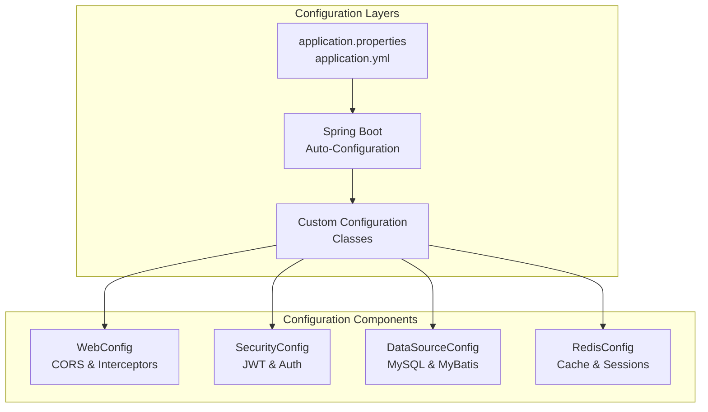
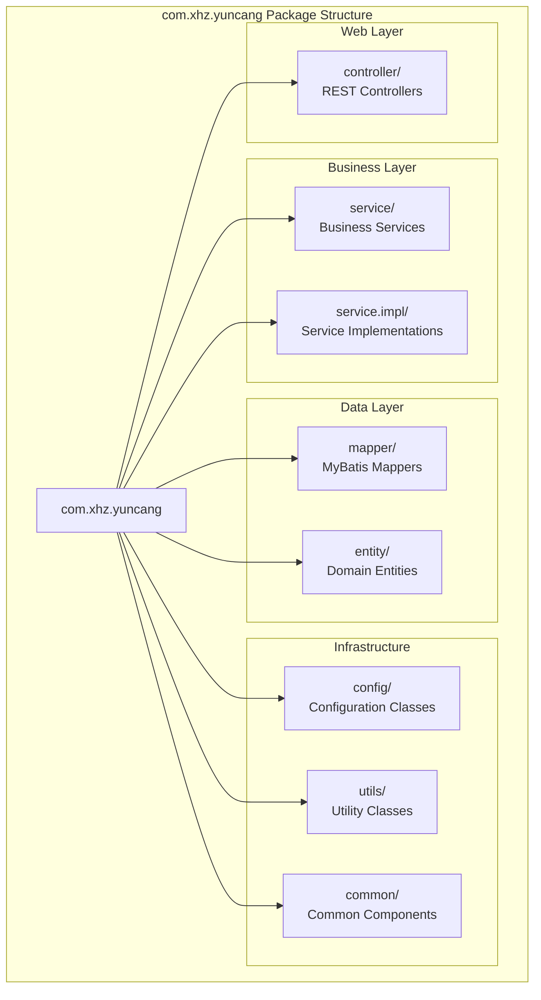

# Application Structure

> **Relevant source files**
> * [pom.xml](https://github.com/yanzhe-Xiao/yuncang/blob/a4a28616/pom.xml)
> * [src/main/java/com/xhz/yuncang/YuncangApplication.java](https://github.com/yanzhe-Xiao/yuncang/blob/a4a28616/src/main/java/com/xhz/yuncang/YuncangApplication.java)
> * [src/main/java/com/xhz/yuncang/config/WebConfig.java](https://github.com/yanzhe-Xiao/yuncang/blob/a4a28616/src/main/java/com/xhz/yuncang/config/WebConfig.java)

This document describes the core Spring Boot application structure of the yuncang warehouse management system, including the main application bootstrap, dependency management, configuration patterns, and component organization. For security-specific architecture details, see [Security Architecture](/yanzhe-Xiao/yuncang/3.2-security-architecture). For database and ORM configuration, see [Data Layer Architecture](/yanzhe-Xiao/yuncang/3.3-data-layer-architecture).

## Application Bootstrap and Entry Point

The yuncang application follows standard Spring Boot conventions with a single main application class that serves as the entry point for the entire system.

```

```

The `YuncangApplication` class enables several key Spring Boot features through annotations:

* `@SpringBootApplication` provides component scanning, auto-configuration, and configuration properties
* `@EnableCaching` activates Spring's caching abstraction for Redis integration
* `@MapperScan("com.xhz.yuncang.mapper")` configures MyBatis-Plus mapper scanning

**Sources:** [src/main/java/com/xhz/yuncang/YuncangApplication.java L8-L10](https://github.com/yanzhe-Xiao/yuncang/blob/a4a28616/src/main/java/com/xhz/yuncang/YuncangApplication.java#L8-L10)

## Technology Stack and Dependencies

The application leverages a modern Spring Boot 3.x technology stack with carefully selected dependencies for enterprise warehouse management functionality.

| Category | Technology | Version | Purpose |
| --- | --- | --- | --- |
| Framework | Spring Boot | 3.4.4 | Core application framework |
| Java Runtime | Java | 21 | Runtime environment |
| Web Layer | Spring Web MVC | 3.4.4 | REST API endpoints |
| Security | Spring Security | 3.4.4 | Authentication & authorization |
| ORM | MyBatis-Plus | 3.5.12 | Database access and SQL mapping |
| Database | MySQL Connector | Latest | MySQL database connectivity |
| Caching | Spring Data Redis | 3.4.4 | Redis cache integration |
| Connection Pooling | Commons Pool2 | Latest | Redis connection pooling |
| JSON Processing | Jackson | 2.18.3 | JSON serialization/deserialization |
| JSON Processing | FastJSON2 | 2.0.51 | High-performance JSON processing |
| JWT | Auth0 Java-JWT | 4.3.0 | JWT token generation and validation |
| Code Generation | Lombok | 1.18.30 | Boilerplate code reduction |
| Documentation | Knife4j | 4.1.0 | OpenAPI/Swagger documentation |
| Email | Spring Boot Mail | 3.4.4 | Email notification capabilities |

**Sources:** [pom.xml L29-L132](https://github.com/yanzhe-Xiao/yuncang/blob/a4a28616/pom.xml#L29-L132)

## Configuration Architecture

The application uses a layered configuration approach with Spring Boot's auto-configuration enhanced by custom configuration classes.



### Web Configuration

The `WebConfig` class implements `WebMvcConfigurer` to customize Spring MVC behavior, specifically handling cross-origin resource sharing (CORS) and request interception.

Key configuration features:

* **CORS Configuration**: Allows cross-origin requests from `http://localhost:13677` with credential support
* **Interceptor Registration**: Integrates `LoginInterceptor` for authentication checks on protected endpoints
* **Path Exclusions**: Bypasses authentication for public endpoints like `/register`, `/login`, and email-related paths

**Sources:** [src/main/java/com/xhz/yuncang/config/WebConfig.java L16-L56](https://github.com/yanzhe-Xiao/yuncang/blob/a4a28616/src/main/java/com/xhz/yuncang/config/WebConfig.java#L16-L56)

## Package Structure and Component Organization

The application follows Spring Boot's recommended package structure with clear separation of concerns across architectural layers.



### Component Scanning and Dependency Injection

The `@SpringBootApplication` annotation enables component scanning starting from the `com.xhz.yuncang` package, automatically discovering and registering:

* `@Controller` and `@RestController` classes for web endpoints
* `@Service` classes for business logic
* `@Repository` and MyBatis mapper interfaces for data access
* `@Configuration` classes for custom configuration
* `@Component` classes for general-purpose beans

**Sources:** [src/main/java/com/xhz/yuncang/YuncangApplication.java L8](https://github.com/yanzhe-Xiao/yuncang/blob/a4a28616/src/main/java/com/xhz/yuncang/YuncangApplication.java#L8-L8)

## Cross-cutting Concerns

The application implements several cross-cutting concerns through Spring's aspect-oriented programming capabilities and configuration.

### Caching Integration

Redis caching is enabled application-wide through the `@EnableCaching` annotation, providing:

* Method-level caching with `@Cacheable`, `@CacheEvict`, and `@CachePut` annotations
* Distributed cache sharing across application instances
* Session management for stateless JWT authentication

### Request Interception

The `LoginInterceptor` provides authentication enforcement across the application:

* Integrates with `StringRedisTemplate` for token validation
* Applies to all endpoints except explicitly excluded public paths
* Validates JWT tokens stored in Redis for session management

**Sources:** [src/main/java/com/xhz/yuncang/config/WebConfig.java L45-L55](https://github.com/yanzhe-Xiao/yuncang/blob/a4a28616/src/main/java/com/xhz/yuncang/config/WebConfig.java#L45-L55)

 [src/main/java/com/xhz/yuncang/YuncangApplication.java L9](https://github.com/yanzhe-Xiao/yuncang/blob/a4a28616/src/main/java/com/xhz/yuncang/YuncangApplication.java#L9-L9)

## Development and Runtime Features

The application includes several development and operational enhancements:

### Development Tools

* **Spring Boot DevTools**: Automatic application restart and enhanced development experience
* **Lombok**: Reduces boilerplate code with annotations for getters, setters, and constructors
* **Knife4j**: Provides interactive API documentation and testing interface

### Production Features

* **Connection Pooling**: Apache Commons Pool2 for efficient Redis connection management
* **JSON Processing**: Dual JSON libraries (Jackson and FastJSON2) for optimal performance
* **Email Integration**: Spring Boot Mail for notification and verification workflows

**Sources:** [pom.xml L54-L57](https://github.com/yanzhe-Xiao/yuncang/blob/a4a28616/pom.xml#L54-L57)

 [pom.xml L103-L107](https://github.com/yanzhe-Xiao/yuncang/blob/a4a28616/pom.xml#L103-L107)

 [pom.xml L115-L119](https://github.com/yanzhe-Xiao/yuncang/blob/a4a28616/pom.xml#L115-L119)

 [pom.xml L128-L131](https://github.com/yanzhe-Xiao/yuncang/blob/a4a28616/pom.xml#L128-L131)