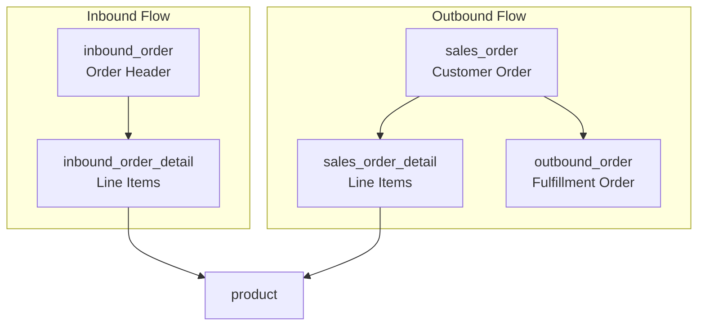
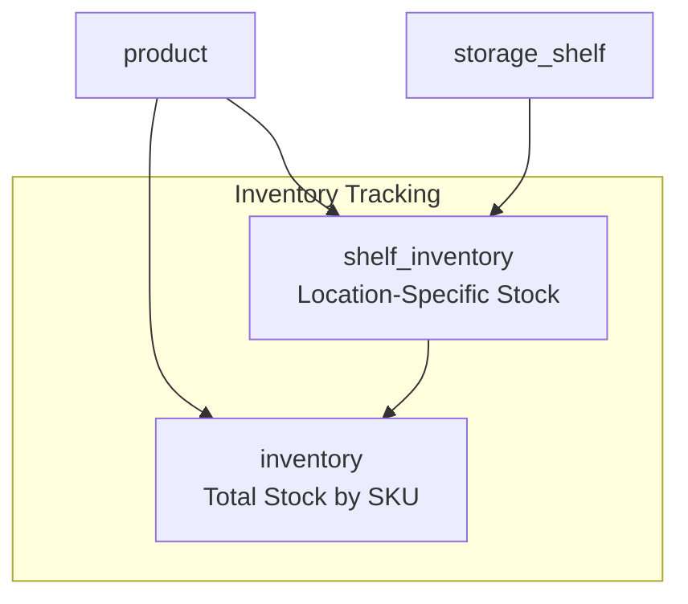

# Core Entities

> **Relevant source files**
> * [docker/mysql/init.sql](https://github.com/yanzhe-Xiao/yuncang/blob/a4a28616/docker/mysql/init.sql)

This document provides comprehensive documentation of the core database entities in the yuncang warehouse management system. These entities form the foundation of the data model and represent the primary business objects used throughout the application.

The entities covered here include products, orders, inventory, storage infrastructure, AGV automation components, and user management. For information about entity relationships and foreign key constraints, see [Relationships and Constraints](/yanzhe-Xiao/yuncang/5.2-relationships-and-constraints). For API endpoints that interact with these entities, see [API Reference](/yanzhe-Xiao/yuncang/7-api-reference).

## Entity Relationship Overview

The following diagram illustrates the core entities and their primary relationships:

```css
#mermaid-pih8u6v1aj{font-family:ui-sans-serif,-apple-system,system-ui,Segoe UI,Helvetica;font-size:16px;fill:#333;}@keyframes edge-animation-frame{from{stroke-dashoffset:0;}}@keyframes dash{to{stroke-dashoffset:0;}}#mermaid-pih8u6v1aj .edge-animation-slow{stroke-dasharray:9,5!important;stroke-dashoffset:900;animation:dash 50s linear infinite;stroke-linecap:round;}#mermaid-pih8u6v1aj .edge-animation-fast{stroke-dasharray:9,5!important;stroke-dashoffset:900;animation:dash 20s linear infinite;stroke-linecap:round;}#mermaid-pih8u6v1aj .error-icon{fill:#dddddd;}#mermaid-pih8u6v1aj .error-text{fill:#222222;stroke:#222222;}#mermaid-pih8u6v1aj .edge-thickness-normal{stroke-width:1px;}#mermaid-pih8u6v1aj .edge-thickness-thick{stroke-width:3.5px;}#mermaid-pih8u6v1aj .edge-pattern-solid{stroke-dasharray:0;}#mermaid-pih8u6v1aj .edge-thickness-invisible{stroke-width:0;fill:none;}#mermaid-pih8u6v1aj .edge-pattern-dashed{stroke-dasharray:3;}#mermaid-pih8u6v1aj .edge-pattern-dotted{stroke-dasharray:2;}#mermaid-pih8u6v1aj .marker{fill:#999;stroke:#999;}#mermaid-pih8u6v1aj .marker.cross{stroke:#999;}#mermaid-pih8u6v1aj svg{font-family:ui-sans-serif,-apple-system,system-ui,Segoe UI,Helvetica;font-size:16px;}#mermaid-pih8u6v1aj p{margin:0;}#mermaid-pih8u6v1aj .entityBox{fill:#ffffff;stroke:#dddddd;}#mermaid-pih8u6v1aj .relationshipLabelBox{fill:#dddddd;opacity:0.7;background-color:#dddddd;}#mermaid-pih8u6v1aj .relationshipLabelBox rect{opacity:0.5;}#mermaid-pih8u6v1aj .labelBkg{background-color:rgba(221, 221, 221, 0.5);}#mermaid-pih8u6v1aj .edgeLabel .label{fill:#dddddd;font-size:14px;}#mermaid-pih8u6v1aj .label{font-family:ui-sans-serif,-apple-system,system-ui,Segoe UI,Helvetica;color:#333;}#mermaid-pih8u6v1aj .edge-pattern-dashed{stroke-dasharray:8,8;}#mermaid-pih8u6v1aj .node rect,#mermaid-pih8u6v1aj .node circle,#mermaid-pih8u6v1aj .node ellipse,#mermaid-pih8u6v1aj .node polygon{fill:#ffffff;stroke:#dddddd;stroke-width:1px;}#mermaid-pih8u6v1aj .relationshipLine{stroke:#999;stroke-width:1;fill:none;}#mermaid-pih8u6v1aj .marker{fill:none!important;stroke:#999!important;stroke-width:1;}#mermaid-pih8u6v1aj :root{--mermaid-font-family:"trebuchet ms",verdana,arial,sans-serif;}hasordered_instored_ontracked_intransported_bycontainscontainsgeneratesholdsmanagesplacesoperatesassigns_toproductBIGINTidPKVARCHARnameVARCHARskuUKVARCHARdescriptionDECIMALweightDECIMALlengthDECIMALwidthDECIMALheightinbound_orderBIGINTidPKVARCHARorder_nameVARCHARorder_numberUKDATETIMEcreate_timeVARCHARuser_idFKVARCHARstatusinbound_order_detailBIGINTidPKVARCHARorder_numberFKVARCHARskuFKBIGINTquantitysales_orderBIGINTidPKVARCHARorder_numberUKVARCHARuser_idFKDATETIMEcreate_timesales_order_detailBIGINTidPKVARCHARorder_numberFKVARCHARskuFKBIGINTquantityoutbound_orderBIGINTidPKVARCHARorder_numberFKDATEplanned_dateVARCHARuser_idFKVARCHARstatusstorage_shelfBIGINTidPKVARCHARshelf_codeUKDECIMALmax_weightDECIMALlengthDECIMALwidthDECIMALheightDECIMALlocation_xDECIMALlocation_yDECIMALlocation_zshelf_inventoryBIGINTidPKVARCHARshelf_codeFKVARCHARskuFKBIGINTquantityinventoryBIGINTidPKVARCHARskuFKBIGINTquantityagv_carBIGINTidPKVARCHARcar_numberUKVARCHARstatusINTbattery_levelVARCHARskuFKBIGINTquantityDECIMALstart_xDECIMALstart_yDECIMALend_xDECIMALend_yDECIMALend_zDECIMALlocation_xDECIMALlocation_yVARCHARuser_idFKDECIMALmax_weightDATETIMEcreate_timeDATETIMEupdate_timeuserBIGINTidPKVARCHARuser_idUKVARCHARusernameUKVARCHARuser_typeVARCHARpasswordVARCHARnicknameVARCHARphoneVARCHARgender
```

Sources: [docker/mysql/init.sql L1-L183](https://github.com/yanzhe-Xiao/yuncang/blob/a4a28616/docker/mysql/init.sql#L1-L183)

## Core Business Entities

### Product Entity

The `product` table stores information about physical items managed in the warehouse, primarily construction materials like steel and lumber.

| Field | Type | Constraints | Description |
| --- | --- | --- | --- |
| `id` | BIGINT | PRIMARY KEY, AUTO_INCREMENT | Unique identifier |
| `name` | VARCHAR(255) | NOT NULL | Product name (e.g., steel rebar, lumber) |
| `sku` | VARCHAR(255) | NOT NULL, UNIQUE | Product code (format: product-001) |
| `description` | VARCHAR(255) | NULL | Product description |
| `weight` | DECIMAL(10,2) | NOT NULL | Weight in kilograms |
| `length` | DECIMAL(10,2) | NOT NULL | Length in centimeters |
| `width` | DECIMAL(10,2) | NOT NULL | Width in centimeters |
| `height` | DECIMAL(10,2) | NOT NULL | Height in centimeters |

The `product` entity serves as the master data for all warehouse operations and is referenced by inventory tracking, order management, and AGV transportation systems.

Sources: [docker/mysql/init.sql L2-L14](https://github.com/yanzhe-Xiao/yuncang/blob/a4a28616/docker/mysql/init.sql#L2-L14)

### Order Management Entities

The system implements a complete order lifecycle through multiple related entities:



#### Inbound Order

The `inbound_order` table tracks incoming shipments and deliveries:

| Field | Type | Constraints | Description |
| --- | --- | --- | --- |
| `id` | BIGINT | PRIMARY KEY, AUTO_INCREMENT | Unique identifier |
| `order_name` | VARCHAR(255) | NOT NULL | Order name (e.g., "steel rebar inbound") |
| `order_number` | VARCHAR(255) | NOT NULL, UNIQUE | Order number (format: inbound_order-001) |
| `create_time` | DATETIME | NULL | Creation date |
| `user_id` | VARCHAR(255) | NULL | Responsible user ID |
| `status` | VARCHAR(255) | NOT NULL | Status (未开始/进行中/已完成) |

#### Inbound Order Detail

The `inbound_order_detail` table stores line items for each inbound order:

| Field | Type | Constraints | Description |
| --- | --- | --- | --- |
| `id` | BIGINT | PRIMARY KEY, AUTO_INCREMENT | Unique identifier |
| `order_number` | VARCHAR(255) | NOT NULL | References `inbound_order.order_number` |
| `sku` | VARCHAR(255) | NOT NULL | References `product.sku` |
| `quantity` | BIGINT | NOT NULL | Quantity to receive |

Sources: [docker/mysql/init.sql L16-L36](https://github.com/yanzhe-Xiao/yuncang/blob/a4a28616/docker/mysql/init.sql#L16-L36)

#### Sales Order

The `sales_order` table captures customer orders:

| Field | Type | Constraints | Description |
| --- | --- | --- | --- |
| `id` | BIGINT | PRIMARY KEY, AUTO_INCREMENT | Unique identifier |
| `order_number` | VARCHAR(255) | NOT NULL, UNIQUE | Order number (format: order-001) |
| `user_id` | VARCHAR(255) | NOT NULL | Customer user ID |
| `create_time` | DATETIME | NULL | Order date |

#### Outbound Order

The `outbound_order` table manages order fulfillment:

| Field | Type | Constraints | Description |
| --- | --- | --- | --- |
| `id` | BIGINT | PRIMARY KEY, AUTO_INCREMENT | Unique identifier |
| `order_number` | VARCHAR(255) | NOT NULL | References `sales_order.order_number` |
| `planned_date` | DATE | NULL | Planned shipping date |
| `user_id` | VARCHAR(255) | NULL | Operator user ID |
| `status` | VARCHAR(255) | NOT NULL | Status (未开始/进行中/已完成) |

Sources: [docker/mysql/init.sql L63-L92](https://github.com/yanzhe-Xiao/yuncang/blob/a4a28616/docker/mysql/init.sql#L63-L92)

## Storage and Inventory Entities

### Storage Shelf

The `storage_shelf` table defines physical storage locations with precise spatial coordinates:

| Field | Type | Constraints | Description |
| --- | --- | --- | --- |
| `id` | BIGINT | PRIMARY KEY, AUTO_INCREMENT | Unique identifier |
| `shelf_code` | VARCHAR(255) | NOT NULL, UNIQUE | Shelf code (format: shelf-001) |
| `max_weight` | DECIMAL(10,2) | NOT NULL | Maximum load capacity in kg |
| `length` | DECIMAL(10,2) | NOT NULL | Physical length in cm |
| `width` | DECIMAL(10,2) | NOT NULL | Physical width in cm |
| `height` | DECIMAL(10,2) | NOT NULL | Physical height in cm |
| `location_x` | DECIMAL(10,2) | NOT NULL | X coordinate of shelf center in cm |
| `location_y` | DECIMAL(10,2) | NOT NULL | Y coordinate of shelf center in cm |
| `location_z` | DECIMAL(10,2) | NOT NULL | Z coordinate of shelf center in cm |

### Inventory Tracking

The system uses a two-tier inventory tracking approach:



#### Global Inventory

The `inventory` table maintains overall stock levels:

| Field | Type | Constraints | Description |
| --- | --- | --- | --- |
| `id` | BIGINT | PRIMARY KEY, AUTO_INCREMENT | Unique identifier |
| `sku` | VARCHAR(255) | NOT NULL | References `product.sku` |
| `quantity` | BIGINT | NOT NULL | Total available quantity |

#### Shelf Inventory

The `shelf_inventory` table tracks location-specific inventory:

| Field | Type | Constraints | Description |
| --- | --- | --- | --- |
| `id` | BIGINT | PRIMARY KEY, AUTO_INCREMENT | Unique identifier |
| `shelf_code` | VARCHAR(255) | NOT NULL | References `storage_shelf.shelf_code` |
| `sku` | VARCHAR(255) | NOT NULL | References `product.sku` |
| `quantity` | BIGINT | NOT NULL | Quantity stored on this shelf |

Sources: [docker/mysql/init.sql L38-L61](https://github.com/yanzhe-Xiao/yuncang/blob/a4a28616/docker/mysql/init.sql#L38-L61)

 [docker/mysql/init.sql L94-L101](https://github.com/yanzhe-Xiao/yuncang/blob/a4a28616/docker/mysql/init.sql#L94-L101)

## Automation Entities

### AGV Car

The `agv_car` table manages Automated Guided Vehicles for warehouse automation:

| Field | Type | Constraints | Description |
| --- | --- | --- | --- |
| `id` | BIGINT | PRIMARY KEY, AUTO_INCREMENT | Unique identifier |
| `car_number` | VARCHAR(255) | NOT NULL, UNIQUE | Car identifier (format: car-001) |
| `status` | VARCHAR(255) | NOT NULL | Status (空闲/任务中/维护中) |
| `battery_level` | INT | NOT NULL | Battery percentage (0-100) |
| `sku` | VARCHAR(255) | NOT NULL | Currently transported product SKU |
| `quantity` | BIGINT | NOT NULL | Quantity being transported |
| `start_x` | DECIMAL(10,2) | NULL | Task start X coordinate in cm |
| `start_y` | DECIMAL(10,2) | NULL | Task start Y coordinate in cm |
| `end_x` | DECIMAL(10,2) | NULL | Task end X coordinate in cm |
| `end_y` | DECIMAL(10,2) | NULL | Task end Y coordinate in cm |
| `end_z` | DECIMAL(10,2) | NULL | Target shelf layer |
| `location_x` | DECIMAL(10,2) | NOT NULL | Current/parking X position |
| `location_y` | DECIMAL(10,2) | NOT NULL | Current/parking Y position |
| `user_id` | VARCHAR(255) | NULL | Assigned operator user ID |
| `max_weight` | DECIMAL(10,2) | NOT NULL | Maximum payload in kg |
| `create_time` | DATETIME | NULL | Record creation time |
| `update_time` | DATETIME | NULL | Last update time |

Sources: [docker/mysql/init.sql L103-L135](https://github.com/yanzhe-Xiao/yuncang/blob/a4a28616/docker/mysql/init.sql#L103-L135)

## System Support Entities

### User Management

The `user` table manages system access and roles:

| Field | Type | Constraints | Description |
| --- | --- | --- | --- |
| `id` | BIGINT | PRIMARY KEY, AUTO_INCREMENT | Unique identifier |
| `user_id` | VARCHAR(255) | NOT NULL, UNIQUE | User identifier (format: user-001) |
| `username` | VARCHAR(255) | NOT NULL, UNIQUE | Login username |
| `user_type` | VARCHAR(255) | NOT NULL | Role (管理员/操作员/客户) |
| `password` | VARCHAR(255) | NOT NULL | Encrypted password |
| `nickname` | VARCHAR(255) | NULL | Display name |
| `phone` | VARCHAR(255) | NULL | Contact phone/email |
| `gender` | VARCHAR(10) | NULL | Gender (男/女) |

### Notification System

The `remind` table handles system notifications:

| Field | Type | Constraints | Description |
| --- | --- | --- | --- |
| `id` | BIGINT | PRIMARY KEY, AUTO_INCREMENT | Unique identifier |
| `status` | VARCHAR(255) | NOT NULL | Notification status |
| `message` | VARCHAR(255) | NOT NULL | Notification title |
| `context` | VARCHAR(255) | NULL | Notification content |
| `create_time` | DATETIME | NOT NULL | Creation timestamp |
| `processed` | VARCHAR(10) | NOT NULL | Processing status |

### Factory Configuration

The `factory_config` table stores global system settings:

| Field | Type | Default | Description |
| --- | --- | --- | --- |
| `id` | BIGINT | - | Unique identifier |
| `allow_collision` | VARCHAR(10) | '否' | AGV collision allowance |
| `weight_ratio` | VARCHAR(20) | '1/1/2' | Weight distribution ratio |
| `path_strategy` | VARCHAR(255) | 'balanced' | AGV path planning strategy |
| `max_layer` | INT | 10 | Maximum shelf layers |
| `max_layer_weight` | DECIMAL(10,2) | 3000 | Maximum layer weight in kg |
| `max_shelf_number` | BIGINT | 540 | Maximum number of shelves |
| `max_car_weight` | DECIMAL(10,2) | 1000 | AGV maximum capacity in kg |
| `in_and_out_time` | INT | 2 | Load/unload time in minutes |
| `car_speed` | DECIMAL(10,2) | 1 | AGV movement speed |

Sources: [docker/mysql/init.sql L139-L183](https://github.com/yanzhe-Xiao/yuncang/blob/a4a28616/docker/mysql/init.sql#L139-L183)