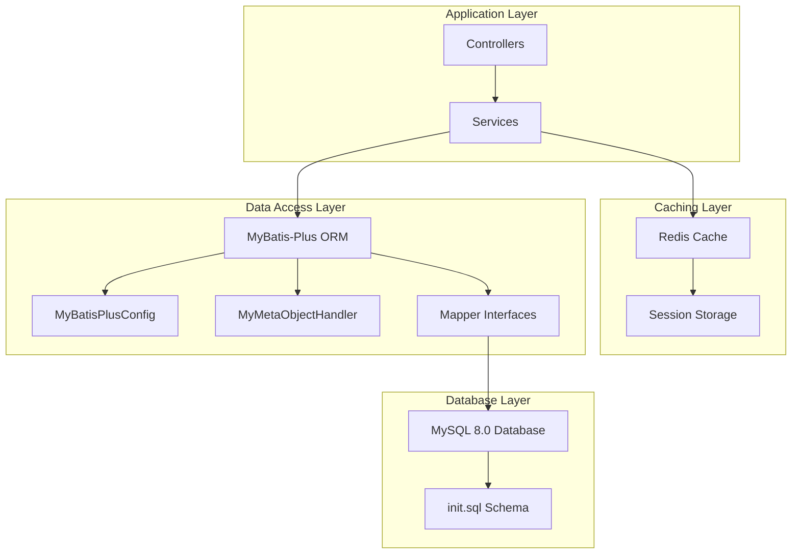
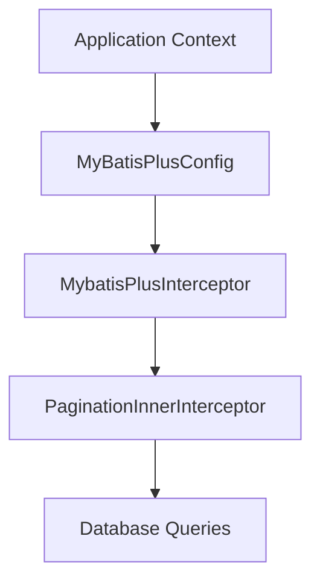
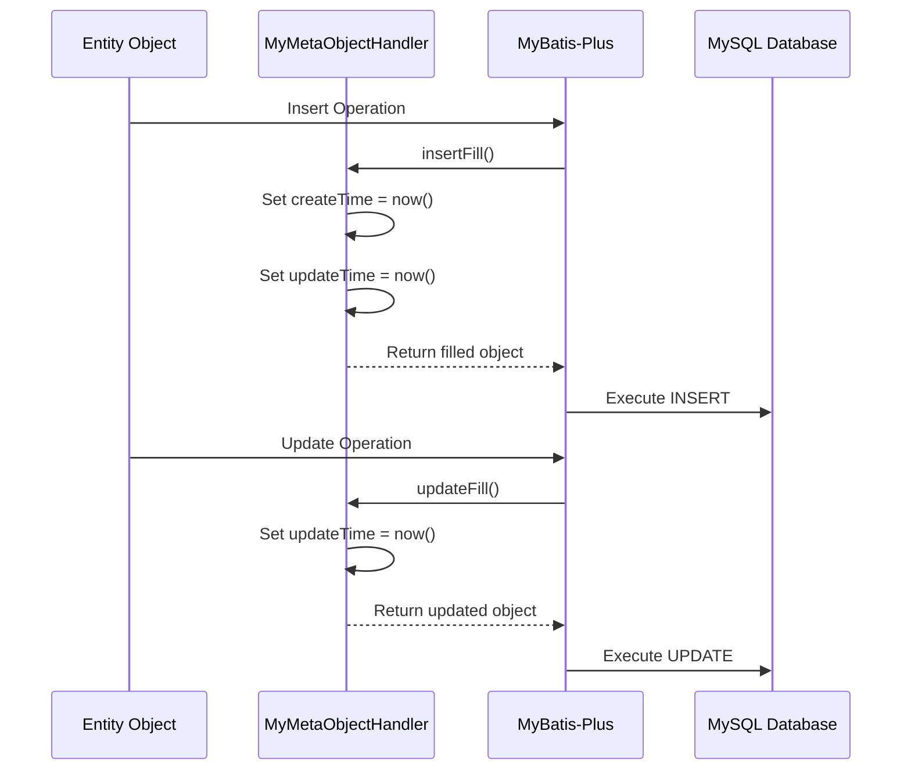

# Data Layer Architecture

> **Relevant source files**
> * [docker/mysql/init.sql](https://github.com/yanzhe-Xiao/yuncang/blob/a4a28616/docker/mysql/init.sql)
> * [src/main/java/com/xhz/yuncang/config/MyBatisPlusConfig.java](https://github.com/yanzhe-Xiao/yuncang/blob/a4a28616/src/main/java/com/xhz/yuncang/config/MyBatisPlusConfig.java)
> * [src/main/java/com/xhz/yuncang/config/MyMetaObjectHandler.java](https://github.com/yanzhe-Xiao/yuncang/blob/a4a28616/src/main/java/com/xhz/yuncang/config/MyMetaObjectHandler.java)

## Purpose and Scope

This document describes the data layer architecture of the yuncang warehouse management system, covering database configuration, ORM setup, entity management, and data access patterns. The data layer provides persistent storage and data access functionality for warehouse operations including inventory management, order processing, and AGV automation.

For information about specific database entities and their relationships, see [Database Schema](/yanzhe-Xiao/yuncang/5-database-schema). For details about system configuration, see [System Administration](/yanzhe-Xiao/yuncang/6-system-administration).

## Database Technology Stack

The yuncang system uses a modern data layer stack built around MySQL and MyBatis-Plus:



**Sources:** [docker/mysql/init.sql L1-L183](https://github.com/yanzhe-Xiao/yuncang/blob/a4a28616/docker/mysql/init.sql#L1-L183)

 [src/main/java/com/xhz/yuncang/config/MyBatisPlusConfig.java L1-L24](https://github.com/yanzhe-Xiao/yuncang/blob/a4a28616/src/main/java/com/xhz/yuncang/config/MyBatisPlusConfig.java#L1-L24)

## Core Database Entities

The system manages warehouse operations through a comprehensive set of interconnected entities:

```css
#mermaid-uljcwf9xjp{font-family:ui-sans-serif,-apple-system,system-ui,Segoe UI,Helvetica;font-size:16px;fill:#333;}@keyframes edge-animation-frame{from{stroke-dashoffset:0;}}@keyframes dash{to{stroke-dashoffset:0;}}#mermaid-uljcwf9xjp .edge-animation-slow{stroke-dasharray:9,5!important;stroke-dashoffset:900;animation:dash 50s linear infinite;stroke-linecap:round;}#mermaid-uljcwf9xjp .edge-animation-fast{stroke-dasharray:9,5!important;stroke-dashoffset:900;animation:dash 20s linear infinite;stroke-linecap:round;}#mermaid-uljcwf9xjp .error-icon{fill:#dddddd;}#mermaid-uljcwf9xjp .error-text{fill:#222222;stroke:#222222;}#mermaid-uljcwf9xjp .edge-thickness-normal{stroke-width:1px;}#mermaid-uljcwf9xjp .edge-thickness-thick{stroke-width:3.5px;}#mermaid-uljcwf9xjp .edge-pattern-solid{stroke-dasharray:0;}#mermaid-uljcwf9xjp .edge-thickness-invisible{stroke-width:0;fill:none;}#mermaid-uljcwf9xjp .edge-pattern-dashed{stroke-dasharray:3;}#mermaid-uljcwf9xjp .edge-pattern-dotted{stroke-dasharray:2;}#mermaid-uljcwf9xjp .marker{fill:#999;stroke:#999;}#mermaid-uljcwf9xjp .marker.cross{stroke:#999;}#mermaid-uljcwf9xjp svg{font-family:ui-sans-serif,-apple-system,system-ui,Segoe UI,Helvetica;font-size:16px;}#mermaid-uljcwf9xjp p{margin:0;}#mermaid-uljcwf9xjp .entityBox{fill:#ffffff;stroke:#dddddd;}#mermaid-uljcwf9xjp .relationshipLabelBox{fill:#dddddd;opacity:0.7;background-color:#dddddd;}#mermaid-uljcwf9xjp .relationshipLabelBox rect{opacity:0.5;}#mermaid-uljcwf9xjp .labelBkg{background-color:rgba(221, 221, 221, 0.5);}#mermaid-uljcwf9xjp .edgeLabel .label{fill:#dddddd;font-size:14px;}#mermaid-uljcwf9xjp .label{font-family:ui-sans-serif,-apple-system,system-ui,Segoe UI,Helvetica;color:#333;}#mermaid-uljcwf9xjp .edge-pattern-dashed{stroke-dasharray:8,8;}#mermaid-uljcwf9xjp .node rect,#mermaid-uljcwf9xjp .node circle,#mermaid-uljcwf9xjp .node ellipse,#mermaid-uljcwf9xjp .node polygon{fill:#ffffff;stroke:#dddddd;stroke-width:1px;}#mermaid-uljcwf9xjp .relationshipLine{stroke:#999;stroke-width:1;fill:none;}#mermaid-uljcwf9xjp .marker{fill:none!important;stroke:#999!important;stroke-width:1;}#mermaid-uljcwf9xjp :root{--mermaid-font-family:"trebuchet ms",verdana,arial,sans-serif;}containsstored_ontracked_intransported_byhas_detailsholdsmanagesoperatesproductBIGINTidPKVARCHARnameVARCHARskuUKproduct-001VARCHARdescriptionDECIMALweightDECIMALlengthDECIMALwidthDECIMALheightinbound_orderBIGINTidPKVARCHARorder_nameVARCHARorder_numberUKinbound_order-001DATETIMEcreate_timeVARCHARuser_idFKVARCHARstatusinbound_order_detailBIGINTidPKVARCHARorder_numberFKVARCHARskuFKBIGINTquantitystorage_shelfBIGINTidPKVARCHARshelf_codeUKshelf-001DECIMALmax_weightDECIMALlengthDECIMALwidthDECIMALheightDECIMALlocation_xDECIMALlocation_yDECIMALlocation_zshelf_inventoryBIGINTidPKVARCHARshelf_codeFKVARCHARskuFKBIGINTquantityagv_carBIGINTidPKVARCHARcar_numberUKcar-001VARCHARstatusINTbattery_levelVARCHARskuFKBIGINTquantityDECIMALstart_xDECIMALstart_yDECIMALend_xDECIMALend_yDECIMALend_zDECIMALlocation_xDECIMALlocation_yVARCHARuser_idFKDECIMALmax_weightDATETIMEcreate_timeDATETIMEupdate_timeinventoryBIGINTidPKVARCHARskuFKBIGINTquantityuserBIGINTidPKVARCHARuser_idUKuser-001VARCHARusernameUKVARCHARuser_typeVARCHARpasswordVARCHARnicknameVARCHARphoneVARCHARgenderfactory_configBIGINTidPKVARCHARallow_collisionVARCHARweight_ratioVARCHARpath_strategyINTmax_layerDECIMALmax_layer_weightBIGINTmax_shelf_numberDECIMALmax_car_weightINTin_and_out_timeDECIMALcar_speed
```

**Sources:** [docker/mysql/init.sql L2-L183](https://github.com/yanzhe-Xiao/yuncang/blob/a4a28616/docker/mysql/init.sql#L2-L183)

## MyBatis-Plus Configuration

The system uses MyBatis-Plus as the primary ORM framework with comprehensive configuration for pagination and automatic field handling:

### Pagination Configuration



The `MyBatisPlusConfig` class configures the pagination interceptor for handling paginated database queries with MySQL-specific optimizations.

**Sources:** [src/main/java/com/xhz/yuncang/config/MyBatisPlusConfig.java L12-L24](https://github.com/yanzhe-Xiao/yuncang/blob/a4a28616/src/main/java/com/xhz/yuncang/config/MyBatisPlusConfig.java#L12-L24)

### Automatic Field Handling



The `MyMetaObjectHandler` automatically manages `createTime` and `updateTime` fields for all entities, ensuring consistent timestamp tracking across the system.

**Sources:** [src/main/java/com/xhz/yuncang/config/MyMetaObjectHandler.java L14-L36](https://github.com/yanzhe-Xiao/yuncang/blob/a4a28616/src/main/java/com/xhz/yuncang/config/MyMetaObjectHandler.java#L14-L36)

## Data Access Patterns

The data layer follows standard patterns for warehouse management operations:

| Pattern | Usage | Examples |
| --- | --- | --- |
| **Entity-based Access** | Direct CRUD operations on single entities | Product management, User management |
| **Relational Queries** | Complex queries across multiple tables | Order details with product information |
| **Inventory Tracking** | Aggregated inventory calculations | Total inventory vs shelf inventory |
| **Spatial Queries** | Location-based operations for AGV management | Shelf coordinates, AGV positioning |
| **Configuration Management** | System-wide settings and parameters | Factory configuration, operational limits |

### Key Database Tables

| Table | Purpose | Key Features |
| --- | --- | --- |
| `product` | Product catalog management | SKU-based identification, dimensional data |
| `inbound_order` / `inbound_order_detail` | Inbound order processing | Order-detail pattern, status tracking |
| `sales_order` / `sales_order_detail` | Sales order management | Customer linking, order workflow |
| `storage_shelf` | Physical shelf management | 3D coordinates, capacity limits |
| `shelf_inventory` | Real-time shelf contents | Product-shelf relationships |
| `inventory` | Aggregate inventory tracking | Total quantity per SKU |
| `agv_car` | AGV fleet management | Status tracking, path planning data |
| `factory_config` | System configuration | Operational parameters, limits |

**Sources:** [docker/mysql/init.sql L2-L180](https://github.com/yanzhe-Xiao/yuncang/blob/a4a28616/docker/mysql/init.sql#L2-L180)

## Entity Lifecycle Management

The system implements comprehensive entity lifecycle management through MyBatis-Plus features:

```

```

### Automatic Timestamp Management

The `MyMetaObjectHandler` provides automatic timestamp management for entities with `createTime` and `updateTime` fields:

* **Insert Operations**: Both `createTime` and `updateTime` are set to current timestamp
* **Update Operations**: Only `updateTime` is updated to current timestamp
* **Strict Mode**: Uses `strictInsertFill` and `strictUpdateFill` for type safety

**Sources:** [src/main/java/com/xhz/yuncang/config/MyMetaObjectHandler.java L22-L35](https://github.com/yanzhe-Xiao/yuncang/blob/a4a28616/src/main/java/com/xhz/yuncang/config/MyMetaObjectHandler.java#L22-L35)

## Database Schema Characteristics

The database schema exhibits several key architectural patterns:

### Naming Conventions

* **Entity IDs**: Format-based identifiers (e.g., `product-001`, `shelf-001`, `car-001`)
* **Primary Keys**: Auto-incrementing `BIGINT` values
* **Foreign Keys**: String-based references using formatted identifiers
* **Timestamps**: `DATETIME` fields with automatic management

### Dimensional Data Management

* **Physical Dimensions**: Length, width, height stored as `DECIMAL(10,2)`
* **Coordinate System**: 3D positioning with X, Y, Z coordinates
* **Weight Management**: Capacity and load tracking in kilograms
* **Unit Consistency**: Centimeters for dimensions, kilograms for weight

### Business Logic Enforcement

* **Status Fields**: Enumerated status values for workflow management
* **Quantity Tracking**: Separate inventory and shelf inventory tables
* **Configuration Driven**: `factory_config` table for operational parameters
* **User Association**: User ID foreign keys for accountability tracking

**Sources:** [docker/mysql/init.sql L1-L183](https://github.com/yanzhe-Xiao/yuncang/blob/a4a28616/docker/mysql/init.sql#L1-L183)