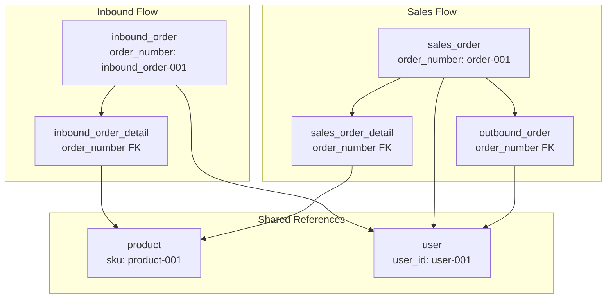
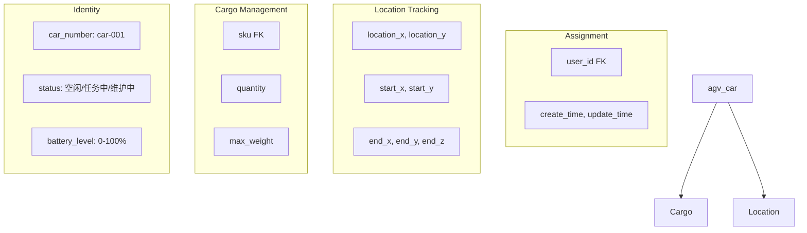

# Database Schema

> **Relevant source files**
> * [docker/mysql/init.sql](https://github.com/yanzhe-Xiao/yuncang/blob/a4a28616/docker/mysql/init.sql)

## Purpose and Scope

This document provides comprehensive documentation of the yuncang warehouse management system's MySQL database schema. It covers all database entities, their relationships, constraints, and data modeling patterns used throughout the system. For detailed information about specific entity business logic, see [Core Entities](/yanzhe-Xiao/yuncang/5.1-core-entities). For relationship constraints and business rules, see [Relationships and Constraints](/yanzhe-Xiao/yuncang/5.2-relationships-and-constraints).

The database schema is defined in the initialization script and supports core warehouse operations including inventory management, order processing, AGV automation, and system administration.

## Database Overview

The yuncang system uses MySQL 8.0 as its primary database, with the schema defined in [docker/mysql/init.sql L1-L183](https://github.com/yanzhe-Xiao/yuncang/blob/a4a28616/docker/mysql/init.sql#L1-L183)

 The database consists of 13 core tables that support the complete warehouse management workflow, from product catalog management to automated guided vehicle operations.

### Core Table Categories

| Category | Tables | Purpose |
| --- | --- | --- |
| **Product Management** | `product`, `inventory` | Product catalog and total inventory tracking |
| **Order Processing** | `inbound_order`, `inbound_order_detail`, `sales_order`, `sales_order_detail`, `outbound_order` | Complete order lifecycle management |
| **Storage Management** | `storage_shelf`, `shelf_inventory` | Physical storage and shelf-level inventory |
| **AGV Operations** | `agv_car` | Automated guided vehicle management |
| **System Administration** | `user`, `remind`, `factory_config` | User management and system configuration |

Sources: [docker/mysql/init.sql L1-L183](https://github.com/yanzhe-Xiao/yuncang/blob/a4a28616/docker/mysql/init.sql#L1-L183)

## Entity Relationship Model

```css
#mermaid-l7gc7zksd4{font-family:ui-sans-serif,-apple-system,system-ui,Segoe UI,Helvetica;font-size:16px;fill:#333;}@keyframes edge-animation-frame{from{stroke-dashoffset:0;}}@keyframes dash{to{stroke-dashoffset:0;}}#mermaid-l7gc7zksd4 .edge-animation-slow{stroke-dasharray:9,5!important;stroke-dashoffset:900;animation:dash 50s linear infinite;stroke-linecap:round;}#mermaid-l7gc7zksd4 .edge-animation-fast{stroke-dasharray:9,5!important;stroke-dashoffset:900;animation:dash 20s linear infinite;stroke-linecap:round;}#mermaid-l7gc7zksd4 .error-icon{fill:#dddddd;}#mermaid-l7gc7zksd4 .error-text{fill:#222222;stroke:#222222;}#mermaid-l7gc7zksd4 .edge-thickness-normal{stroke-width:1px;}#mermaid-l7gc7zksd4 .edge-thickness-thick{stroke-width:3.5px;}#mermaid-l7gc7zksd4 .edge-pattern-solid{stroke-dasharray:0;}#mermaid-l7gc7zksd4 .edge-thickness-invisible{stroke-width:0;fill:none;}#mermaid-l7gc7zksd4 .edge-pattern-dashed{stroke-dasharray:3;}#mermaid-l7gc7zksd4 .edge-pattern-dotted{stroke-dasharray:2;}#mermaid-l7gc7zksd4 .marker{fill:#999;stroke:#999;}#mermaid-l7gc7zksd4 .marker.cross{stroke:#999;}#mermaid-l7gc7zksd4 svg{font-family:ui-sans-serif,-apple-system,system-ui,Segoe UI,Helvetica;font-size:16px;}#mermaid-l7gc7zksd4 p{margin:0;}#mermaid-l7gc7zksd4 .entityBox{fill:#ffffff;stroke:#dddddd;}#mermaid-l7gc7zksd4 .relationshipLabelBox{fill:#dddddd;opacity:0.7;background-color:#dddddd;}#mermaid-l7gc7zksd4 .relationshipLabelBox rect{opacity:0.5;}#mermaid-l7gc7zksd4 .labelBkg{background-color:rgba(221, 221, 221, 0.5);}#mermaid-l7gc7zksd4 .edgeLabel .label{fill:#dddddd;font-size:14px;}#mermaid-l7gc7zksd4 .label{font-family:ui-sans-serif,-apple-system,system-ui,Segoe UI,Helvetica;color:#333;}#mermaid-l7gc7zksd4 .edge-pattern-dashed{stroke-dasharray:8,8;}#mermaid-l7gc7zksd4 .node rect,#mermaid-l7gc7zksd4 .node circle,#mermaid-l7gc7zksd4 .node ellipse,#mermaid-l7gc7zksd4 .node polygon{fill:#ffffff;stroke:#dddddd;stroke-width:1px;}#mermaid-l7gc7zksd4 .relationshipLine{stroke:#999;stroke-width:1;fill:none;}#mermaid-l7gc7zksd4 .marker{fill:none!important;stroke:#999!important;stroke-width:1;}#mermaid-l7gc7zksd4 :root{--mermaid-font-family:"trebuchet ms",verdana,arial,sans-serif;}tracked incontainsorderedstored ontransported byhas detailshas detailsgeneratesholdscreatesplacesprocessesmanagesproductBIGINTidPKVARCHARnameVARCHARskuUKproduct-001VARCHARdescriptionDECIMALweightDECIMALlengthDECIMALwidthDECIMALheightinventoryBIGINTidPKVARCHARskuFKBIGINTquantityinbound_orderBIGINTidPKVARCHARorder_nameVARCHARorder_numberUKinbound_order-001DATETIMEcreate_timeVARCHARuser_idFKVARCHARstatusinbound_order_detailBIGINTidPKVARCHARorder_numberFKVARCHARskuFKBIGINTquantitysales_orderBIGINTidPKVARCHARorder_numberUKorder-001VARCHARuser_idFKDATETIMEcreate_timesales_order_detailBIGINTidPKVARCHARorder_numberFKVARCHARskuFKBIGINTquantityoutbound_orderBIGINTidPKVARCHARorder_numberFKDATEplanned_dateVARCHARuser_idFKVARCHARstatusstorage_shelfBIGINTidPKVARCHARshelf_codeUKshelf-001DECIMALmax_weightDECIMALlengthDECIMALwidthDECIMALheightDECIMALlocation_xDECIMALlocation_yDECIMALlocation_zshelf_inventoryBIGINTidPKVARCHARshelf_codeFKVARCHARskuFKBIGINTquantityagv_carBIGINTidPKVARCHARcar_numberUKcar-001VARCHARstatusINTbattery_levelVARCHARskuFKBIGINTquantityDECIMALstart_xDECIMALstart_yDECIMALend_xDECIMALend_yDECIMALend_zDECIMALlocation_xDECIMALlocation_yVARCHARuser_idFKDECIMALmax_weightDATETIMEcreate_timeDATETIMEupdate_timeuserBIGINTidPKVARCHARuser_idUKuser-001VARCHARusernameUKVARCHARuser_typeVARCHARpasswordVARCHARnicknameVARCHARphoneVARCHARgenderremindBIGINTidPKVARCHARstatusVARCHARmessageVARCHARcontextDATETIMEcreate_timeVARCHARprocessedfactory_configBIGINTidPKVARCHARallow_collisionVARCHARweight_ratioVARCHARpath_strategyINTmax_layerDECIMALmax_layer_weightBIGINTmax_shelf_numberDECIMALmax_car_weightINTin_and_out_timeDECIMALcar_speed
```

Sources: [docker/mysql/init.sql L3-L179](https://github.com/yanzhe-Xiao/yuncang/blob/a4a28616/docker/mysql/init.sql#L3-L179)

## Product and Inventory Schema

The product management schema centers around the `product` table which stores comprehensive product specifications including physical dimensions and weight. The `inventory` table maintains total quantities across the warehouse.

### Product Table Structure

The `product` table [docker/mysql/init.sql L3-L14](https://github.com/yanzhe-Xiao/yuncang/blob/a4a28616/docker/mysql/init.sql#L3-L14)

 defines the core product catalog:

| Column | Type | Constraints | Description |
| --- | --- | --- | --- |
| `id` | BIGINT | PRIMARY KEY, AUTO_INCREMENT | Unique product identifier |
| `name` | VARCHAR(255) | NOT NULL | Product name (e.g., steel bars, lumber) |
| `sku` | VARCHAR(255) | NOT NULL, UNIQUE | Product code format: `product-001` |
| `description` | VARCHAR(255) | NULL | Optional product description |
| `weight` | DECIMAL(10,2) | NOT NULL | Weight in kilograms |
| `length` | DECIMAL(10,2) | NOT NULL | Length in centimeters |
| `width` | DECIMAL(10,2) | NOT NULL | Width in centimeters |
| `height` | DECIMAL(10,2) | NOT NULL | Height in centimeters |

### Inventory Tracking

The `inventory` table [docker/mysql/init.sql L95-L101](https://github.com/yanzhe-Xiao/yuncang/blob/a4a28616/docker/mysql/init.sql#L95-L101)

 maintains aggregate quantity tracking:

```sql
CREATE TABLE inventory
(
    id       BIGINT AUTO_INCREMENT PRIMARY KEY,
    sku      VARCHAR(255) NOT NULL COMMENT '商品编号，引用product表',
    quantity BIGINT       NOT NULL COMMENT '总库存量'
)
```

Sources: [docker/mysql/init.sql L3-L14](https://github.com/yanzhe-Xiao/yuncang/blob/a4a28616/docker/mysql/init.sql#L3-L14)

 [docker/mysql/init.sql L95-L101](https://github.com/yanzhe-Xiao/yuncang/blob/a4a28616/docker/mysql/init.sql#L95-L101)

## Order Processing Schema

The order processing system uses a multi-table design supporting both inbound and outbound operations with detailed order line items.



### Order Status Management

Both `inbound_order` and `outbound_order` tables implement status tracking:

* **Inbound Status**: 未开始 (Not Started), 进行中 (In Progress), 已完成 (Completed)
* **Outbound Status**: 未开始 (Not Started), 进行中 (In Progress), 已完成 (Completed)

Sources: [docker/mysql/init.sql L17-L36](https://github.com/yanzhe-Xiao/yuncang/blob/a4a28616/docker/mysql/init.sql#L17-L36)

 [docker/mysql/init.sql L64-L92](https://github.com/yanzhe-Xiao/yuncang/blob/a4a28616/docker/mysql/init.sql#L64-L92)

## Storage and Shelf Management

The storage system models physical warehouse infrastructure through the `storage_shelf` and `shelf_inventory` tables, supporting 3D coordinate positioning for AGV navigation.

### Storage Shelf Schema

The `storage_shelf` table [docker/mysql/init.sql L39-L51](https://github.com/yanzhe-Xiao/yuncang/blob/a4a28616/docker/mysql/init.sql#L39-L51)

 defines physical storage locations:

| Column | Type | Purpose |
| --- | --- | --- |
| `shelf_code` | VARCHAR(255) | Unique identifier format: `shelf-001` |
| `max_weight` | DECIMAL(10,2) | Maximum load capacity in kilograms |
| `location_x`, `location_y`, `location_z` | DECIMAL(10,2) | 3D coordinates for AGV navigation |
| `length`, `width`, `height` | DECIMAL(10,2) | Physical dimensions in centimeters |

### Shelf Inventory Tracking

The `shelf_inventory` table [docker/mysql/init.sql L54-L61](https://github.com/yanzhe-Xiao/yuncang/blob/a4a28616/docker/mysql/init.sql#L54-L61)

 maintains location-specific inventory:

```sql
CREATE TABLE shelf_inventory
(
    id         BIGINT AUTO_INCREMENT PRIMARY KEY,
    shelf_code VARCHAR(255) NOT NULL COMMENT '货架编号，引用storage_shelf表',
    sku        VARCHAR(255) NOT NULL COMMENT '商品编号，引用product表',
    quantity   BIGINT       NOT NULL COMMENT '商品数量'
)
```

Sources: [docker/mysql/init.sql L39-L61](https://github.com/yanzhe-Xiao/yuncang/blob/a4a28616/docker/mysql/init.sql#L39-L61)

## AGV Operations Schema

The `agv_car` table supports automated guided vehicle operations with comprehensive state management and coordinate tracking.



### AGV Table Evolution

The `agv_car` table includes several schema modifications [docker/mysql/init.sql L121-L135](https://github.com/yanzhe-Xiao/yuncang/blob/a4a28616/docker/mysql/init.sql#L121-L135)

:

* Added `create_time` and `update_time` timestamps
* Added `end_z` for target shelf layer specification
* Added `location_x` and `location_y` for parking position tracking

Sources: [docker/mysql/init.sql L104-L135](https://github.com/yanzhe-Xiao/yuncang/blob/a4a28616/docker/mysql/init.sql#L104-L135)

## System Configuration Schema

### User Management

The `user` table [docker/mysql/init.sql L140-L151](https://github.com/yanzhe-Xiao/yuncang/blob/a4a28616/docker/mysql/init.sql#L140-L151)

 supports role-based access with three user types:

* **管理员** (Administrator): Full system access
* **操作员** (Operator): Operational functions
* **客户** (Customer): Order placement and tracking

### Factory Configuration

The `factory_config` table [docker/mysql/init.sql L166-L179](https://github.com/yanzhe-Xiao/yuncang/blob/a4a28616/docker/mysql/init.sql#L166-L179)

 centralizes operational parameters:

| Parameter | Default | Purpose |
| --- | --- | --- |
| `allow_collision` | 否 | AGV collision prevention setting |
| `weight_ratio` | 1/1/2 | Load balancing ratios |
| `path_strategy` | balanced | AGV path planning algorithm |
| `max_layer` | 10 | Maximum shelf layers |
| `max_car_weight` | 1000kg | AGV weight capacity |
| `car_speed` | 1 | AGV movement speed |

### Notification System

The `remind` table [docker/mysql/init.sql L154-L163](https://github.com/yanzhe-Xiao/yuncang/blob/a4a28616/docker/mysql/init.sql#L154-L163)

 implements system notifications with processing status tracking.

Sources: [docker/mysql/init.sql L140-L179](https://github.com/yanzhe-Xiao/yuncang/blob/a4a28616/docker/mysql/init.sql#L140-L179)

## Data Model Patterns

### Naming Conventions

The schema follows consistent naming patterns:

* **Entity IDs**: Format `{entity}-{number}` (e.g., `product-001`, `user-001`)
* **Order Numbers**: Descriptive prefixes (`inbound_order-001`, `order-001`)
* **Shelf Codes**: Simple format `shelf-001`
* **Car Numbers**: Format `car-001`

### Foreign Key Relationships

Foreign key relationships are established through string-based identifiers rather than numeric IDs:

* `sku` references link `product`, `inventory`, `shelf_inventory`, and order detail tables
* `user_id` references connect users to orders and AGV assignments
* `order_number` and `shelf_code` establish order and storage relationships

### Dimensional Data Storage

Physical dimensions are consistently stored as `DECIMAL(10,2)` with centimeter precision for products, shelves, and AGV coordinates, enabling precise spatial calculations for warehouse automation.

Sources: [docker/mysql/init.sql L1-L183](https://github.com/yanzhe-Xiao/yuncang/blob/a4a28616/docker/mysql/init.sql#L1-L183)