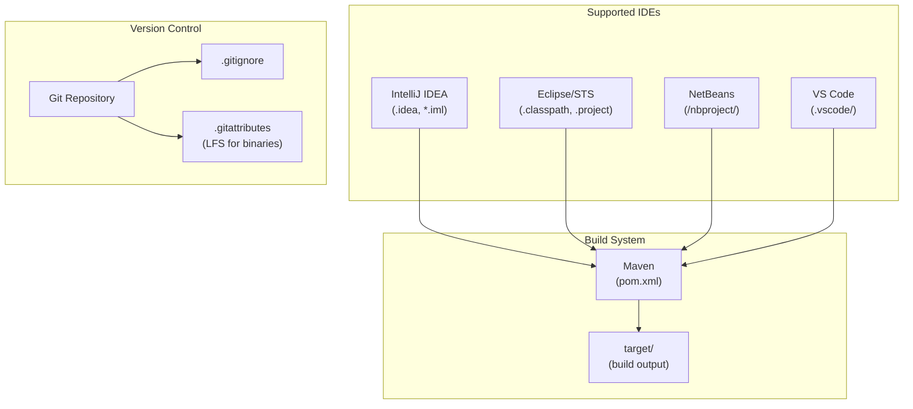
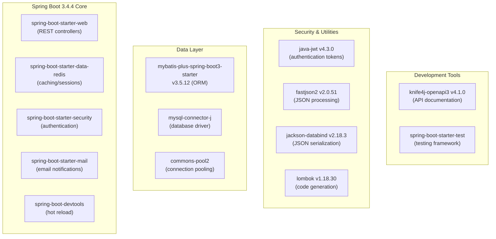
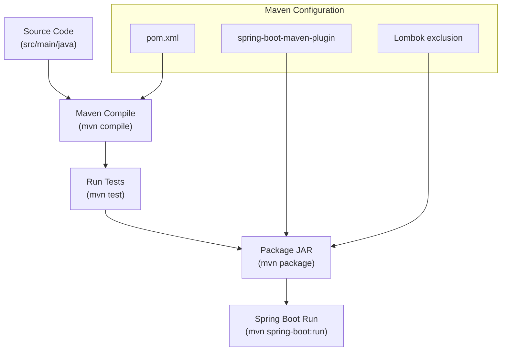
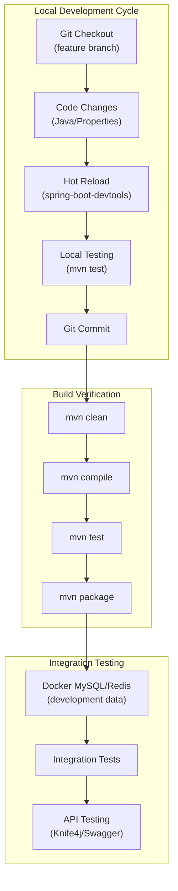
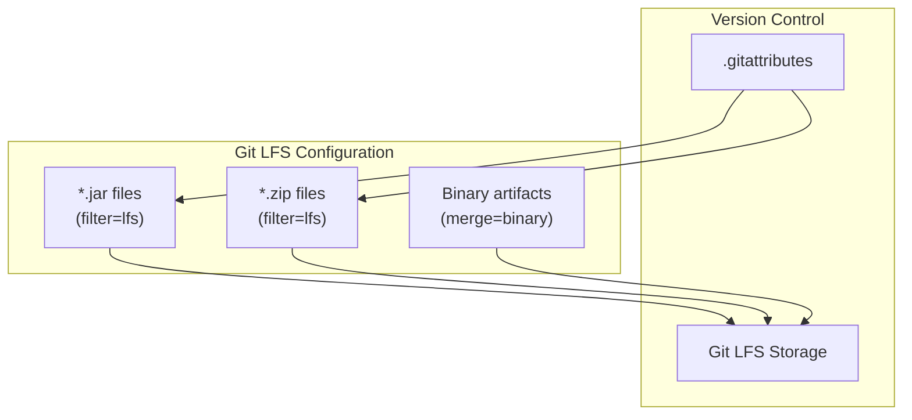

# Development Environment

> **Relevant source files**
> * [.gitattributes](https://github.com/yanzhe-Xiao/yuncang/blob/a4a28616/.gitattributes)
> * [.gitignore](https://github.com/yanzhe-Xiao/yuncang/blob/a4a28616/.gitignore)
> * [package-lock.json](https://github.com/yanzhe-Xiao/yuncang/blob/a4a28616/package-lock.json)
> * [pom.xml](https://github.com/yanzhe-Xiao/yuncang/blob/a4a28616/pom.xml)

This document provides comprehensive guidance for setting up a local development environment for the yuncang warehouse management system. It covers prerequisites, tooling, IDE configuration, and development workflows necessary for contributors to build, test, and modify the codebase effectively.

For information about deploying the complete system using Docker, see [Docker Deployment](/yanzhe-Xiao/yuncang/2.1-docker-deployment). For understanding the overall system architecture and design patterns, see [System Architecture](/yanzhe-Xiao/yuncang/3-system-architecture).

## Prerequisites

### Java Development Kit

The yuncang system requires **Java 21** as specified in the Maven configuration. This is a modern LTS version that provides enhanced performance and language features.

| Component | Version | Purpose |
| --- | --- | --- |
| Java JDK | 21 | Runtime and compilation target |
| Maven | 3.6+ | Build automation and dependency management |
| Git | 2.20+ | Version control system |

**Sources:** [pom.xml L30](https://github.com/yanzhe-Xiao/yuncang/blob/a4a28616/pom.xml#L30-L30)

### Development Tools

The project supports multiple IDEs and development environments as evidenced by the comprehensive `.gitignore` configuration:

**Sources:** [.gitignore L16-L33](https://github.com/yanzhe-Xiao/yuncang/blob/a4a28616/.gitignore#L16-L33)

 [.gitattributes L1-L4](https://github.com/yanzhe-Xiao/yuncang/blob/a4a28616/.gitattributes#L1-L4)

## Core Dependencies and Framework Stack

### Spring Boot Framework

The application is built on **Spring Boot 3.4.4**, providing a modern, production-ready foundation with extensive auto-configuration capabilities.

**Sources:** [pom.xml L32-L132](https://github.com/yanzhe-Xiao/yuncang/blob/a4a28616/pom.xml#L32-L132)

### Build Configuration

The Maven build process is configured with Spring Boot's plugin for packaging and development workflow optimization:

**Sources:** [pom.xml L135-L152](https://github.com/yanzhe-Xiao/yuncang/blob/a4a28616/pom.xml#L135-L152)

## IDE Setup and Configuration

### IntelliJ IDEA Configuration

For IntelliJ IDEA development, the project excludes several generated files and directories from version control:

* `.idea/` - IDE settings and configuration
* `*.iws` - workspace files
* `*.iml` - module files
* `*.ipr` - project files

### Eclipse/STS Configuration

Eclipse and Spring Tool Suite users will find these artifacts excluded:

* `.apt_generated` - annotation processing output
* `.classpath` - Eclipse classpath configuration
* `.factorypath` - factory path settings
* `.project` - Eclipse project file
* `.settings/` - workspace settings
* `.springBeans` - Spring configuration
* `.sts4-cache` - STS cache files

### Development Workflow

**Sources:** [pom.xml L54-L57](https://github.com/yanzhe-Xiao/yuncang/blob/a4a28616/pom.xml#L54-L57)

 [.gitignore L35-L39](https://github.com/yanzhe-Xiao/yuncang/blob/a4a28616/.gitignore#L35-L39)

## Development Dependencies

### Runtime Dependencies

| Dependency | Version | Purpose | Scope |
| --- | --- | --- | --- |
| `spring-boot-devtools` | 3.4.4 | Hot reload, automatic restart | `runtime` |
| `mysql-connector-j` | Latest | MySQL database connectivity | `runtime` |
| `lombok` | 1.18.30 | Code generation annotations | `provided` |

### Test Dependencies

The project includes comprehensive testing support through Spring Boot's test starter, which provides:

* JUnit 5 testing framework
* Spring Test context support
* MockMvc for web layer testing
* TestContainers integration capabilities

**Sources:** [pom.xml L64-L73](https://github.com/yanzhe-Xiao/yuncang/blob/a4a28616/pom.xml#L64-L73)

## Binary File Management

The project uses Git LFS (Large File Storage) for managing binary artifacts:

**Sources:** [.gitattributes L2-L3](https://github.com/yanzhe-Xiao/yuncang/blob/a4a28616/.gitattributes#L2-L3)

## Docker Development Integration

The development environment integrates with Docker for database and cache services, with runtime data excluded from version control:

* `docker/mysql/data/` - MySQL development data
* `docker/redis/data/` - Redis development data

This allows developers to maintain clean local databases while preserving development state between sessions.

**Sources:** [.gitignore L36-L39](https://github.com/yanzhe-Xiao/yuncang/blob/a4a28616/.gitignore#L36-L39)

## API Development and Testing

The project includes Knife4j OpenAPI integration for interactive API documentation and testing during development. This provides:

* Swagger UI interface at `/doc.html`
* OpenAPI 3.0 specification generation
* Interactive API testing capabilities
* Request/response schema validation

**Sources:** [pom.xml L114-L119](https://github.com/yanzhe-Xiao/yuncang/blob/a4a28616/pom.xml#L114-L119)