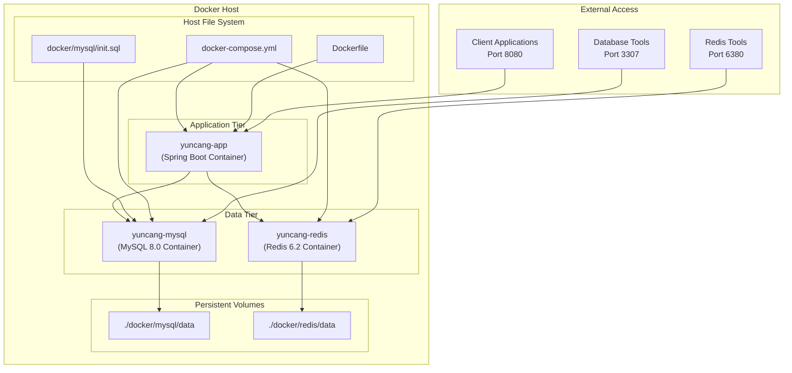
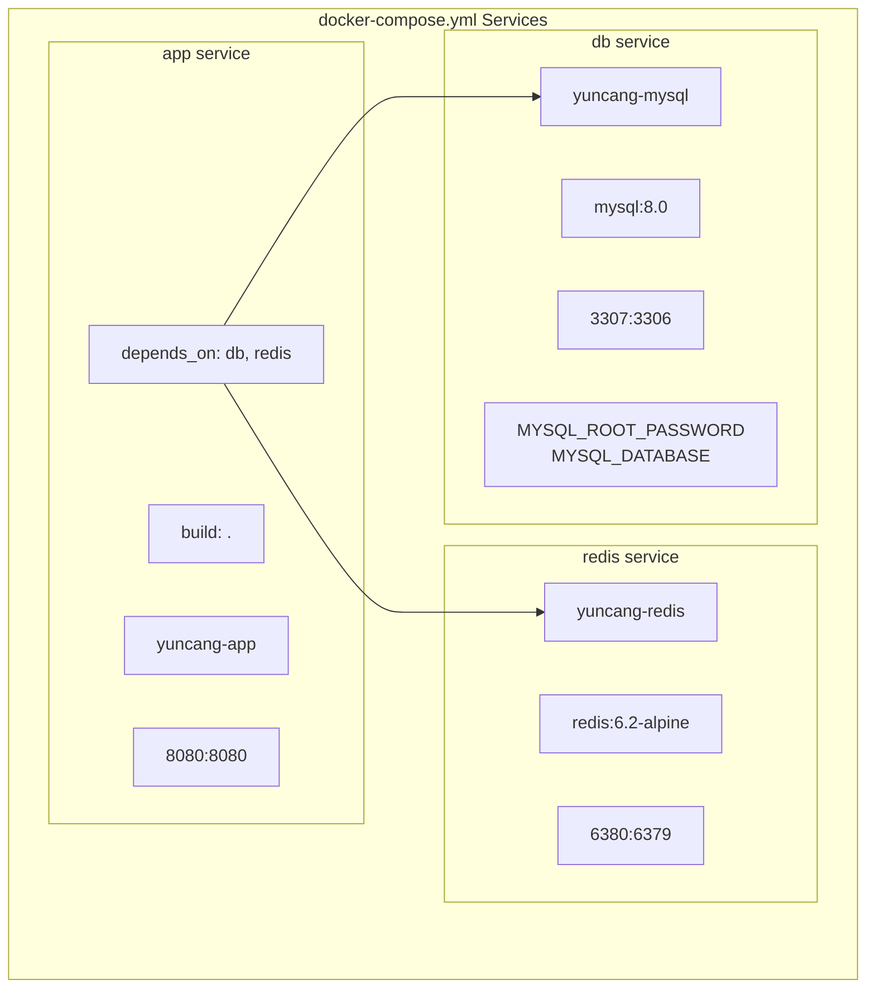
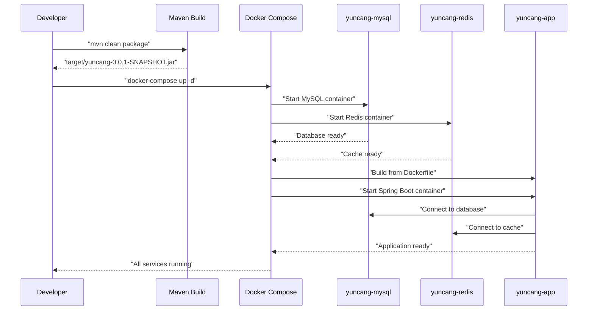

# Docker Deployment

> **Relevant source files**
> * [Dockerfile](https://github.com/yanzhe-Xiao/yuncang/blob/a4a28616/Dockerfile)
> * [docker-compose.yml](https://github.com/yanzhe-Xiao/yuncang/blob/a4a28616/docker-compose.yml)
> * [docker/mysql/init.sql](https://github.com/yanzhe-Xiao/yuncang/blob/a4a28616/docker/mysql/init.sql)

This document provides comprehensive instructions for deploying the yuncang warehouse management system using Docker Compose. The deployment consists of a multi-container setup with separate services for the Spring Boot application, MySQL database, and Redis cache.

For information about setting up the development environment without Docker, see [Development Environment](/yanzhe-Xiao/yuncang/2.2-development-environment). For details about the application structure and configuration, see [Application Structure](/yanzhe-Xiao/yuncang/3.1-application-structure).

## Container Architecture

The yuncang system uses a three-tier containerized architecture with service isolation and data persistence.



Sources: [docker-compose.yml L1-L55](https://github.com/yanzhe-Xiao/yuncang/blob/a4a28616/docker-compose.yml#L1-L55)

 [Dockerfile L1-L15](https://github.com/yanzhe-Xiao/yuncang/blob/a4a28616/Dockerfile#L1-L15)

 [docker/mysql/init.sql L1-L183](https://github.com/yanzhe-Xiao/yuncang/blob/a4a28616/docker/mysql/init.sql#L1-L183)

## Service Configuration

The Docker Compose configuration defines three interdependent services with specific networking and volume requirements.



Sources: [docker-compose.yml L3-L55](https://github.com/yanzhe-Xiao/yuncang/blob/a4a28616/docker-compose.yml#L3-L55)

### Database Service (db)

| Configuration | Value | Purpose |
| --- | --- | --- |
| Image | `mysql:8.0` | Production-ready MySQL database |
| Container Name | `yuncang-mysql` | Service discovery identifier |
| Port Mapping | `3307:3306` | External database access |
| Root Password | Empty string | Development convenience |
| Database Name | `yuncang` | Application database |
| Init Script | `./docker/mysql/init.sql` | Automatic schema creation |
| Data Volume | `./docker/mysql/data` | Data persistence |

Sources: [docker-compose.yml L3-L19](https://github.com/yanzhe-Xiao/yuncang/blob/a4a28616/docker-compose.yml#L3-L19)

### Redis Service (redis)

| Configuration | Value | Purpose |
| --- | --- | --- |
| Image | `redis:6.2-alpine` | Lightweight Redis cache |
| Container Name | `yuncang-redis` | Service discovery identifier |
| Port Mapping | `6380:6379` | External Redis access |
| Data Volume | `./docker/redis/data` | Session persistence |

Sources: [docker-compose.yml L21-L31](https://github.com/yanzhe-Xiao/yuncang/blob/a4a28616/docker-compose.yml#L21-L31)

### Application Service (app)

The Spring Boot application is built from the local `Dockerfile` and configured with environment variables to connect to the containerized services.

| Configuration | Value | Purpose |
| --- | --- | --- |
| Build Context | `.` (current directory) | Uses local `Dockerfile` |
| Container Name | `yuncang-app` | Service identifier |
| Port Mapping | `8080:8080` | Web application access |
| Dependencies | `db`, `redis` | Service startup order |

**Environment Variables:**

* `SPRING_DATASOURCE_URL`: `jdbc:mysql://db:3306/yuncang?useUnicode=true&characterEncoding=utf-8&useSSL=false&serverTimezone=Asia/Shanghai`
* `SPRING_DATASOURCE_USERNAME`: `root`
* `SPRING_DATASOURCE_PASSWORD`: (empty)
* `SPRING_DATA_REDIS_HOST`: `redis`
* `SPRING_DATA_REDIS_PORT`: `6379`
* `SPRING_DATA_REDIS_DATABASE`: `2`

Sources: [docker-compose.yml L33-L55](https://github.com/yanzhe-Xiao/yuncang/blob/a4a28616/docker-compose.yml#L33-L55)

 [Dockerfile L1-L15](https://github.com/yanzhe-Xiao/yuncang/blob/a4a28616/Dockerfile#L1-L15)

## Deployment Process

The deployment process involves building the Spring Boot JAR file and launching the multi-container environment.



Sources: [docker-compose.yml L39-L42](https://github.com/yanzhe-Xiao/yuncang/blob/a4a28616/docker-compose.yml#L39-L42)

 [Dockerfile L9](https://github.com/yanzhe-Xiao/yuncang/blob/a4a28616/Dockerfile#L9-L9)

### Prerequisites

1. **Docker and Docker Compose** installed and running
2. **Maven** for building the JAR file
3. **Java 21** compatible build environment
4. **Port availability**: 8080, 3307, 6380 on the host system

### Step-by-Step Deployment

1. **Build the application JAR**: ``` mvn clean package ``` This creates `target/yuncang-0.0.1-SNAPSHOT.jar` referenced in the `Dockerfile`.
2. **Start the container stack**: ``` docker-compose up -d ``` Services start in dependency order: `db` and `redis` first, then `app`.
3. **Verify deployment**: ``` docker-compose ps ``` All three services should show as "Up".
4. **Access the application**: * Web application: `http://localhost:8080` * MySQL database: `localhost:3307` * Redis cache: `localhost:6380`

Sources: [Dockerfile L9](https://github.com/yanzhe-Xiao/yuncang/blob/a4a28616/Dockerfile#L9-L9)

 [docker-compose.yml L39-L55](https://github.com/yanzhe-Xiao/yuncang/blob/a4a28616/docker-compose.yml#L39-L55)

## Data Persistence and Initialization

The system implements persistent storage for both database and cache data, with automatic database schema initialization.

### Database Initialization

The MySQL container automatically executes the initialization script on first startup:

* **Init Script**: [docker/mysql/init.sql L1-L183](https://github.com/yanzhe-Xiao/yuncang/blob/a4a28616/docker/mysql/init.sql#L1-L183)
* **Mount Point**: `/docker-entrypoint-initdb.d/init.sql`
* **Execution**: Automatic on container first run

The script creates all required tables:

* `product` - Product catalog
* `inbound_order`, `inbound_order_detail` - Inbound operations
* `sales_order`, `sales_order_detail` - Sales orders
* `outbound_order` - Outbound operations
* `storage_shelf`, `shelf_inventory` - Storage management
* `inventory` - Inventory tracking
* `agv_car` - AGV automation
* `user` - User management
* `remind` - Notification system
* `factory_config` - System configuration

### Volume Mappings

| Service | Host Path | Container Path | Purpose |
| --- | --- | --- | --- |
| MySQL | `./docker/mysql/data` | `/var/lib/mysql` | Database files |
| MySQL | `./docker/mysql/init.sql` | `/docker-entrypoint-initdb.d/init.sql` | Schema init |
| Redis | `./docker/redis/data` | `/data` | Cache persistence |

Sources: [docker-compose.yml L15-L31](https://github.com/yanzhe-Xiao/yuncang/blob/a4a28616/docker-compose.yml#L15-L31)

 [docker/mysql/init.sql L1-L183](https://github.com/yanzhe-Xiao/yuncang/blob/a4a28616/docker/mysql/init.sql#L1-L183)

## Network Configuration

Docker Compose creates an isolated network where services communicate using their service names as hostnames.

### Internal Service Communication

* **Database Connection**: `jdbc:mysql://db:3306/yuncang`
* **Redis Connection**: `redis:6379`
* **Service Discovery**: Automatic via Docker Compose networking

### External Port Mappings

* **Application**: `localhost:8080` → `yuncang-app:8080`
* **Database**: `localhost:3307` → `yuncang-mysql:3306`
* **Redis**: `localhost:6380` → `yuncang-redis:6379`

Sources: [docker-compose.yml L46-L55](https://github.com/yanzhe-Xiao/yuncang/blob/a4a28616/docker-compose.yml#L46-L55)

## Troubleshooting

### Common Issues

**Container startup failures:**

* Check port conflicts with `netstat -tlnp | grep :<port>`
* Verify Docker daemon is running
* Ensure sufficient disk space for volumes

**Database connection errors:**

* Verify MySQL container is healthy: `docker logs yuncang-mysql`
* Check if initialization script executed successfully
* Confirm environment variables match in `docker-compose.yml`

**Application startup timeout:**

* Monitor logs: `docker logs yuncang-app`
* Verify JAR file exists: `target/yuncang-0.0.1-SNAPSHOT.jar`
* Check dependency service health

### Useful Commands

```markdown
# View all service logs
docker-compose logs

# View specific service logs  
docker logs yuncang-app

# Restart services
docker-compose restart

# Stop and remove all containers
docker-compose down

# Rebuild application container
docker-compose build app
```

Sources: [docker-compose.yml L5-L37](https://github.com/yanzhe-Xiao/yuncang/blob/a4a28616/docker-compose.yml#L5-L37)

 [Dockerfile L9](https://github.com/yanzhe-Xiao/yuncang/blob/a4a28616/Dockerfile#L9-L9)