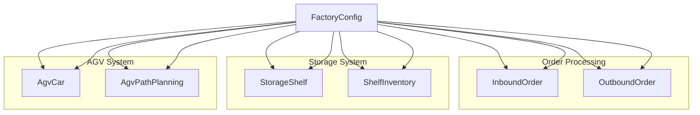
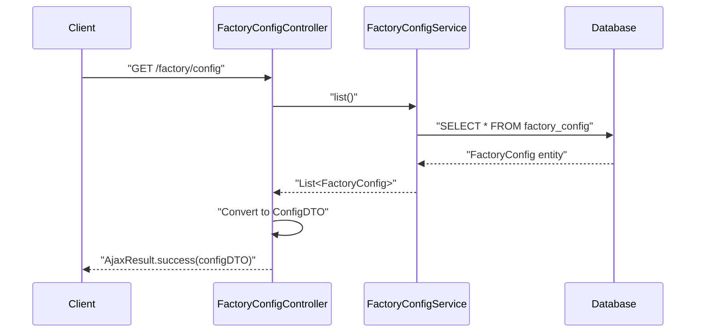
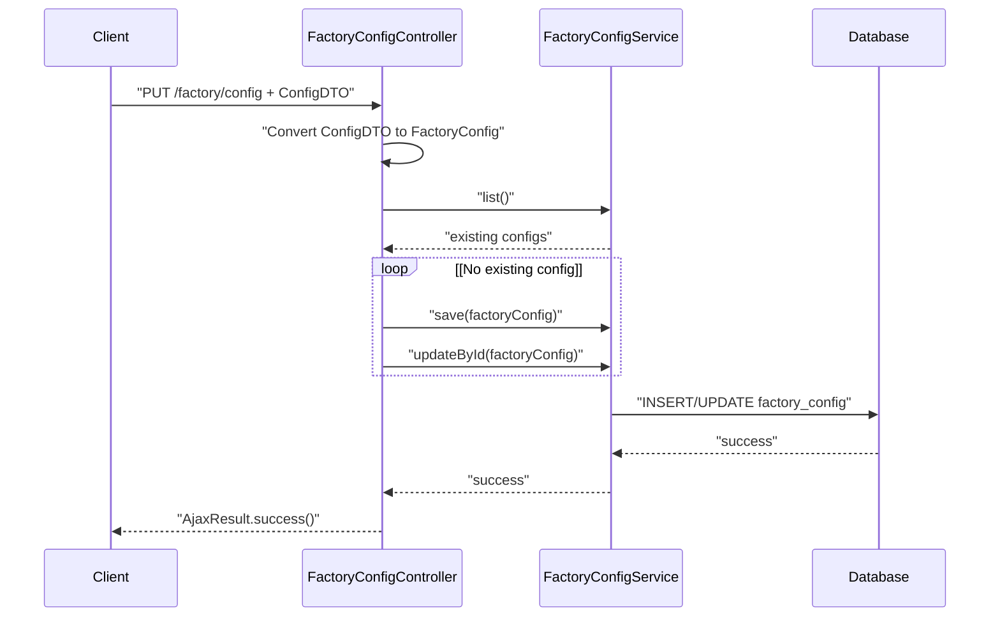

# Factory Configuration

> **Relevant source files**
> * [docker/mysql/init.sql](https://github.com/yanzhe-Xiao/yuncang/blob/a4a28616/docker/mysql/init.sql)
> * [src/main/java/com/xhz/yuncang/controller/FactoryConfigController.java](https://github.com/yanzhe-Xiao/yuncang/blob/a4a28616/src/main/java/com/xhz/yuncang/controller/FactoryConfigController.java)

This document covers the factory configuration system in the yuncang warehouse management system. Factory configuration provides global operational parameters that control warehouse behavior, AGV automation settings, storage capacity limits, and system performance characteristics.

For user management and permissions, see [User Management](/yanzhe-Xiao/yuncang/6.2-user-management). For AGV-specific operational details, see [AGV Automation](/yanzhe-Xiao/yuncang/4.3-agv-automation).

## Overview

The factory configuration system manages warehouse-wide operational parameters stored in a single configuration record. These settings control critical aspects of warehouse automation including AGV collision handling, weight distribution ratios, path planning strategies, storage capacity limits, and timing parameters.

The configuration is managed through a REST API restricted to administrators and affects all warehouse operations including inventory management, AGV automation, and order processing.

## Configuration Parameters

The factory configuration consists of the following operational parameters:

| Parameter | Type | Default | Description |
| --- | --- | --- | --- |
| `allow_collision` | String | "否" (No) | Whether AGV collision is allowed during path planning |
| `weight_ratio` | String | "1/1/2" | Weight distribution ratio for storage calculations |
| `path_strategy` | String | "balanced" | AGV path planning strategy |
| `max_layer` | Integer | 10 | Maximum number of storage layers per shelf |
| `max_layer_weight` | Decimal | 3000.0 | Maximum weight capacity per storage layer (kg) |
| `max_shelf_number` | Long | 540 | Maximum number of storage shelves in warehouse |
| `max_car_weight` | Decimal | 1000.0 | Maximum carrying capacity per AGV car (kg) |
| `in_and_out_time` | Integer | 2 | Time required for loading/unloading operations |
| `car_speed` | Decimal | 1.0 | Default AGV car movement speed |

Sources: [docker/mysql/init.sql L166-L180](https://github.com/yanzhe-Xiao/yuncang/blob/a4a28616/docker/mysql/init.sql#L166-L180)

## Data Model

The factory configuration uses a single-record pattern in the `factory_config` table. The system maintains only one active configuration record that applies globally to all warehouse operations.

```css
#mermaid-60ezxai38yr{font-family:ui-sans-serif,-apple-system,system-ui,Segoe UI,Helvetica;font-size:16px;fill:#333;}@keyframes edge-animation-frame{from{stroke-dashoffset:0;}}@keyframes dash{to{stroke-dashoffset:0;}}#mermaid-60ezxai38yr .edge-animation-slow{stroke-dasharray:9,5!important;stroke-dashoffset:900;animation:dash 50s linear infinite;stroke-linecap:round;}#mermaid-60ezxai38yr .edge-animation-fast{stroke-dasharray:9,5!important;stroke-dashoffset:900;animation:dash 20s linear infinite;stroke-linecap:round;}#mermaid-60ezxai38yr .error-icon{fill:#dddddd;}#mermaid-60ezxai38yr .error-text{fill:#222222;stroke:#222222;}#mermaid-60ezxai38yr .edge-thickness-normal{stroke-width:1px;}#mermaid-60ezxai38yr .edge-thickness-thick{stroke-width:3.5px;}#mermaid-60ezxai38yr .edge-pattern-solid{stroke-dasharray:0;}#mermaid-60ezxai38yr .edge-thickness-invisible{stroke-width:0;fill:none;}#mermaid-60ezxai38yr .edge-pattern-dashed{stroke-dasharray:3;}#mermaid-60ezxai38yr .edge-pattern-dotted{stroke-dasharray:2;}#mermaid-60ezxai38yr .marker{fill:#999;stroke:#999;}#mermaid-60ezxai38yr .marker.cross{stroke:#999;}#mermaid-60ezxai38yr svg{font-family:ui-sans-serif,-apple-system,system-ui,Segoe UI,Helvetica;font-size:16px;}#mermaid-60ezxai38yr p{margin:0;}#mermaid-60ezxai38yr .entityBox{fill:#ffffff;stroke:#dddddd;}#mermaid-60ezxai38yr .relationshipLabelBox{fill:#dddddd;opacity:0.7;background-color:#dddddd;}#mermaid-60ezxai38yr .relationshipLabelBox rect{opacity:0.5;}#mermaid-60ezxai38yr .labelBkg{background-color:rgba(221, 221, 221, 0.5);}#mermaid-60ezxai38yr .edgeLabel .label{fill:#dddddd;font-size:14px;}#mermaid-60ezxai38yr .label{font-family:ui-sans-serif,-apple-system,system-ui,Segoe UI,Helvetica;color:#333;}#mermaid-60ezxai38yr .edge-pattern-dashed{stroke-dasharray:8,8;}#mermaid-60ezxai38yr .node rect,#mermaid-60ezxai38yr .node circle,#mermaid-60ezxai38yr .node ellipse,#mermaid-60ezxai38yr .node polygon{fill:#ffffff;stroke:#dddddd;stroke-width:1px;}#mermaid-60ezxai38yr .relationshipLine{stroke:#999;stroke-width:1;fill:none;}#mermaid-60ezxai38yr .marker{fill:none!important;stroke:#999!important;stroke-width:1;}#mermaid-60ezxai38yr :root{--mermaid-font-family:"trebuchet ms",verdana,arial,sans-serif;}configureslimitsaffects_timingaffects_timingFACTORY_CONFIGbigintidPKvarcharallow_collisionvarcharweight_ratiovarcharpath_strategyintmax_layerdecimalmax_layer_weightbigintmax_shelf_numberdecimalmax_car_weightintin_and_out_timedecimalcar_speedAGV_CARSTORAGE_SHELFINBOUND_ORDEROUTBOUND_ORDER
```

Sources: [docker/mysql/init.sql L166-L180](https://github.com/yanzhe-Xiao/yuncang/blob/a4a28616/docker/mysql/init.sql#L166-L180)

## System Integration

The factory configuration integrates with multiple warehouse subsystems to control operational behavior:



Sources: [src/main/java/com/xhz/yuncang/controller/FactoryConfigController.java L1-L88](https://github.com/yanzhe-Xiao/yuncang/blob/a4a28616/src/main/java/com/xhz/yuncang/controller/FactoryConfigController.java#L1-L88)

 [docker/mysql/init.sql L166-L180](https://github.com/yanzhe-Xiao/yuncang/blob/a4a28616/docker/mysql/init.sql#L166-L180)

## REST API Endpoints

The factory configuration provides two main API endpoints for configuration management:

### GET /factory/config

Retrieves the current factory configuration settings.

**Security**: Requires administrator role (`@PreAuthorize("hasRole('管理员')")`)

**Response**: Returns `ConfigDTO` with current configuration values



### PUT /factory/config

Updates the factory configuration with new settings.

**Security**: Requires administrator role (`@PreAuthorize("hasRole('管理员')")`)

**Request Body**: `ConfigDTO` with updated configuration values

**Response**: Success confirmation



Sources: [src/main/java/com/xhz/yuncang/controller/FactoryConfigController.java L23-L58](https://github.com/yanzhe-Xiao/yuncang/blob/a4a28616/src/main/java/com/xhz/yuncang/controller/FactoryConfigController.java#L23-L58)

 [src/main/java/com/xhz/yuncang/controller/FactoryConfigController.java L61-L87](https://github.com/yanzhe-Xiao/yuncang/blob/a4a28616/src/main/java/com/xhz/yuncang/controller/FactoryConfigController.java#L61-L87)

## Configuration Management Process

The system uses a singleton pattern for factory configuration management:

1. **Single Record Pattern**: Only one active configuration record exists in the database
2. **Upsert Logic**: The controller checks for existing configuration and either creates new or updates existing record
3. **Data Transformation**: Converts between `ConfigDTO` (API layer) and `FactoryConfig` (entity layer)
4. **Default Fallbacks**: Provides default values when configuration fields are null or missing

Key transformation logic includes:

* Boolean collision setting: `"true"/"false"` ↔ `"是"/"否"`
* Weight ratio parsing: List format ↔ `"1/1/2"` string format
* Numeric conversions with null safety and defaults

Sources: [src/main/java/com/xhz/yuncang/controller/FactoryConfigController.java L29-L54](https://github.com/yanzhe-Xiao/yuncang/blob/a4a28616/src/main/java/com/xhz/yuncang/controller/FactoryConfigController.java#L29-L54)

 [src/main/java/com/xhz/yuncang/controller/FactoryConfigController.java L70-L86](https://github.com/yanzhe-Xiao/yuncang/blob/a4a28616/src/main/java/com/xhz/yuncang/controller/FactoryConfigController.java#L70-L86)

## Security and Access Control

Factory configuration management is restricted to administrator users only:

* **Role-Based Access**: `@PreAuthorize("hasRole('管理员')")` annotation on `FactoryConfigController`
* **Admin-Only Operations**: Both read and write operations require administrator privileges
* **System-Wide Impact**: Configuration changes affect all warehouse operations, justifying admin-only access

The security model ensures that only authorized personnel can modify critical operational parameters that control warehouse automation and safety systems.

Sources: [src/main/java/com/xhz/yuncang/controller/FactoryConfigController.java L17](https://github.com/yanzhe-Xiao/yuncang/blob/a4a28616/src/main/java/com/xhz/yuncang/controller/FactoryConfigController.java#L17-L17)