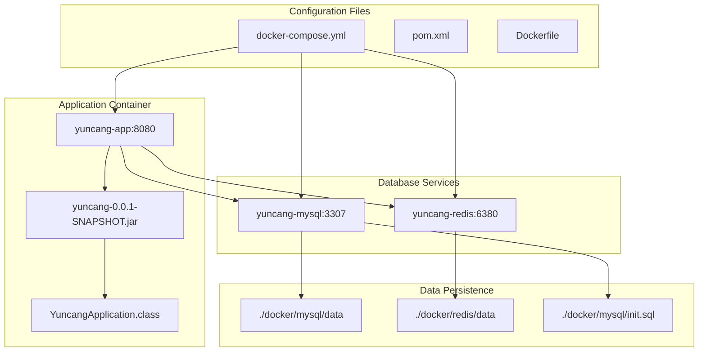
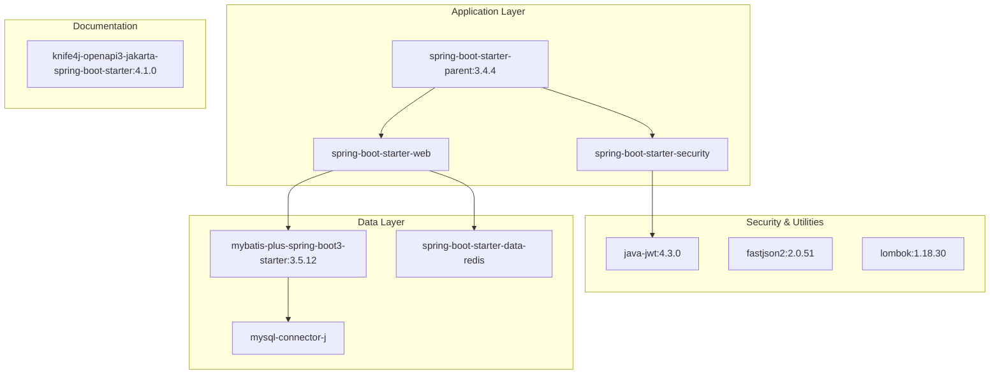
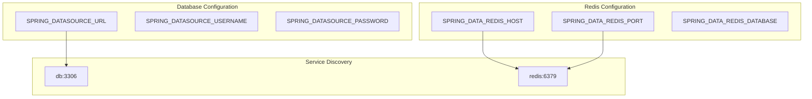

# Getting Started

> **Relevant source files**
> * [Dockerfile](https://github.com/yanzhe-Xiao/yuncang/blob/a4a28616/Dockerfile)
> * [docker-compose.yml](https://github.com/yanzhe-Xiao/yuncang/blob/a4a28616/docker-compose.yml)
> * [pom.xml](https://github.com/yanzhe-Xiao/yuncang/blob/a4a28616/pom.xml)

This page provides a quick start guide for setting up and running the yuncang warehouse management system. It covers the essential prerequisites, deployment options, and verification steps to get the system operational.

For detailed Docker deployment instructions, see [Docker Deployment](/yanzhe-Xiao/yuncang/2.1-docker-deployment). For development environment setup and build processes, see [Development Environment](/yanzhe-Xiao/yuncang/2.2-development-environment). For comprehensive system architecture details, see [System Architecture](/yanzhe-Xiao/yuncang/3-system-architecture).

## System Overview

The yuncang system is a Spring Boot 3 application built with Java 21 that provides comprehensive warehouse management capabilities including inventory tracking, order processing, and AGV automation. The system uses MySQL for persistent data storage and Redis for caching and session management.

### Core Application Structure



Sources: [docker-compose.yml L1-L55](https://github.com/yanzhe-Xiao/yuncang/blob/a4a28616/docker-compose.yml#L1-L55)

 [Dockerfile L1-L15](https://github.com/yanzhe-Xiao/yuncang/blob/a4a28616/Dockerfile#L1-L15)

 [pom.xml L12-L14](https://github.com/yanzhe-Xiao/yuncang/blob/a4a28616/pom.xml#L12-L14)

### Technology Stack and Dependencies



Sources: [pom.xml L32-L132](https://github.com/yanzhe-Xiao/yuncang/blob/a4a28616/pom.xml#L32-L132)

## Prerequisites

Before running the yuncang system, ensure you have the following installed:

| Requirement | Version | Purpose |
| --- | --- | --- |
| Docker | Latest | Container runtime for services |
| Docker Compose | Latest | Multi-container orchestration |
| Java | 21+ | Development and build (if building from source) |
| Maven | 3.6+ | Build tool (if building from source) |

## Quick Start Options

### Option 1: Docker Compose (Recommended)

The fastest way to get yuncang running is using the provided Docker Compose configuration:

1. **Clone the repository**
2. **Start all services**: ``` docker-compose up -d ```

This command will:

* Build the Spring Boot application using the `Dockerfile`
* Start MySQL 8.0 on port 3307 with the `yuncang` database
* Start Redis 6.2 on port 6380
* Start the yuncang application on port 8080
* Initialize the database schema using the init script

### Option 2: Development Mode

For development and debugging, you can run the services separately:

1. **Start infrastructure services**: ``` docker-compose up -d db redis ```
2. **Run the application locally** (requires Java 21 and Maven)

For detailed development setup, see [Development Environment](/yanzhe-Xiao/yuncang/2.2-development-environment).

## Service Configuration

The Docker Compose setup configures the following service connections:

| Service | Container Name | Host Port | Internal Port | Configuration |
| --- | --- | --- | --- | --- |
| Application | `yuncang-app` | 8080 | 8080 | Spring Boot application |
| MySQL | `yuncang-mysql` | 3307 | 3306 | Database with empty root password |
| Redis | `yuncang-redis` | 6380 | 6379 | Cache and session store |

### Environment Variables

The application container is configured with these key environment variables:



Sources: [docker-compose.yml L46-L54](https://github.com/yanzhe-Xiao/yuncang/blob/a4a28616/docker-compose.yml#L46-L54)

## Verification Steps

After starting the system, verify it's running correctly:

### 1. Check Service Health

```markdown
# Check all containers are running
docker-compose ps

# Check application logs
docker-compose logs app

# Check database connection
docker-compose logs db
```

### 2. Access Application Endpoints

| Endpoint | Purpose | Expected Response |
| --- | --- | --- |
| `http://localhost:8080` | Application health | Application response |
| `http://localhost:8080/doc.html` | API documentation | Knife4j Swagger UI |

### 3. Database Connectivity

The MySQL service should be accessible at `localhost:3307` with:

* Username: `root`
* Password: `` (empty)
* Database: `yuncang`

## Troubleshooting Common Issues

### Port Conflicts

If you encounter port conflicts, modify the port mappings in [docker-compose.yml L12-L45](https://github.com/yanzhe-Xiao/yuncang/blob/a4a28616/docker-compose.yml#L12-L45)

:

```yaml
ports:
  - "3308:3306"  # Change MySQL port
  - "6381:6379"  # Change Redis port  
  - "8081:8080"  # Change application port
```

### Container Build Issues

If the application container fails to build, ensure the JAR file exists:

```go
# Build the JAR file first
mvn clean package -DskipTests

# Then rebuild containers
docker-compose build --no-cache
```

## Next Steps

Once the system is running successfully:

1. **Production Deployment**: See [Docker Deployment](/yanzhe-Xiao/yuncang/2.1-docker-deployment) for production-ready configuration options, including volume mounts and environment-specific settings.
2. **Development Setup**: See [Development Environment](/yanzhe-Xiao/yuncang/2.2-development-environment) for IDE configuration, debugging setup, and development workflow.
3. **System Configuration**: Explore [System Administration](/yanzhe-Xiao/yuncang/6-system-administration) for configuring factory settings and user management.
4. **API Exploration**: Use the Swagger UI at `http://localhost:8080/doc.html` to explore available endpoints, or refer to [API Reference](/yanzhe-Xiao/yuncang/7-api-reference) for detailed documentation.

Sources: [docker-compose.yml L1-L55](https://github.com/yanzhe-Xiao/yuncang/blob/a4a28616/docker-compose.yml#L1-L55)

 [Dockerfile L1-L15](https://github.com/yanzhe-Xiao/yuncang/blob/a4a28616/Dockerfile#L1-L15)

 [pom.xml L1-L152](https://github.com/yanzhe-Xiao/yuncang/blob/a4a28616/pom.xml#L1-L152)