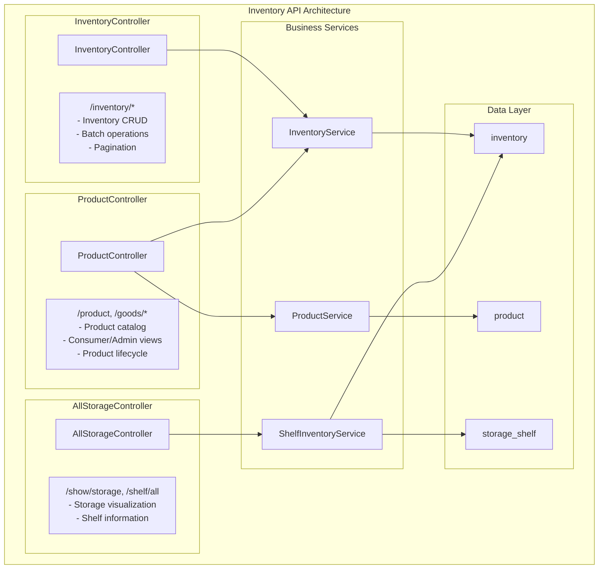
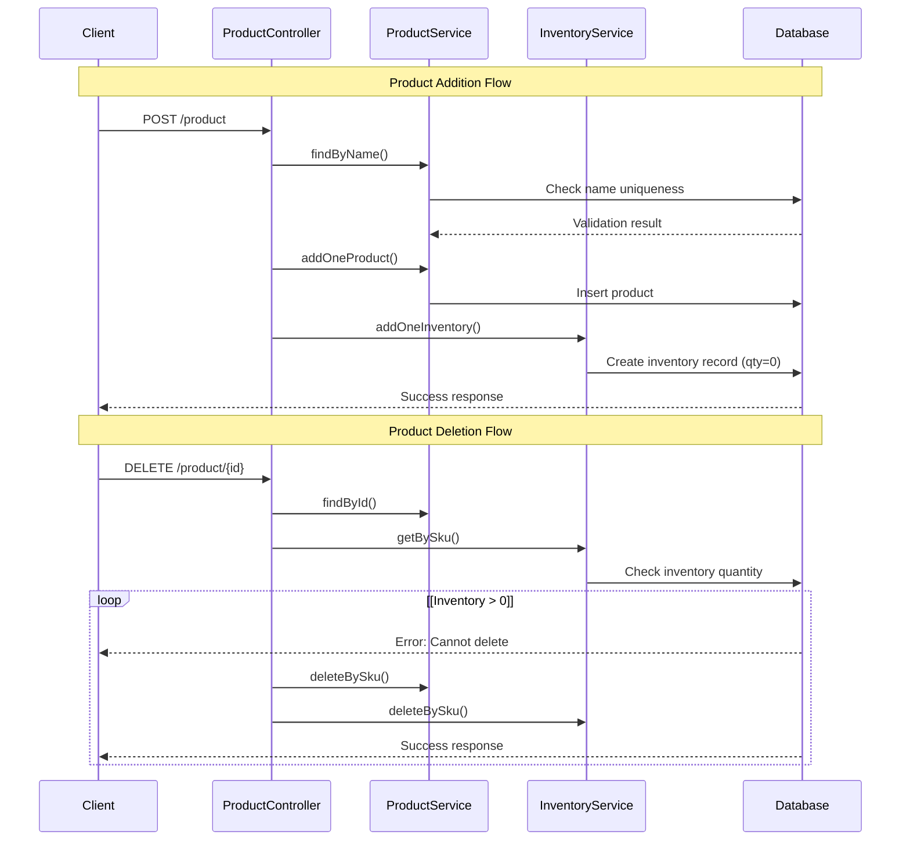

# Inventory APIs

> **Relevant source files**
> * [src/main/java/com/xhz/yuncang/controller/AllStorageController.java](https://github.com/yanzhe-Xiao/yuncang/blob/a4a28616/src/main/java/com/xhz/yuncang/controller/AllStorageController.java)
> * [src/main/java/com/xhz/yuncang/controller/InventoryController.java](https://github.com/yanzhe-Xiao/yuncang/blob/a4a28616/src/main/java/com/xhz/yuncang/controller/InventoryController.java)
> * [src/main/java/com/xhz/yuncang/controller/ProductController.java](https://github.com/yanzhe-Xiao/yuncang/blob/a4a28616/src/main/java/com/xhz/yuncang/controller/ProductController.java)

This document provides comprehensive documentation for all REST API endpoints related to inventory management, product catalog, and storage operations in the yuncang warehouse management system. The inventory APIs are divided into three main controller groups that handle different aspects of warehouse inventory operations.

For information about order processing APIs, see [Order Management APIs](/yanzhe-Xiao/yuncang/7.2-order-management-apis). For AGV and automation APIs, see [AGV Management APIs](/yanzhe-Xiao/yuncang/7.3-agv-management-apis).

## API Controller Overview

The inventory management functionality is distributed across three main controllers, each serving specific business domains:



Sources: [src/main/java/com/xhz/yuncang/controller/InventoryController.java L1-L302](https://github.com/yanzhe-Xiao/yuncang/blob/a4a28616/src/main/java/com/xhz/yuncang/controller/InventoryController.java#L1-L302)

 [src/main/java/com/xhz/yuncang/controller/ProductController.java L1-L422](https://github.com/yanzhe-Xiao/yuncang/blob/a4a28616/src/main/java/com/xhz/yuncang/controller/ProductController.java#L1-L422)

 [src/main/java/com/xhz/yuncang/controller/AllStorageController.java L1-L108](https://github.com/yanzhe-Xiao/yuncang/blob/a4a28616/src/main/java/com/xhz/yuncang/controller/AllStorageController.java#L1-L108)

## API Endpoint Structure

The following diagram maps the specific endpoints to their controller classes and HTTP methods:

```mermaid
flowchart TD

GET_INV["/inventory/getBySku<br>POST"]
BATCH_INV["/inventory/batch<br>POST"]
ALL_PROD["/inventory/products/all<br>GET"]
ADD_INV["/inventory/add<br>POST"]
DEL_INV["/inventory/delete<br>POST"]
PAGE_INV["/inventory/inventories/{pageNo}<br>GET"]
GET_PROD["/product<br>GET"]
GET_GOODS["/goods/{pageNo}<br>GET"]
UPD_PROD["/product/{sku}<br>PUT"]
ADD_PROD["/product<br>POST"]
DEL_PROD["/product/{id}<br>DELETE"]
GET_STORAGE["/show/storage<br>GET"]
GET_SHELVES["/shelf/all<br>GET"]
InventoryController["InventoryController"]
ProductController["ProductController"]
AllStorageController["AllStorageController"]

GET_INV --> InventoryController
BATCH_INV --> InventoryController
ALL_PROD --> InventoryController
ADD_INV --> InventoryController
DEL_INV --> InventoryController
PAGE_INV --> InventoryController
GET_PROD --> ProductController
GET_GOODS --> ProductController
UPD_PROD --> ProductController
ADD_PROD --> ProductController
DEL_PROD --> ProductController
GET_STORAGE --> AllStorageController
GET_SHELVES --> AllStorageController

subgraph subGraph2 ["Storage Visualization"]
    GET_STORAGE
    GET_SHELVES
end

subgraph subGraph1 ["Product Management"]
    GET_PROD
    GET_GOODS
    UPD_PROD
    ADD_PROD
    DEL_PROD
end

subgraph subGraph0 ["Inventory Operations"]
    GET_INV
    BATCH_INV
    ALL_PROD
    ADD_INV
    DEL_INV
    PAGE_INV
end
```



Sources: [src/main/java/com/xhz/yuncang/controller/InventoryController.java L60-L301](https://github.com/yanzhe-Xiao/yuncang/blob/a4a28616/src/main/java/com/xhz/yuncang/controller/InventoryController.java#L60-L301)

 [src/main/java/com/xhz/yuncang/controller/ProductController.java L88-L418](https://github.com/yanzhe-Xiao/yuncang/blob/a4a28616/src/main/java/com/xhz/yuncang/controller/ProductController.java#L88-L418)

 [src/main/java/com/xhz/yuncang/controller/AllStorageController.java L66-L105](https://github.com/yanzhe-Xiao/yuncang/blob/a4a28616/src/main/java/com/xhz/yuncang/controller/AllStorageController.java#L66-L105)

## InventoryController APIs

The `InventoryController` handles core inventory record operations including CRUD operations, batch queries, and pagination.

### Authentication and Authorization

All inventory endpoints require authentication and most require either `管理员` (Administrator) or `操作员` (Operator) roles:

| Endpoint | Authorization |
| --- | --- |
| `/inventory/getBySku` | `@PreAuthorize("hasRole('操作员') or hasRole('管理员')")` |
| `/inventory/batch` | `@PreAuthorize("hasRole('操作员') or hasRole('管理员')")` |
| `/inventory/add` | `@PreAuthorize("hasRole('操作员') or hasRole('管理员')")` |
| `/inventory/delete` | `@PreAuthorize("hasRole('操作员') or hasRole('管理员')")` |
| `/inventory/inventories/{pageNo}` | `@PreAuthorize("hasRole('操作员') or hasRole('管理员')")` |
| `/inventory/products/all` | No explicit authorization |

Sources: [src/main/java/com/xhz/yuncang/controller/InventoryController.java L47-L263](https://github.com/yanzhe-Xiao/yuncang/blob/a4a28616/src/main/java/com/xhz/yuncang/controller/InventoryController.java#L47-L263)

### Inventory Query Operations

#### Get Inventory by SKU

* **Endpoint**: `POST /inventory/getBySku`
* **Purpose**: Retrieve inventory record for a specific SKU
* **Request Body**: `{"sku": "string"}`
* **Response**: `Inventory` entity or 404 error
* **Implementation**: [src/main/java/com/xhz/yuncang/controller/InventoryController.java L60-L69](https://github.com/yanzhe-Xiao/yuncang/blob/a4a28616/src/main/java/com/xhz/yuncang/controller/InventoryController.java#L60-L69)

#### Batch Inventory Query

* **Endpoint**: `POST /inventory/batch`
* **Purpose**: Query multiple inventory records by SKU list
* **Request Body**: `InventoryListDTO` containing SKU array
* **Response**: Array of `InventoryDTO` objects with SKU and quantity
* **Implementation**: [src/main/java/com/xhz/yuncang/controller/InventoryController.java L86-L92](https://github.com/yanzhe-Xiao/yuncang/blob/a4a28616/src/main/java/com/xhz/yuncang/controller/InventoryController.java#L86-L92)

#### Get All Products with Inventory

* **Endpoint**: `GET /inventory/products/all`
* **Purpose**: Retrieve all products with available inventory (excluding reserved quantities)
* **Parameters**: `current` (default: 1), `pageSize` (default: 200)
* **Response**: Paginated list of `SalesOrderDetailAddDTO` with available quantities
* **Business Logic**: Calculates available inventory by subtracting pending outbound orders
* **Implementation**: [src/main/java/com/xhz/yuncang/controller/InventoryController.java L104-L143](https://github.com/yanzhe-Xiao/yuncang/blob/a4a28616/src/main/java/com/xhz/yuncang/controller/InventoryController.java#L104-L143)

### Inventory Modification Operations

#### Add Inventory Record

* **Endpoint**: `POST /inventory/add`
* **Purpose**: Create new inventory record
* **Request Body**: `InventoryDTO` with SKU and quantity
* **Validation**: Ensures SKU uniqueness
* **Response**: Success message or error if SKU already exists
* **Implementation**: [src/main/java/com/xhz/yuncang/controller/InventoryController.java L191-L207](https://github.com/yanzhe-Xiao/yuncang/blob/a4a28616/src/main/java/com/xhz/yuncang/controller/InventoryController.java#L191-L207)

#### Delete Inventory Record

* **Endpoint**: `POST /inventory/delete`
* **Purpose**: Remove inventory record by SKU
* **Request Body**: `{"sku": "string"}`
* **Validation**: Verifies inventory record exists
* **Response**: Success message or error if not found
* **Implementation**: [src/main/java/com/xhz/yuncang/controller/InventoryController.java L224-L239](https://github.com/yanzhe-Xiao/yuncang/blob/a4a28616/src/main/java/com/xhz/yuncang/controller/InventoryController.java#L224-L239)

### Paginated Inventory Query

* **Endpoint**: `GET /inventory/inventories/{pageNo}`
* **Purpose**: Retrieve paginated inventory records
* **Parameters**: `pageNo` (path parameter, starts from 1)
* **Page Size**: Configured via `Constants.PageSize`
* **Response**: `PageVo<InventoryInfoVo>` with navigation metadata
* **Implementation**: [src/main/java/com/xhz/yuncang/controller/InventoryController.java L262-L301](https://github.com/yanzhe-Xiao/yuncang/blob/a4a28616/src/main/java/com/xhz/yuncang/controller/InventoryController.java#L262-L301)

Sources: [src/main/java/com/xhz/yuncang/controller/InventoryController.java L60-L301](https://github.com/yanzhe-Xiao/yuncang/blob/a4a28616/src/main/java/com/xhz/yuncang/controller/InventoryController.java#L60-L301)

## ProductController APIs

The `ProductController` manages the product catalog with separate views for consumers and administrators, plus full CRUD operations.

### Product Query Operations

#### Consumer Product View

* **Endpoint**: `GET /product`
* **Purpose**: Public product catalog for consumers
* **Parameters**: `current` (default: 1), `pageSize` (default: 10), `name` (optional filter)
* **Features**: Name-based search with `LIKE` query
* **Response**: Paginated `ProductInfoVo` list with navigation metadata
* **Implementation**: [src/main/java/com/xhz/yuncang/controller/ProductController.java L88-L138](https://github.com/yanzhe-Xiao/yuncang/blob/a4a28616/src/main/java/com/xhz/yuncang/controller/ProductController.java#L88-L138)

#### Administrator Goods View

* **Endpoint**: `GET /goods/{pageNo}`
* **Purpose**: Administrative view of goods with detailed information
* **Authorization**: Requires `管理员` or `操作员` role
* **Parameters**: `pageNo` (path parameter)
* **Response**: `PageVo<GoodsInfoVo>` with administrative details
* **Implementation**: [src/main/java/com/xhz/yuncang/controller/ProductController.java L160-L203](https://github.com/yanzhe-Xiao/yuncang/blob/a4a28616/src/main/java/com/xhz/yuncang/controller/ProductController.java#L160-L203)

### Product Lifecycle Management

The following diagram shows the product lifecycle operations and their relationships:



Sources: [src/main/java/com/xhz/yuncang/controller/ProductController.java L288-L372](https://github.com/yanzhe-Xiao/yuncang/blob/a4a28616/src/main/java/com/xhz/yuncang/controller/ProductController.java#L288-L372)

#### Add Product

* **Endpoint**: `POST /product`
* **Purpose**: Create new product with automatic inventory initialization
* **Authorization**: Requires `管理员` or `操作员` role
* **Request Body**: `ProductAddDTO` with all product details
* **Business Logic**: * Validates name uniqueness * Creates product record * Automatically creates inventory record with quantity 0 * Implements rollback on inventory creation failure
* **Implementation**: [src/main/java/com/xhz/yuncang/controller/ProductController.java L288-L323](https://github.com/yanzhe-Xiao/yuncang/blob/a4a28616/src/main/java/com/xhz/yuncang/controller/ProductController.java#L288-L323)

#### Update Product

* **Endpoint**: `PUT /product/{sku}`
* **Purpose**: Update product information by SKU
* **Authorization**: Requires `管理员` or `操作员` role
* **Request Body**: `ProductInfoDTO` with updated fields
* **Validation**: Ensures name uniqueness (excluding current product)
* **Implementation**: [src/main/java/com/xhz/yuncang/controller/ProductController.java L231-L262](https://github.com/yanzhe-Xiao/yuncang/blob/a4a28616/src/main/java/com/xhz/yuncang/controller/ProductController.java#L231-L262)

#### Delete Product

* **Endpoint**: `DELETE /product/{id}`
* **Purpose**: Remove product and associated inventory record
* **Authorization**: Requires `管理员` or `操作员` role
* **Validation**: Inventory quantity must be 0
* **Business Logic**: Deletes both product and inventory records
* **Implementation**: [src/main/java/com/xhz/yuncang/controller/ProductController.java L341-L372](https://github.com/yanzhe-Xiao/yuncang/blob/a4a28616/src/main/java/com/xhz/yuncang/controller/ProductController.java#L341-L372)

Sources: [src/main/java/com/xhz/yuncang/controller/ProductController.java L88-L418](https://github.com/yanzhe-Xiao/yuncang/blob/a4a28616/src/main/java/com/xhz/yuncang/controller/ProductController.java#L88-L418)

## AllStorageController APIs

The `AllStorageController` provides warehouse visualization data and shelf information for monitoring and analytics.

### Storage Visualization

#### Get Storage Overview

* **Endpoint**: `GET /show/storage`
* **Purpose**: Retrieve warehouse storage capacity and utilization data
* **Authorization**: Requires `管理员` or `操作员` role
* **Response Structure**: ```json {   "totalWeight": "number",   "currentWeight": "number",    "details": [     {       "name": "string",       "quantity": "number"     }   ] } ```
* **Implementation**: [src/main/java/com/xhz/yuncang/controller/AllStorageController.java L66-L73](https://github.com/yanzhe-Xiao/yuncang/blob/a4a28616/src/main/java/com/xhz/yuncang/controller/AllStorageController.java#L66-L73)

#### Get All Shelf Information

* **Endpoint**: `GET /shelf/all`
* **Purpose**: Retrieve comprehensive shelf configuration and status data
* **Authorization**: Requires `管理员` or `操作员` role
* **Response Structure**: ```json {   "shelves": [     {       "shelfCode": "string",       "shelfX": "number",       "shelfY": "number",        "maxWeight": "number"     }   ] } ```
* **Implementation**: [src/main/java/com/xhz/yuncang/controller/AllStorageController.java L100-L105](https://github.com/yanzhe-Xiao/yuncang/blob/a4a28616/src/main/java/com/xhz/yuncang/controller/AllStorageController.java#L100-L105)

Sources: [src/main/java/com/xhz/yuncang/controller/AllStorageController.java L66-L105](https://github.com/yanzhe-Xiao/yuncang/blob/a4a28616/src/main/java/com/xhz/yuncang/controller/AllStorageController.java#L66-L105)

## Data Transfer Objects

The inventory APIs use several DTOs for data exchange:

| DTO Class | Purpose | Key Fields |
| --- | --- | --- |
| `InventoryDTO` | Basic inventory data | `sku`, `quantity` |
| `InventoryListDTO` | Batch SKU queries | `sku[]` |
| `ProductInfoDTO` | Product updates | `name`, `description`, `weight`, dimensions |
| `ProductAddDTO` | Product creation | All product fields including `sku` |
| `SalesOrderDetailAddDTO` | Available inventory | `name`, `sku`, `quantity` |
| `AllStorageVo` | Storage visualization | `totalWeight`, `currentWeight`, `details[]` |
| `AllShelfInfoVo` | Shelf information | `shelves[]` |

Sources: [src/main/java/com/xhz/yuncang/controller/InventoryController.java L4-L12](https://github.com/yanzhe-Xiao/yuncang/blob/a4a28616/src/main/java/com/xhz/yuncang/controller/InventoryController.java#L4-L12)

 [src/main/java/com/xhz/yuncang/controller/ProductController.java L6-L18](https://github.com/yanzhe-Xiao/yuncang/blob/a4a28616/src/main/java/com/xhz/yuncang/controller/ProductController.java#L6-L18)

 [src/main/java/com/xhz/yuncang/controller/AllStorageController.java L5-L6](https://github.com/yanzhe-Xiao/yuncang/blob/a4a28616/src/main/java/com/xhz/yuncang/controller/AllStorageController.java#L5-L6)

## Error Handling

All inventory API endpoints follow consistent error handling patterns:

* **400 Bad Request**: Invalid input data, validation failures, business rule violations
* **404 Not Found**: Requested resource does not exist
* **500 Internal Server Error**: Database or service layer failures
* **200 OK**: Successful operations with `AjaxResult.success()` wrapper

Response format uses the `AjaxResult` wrapper class for consistent API responses across all endpoints.

Sources: [src/main/java/com/xhz/yuncang/controller/InventoryController.java L65-L301](https://github.com/yanzhe-Xiao/yuncang/blob/a4a28616/src/main/java/com/xhz/yuncang/controller/InventoryController.java#L65-L301)

 [src/main/java/com/xhz/yuncang/controller/ProductController.java L95-L417](https://github.com/yanzhe-Xiao/yuncang/blob/a4a28616/src/main/java/com/xhz/yuncang/controller/ProductController.java#L95-L417)

 [src/main/java/com/xhz/yuncang/controller/AllStorageController.java L72-L104](https://github.com/yanzhe-Xiao/yuncang/blob/a4a28616/src/main/java/com/xhz/yuncang/controller/AllStorageController.java#L72-L104)