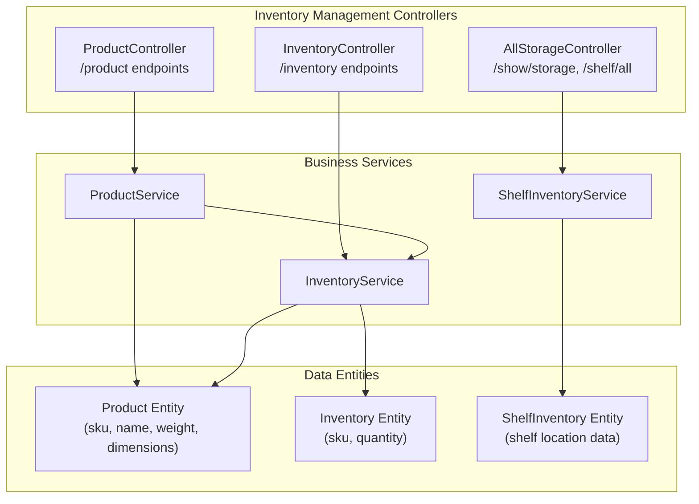
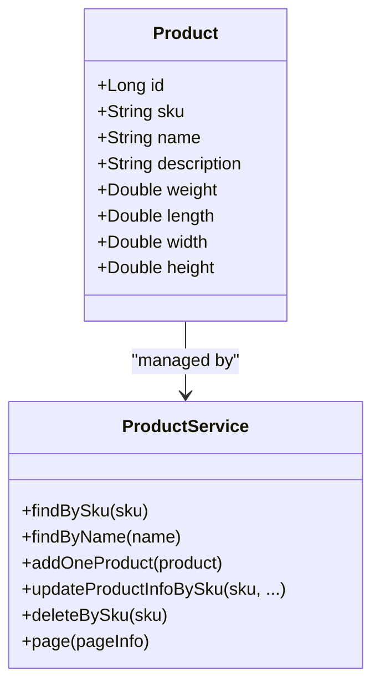
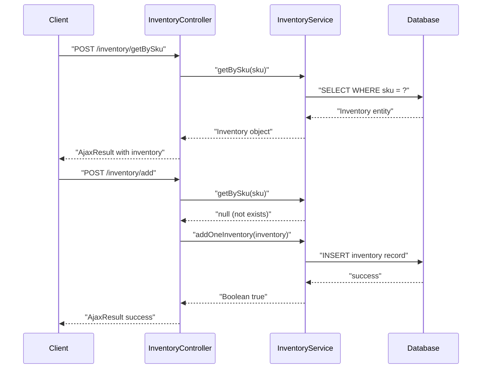
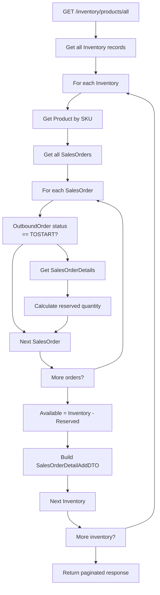
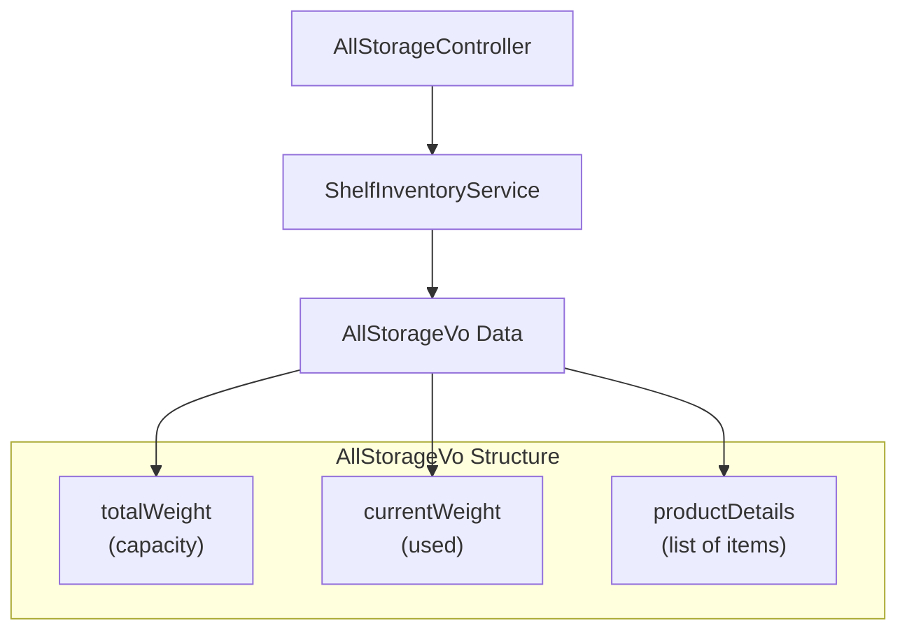
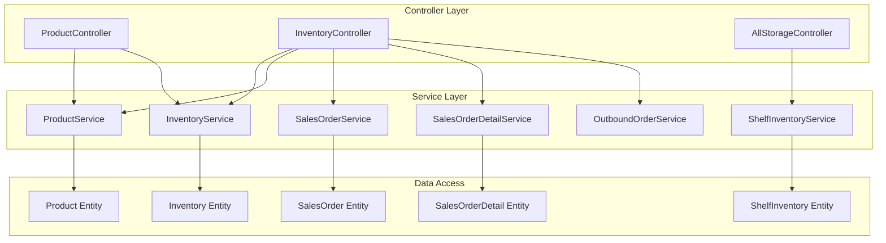

# Inventory Management

> **Relevant source files**
> * [src/main/java/com/xhz/yuncang/controller/AllStorageController.java](https://github.com/yanzhe-Xiao/yuncang/blob/a4a28616/src/main/java/com/xhz/yuncang/controller/AllStorageController.java)
> * [src/main/java/com/xhz/yuncang/controller/InventoryController.java](https://github.com/yanzhe-Xiao/yuncang/blob/a4a28616/src/main/java/com/xhz/yuncang/controller/InventoryController.java)
> * [src/main/java/com/xhz/yuncang/controller/ProductController.java](https://github.com/yanzhe-Xiao/yuncang/blob/a4a28616/src/main/java/com/xhz/yuncang/controller/ProductController.java)

## Purpose and Scope

This document covers the inventory management functionality of the yuncang warehouse management system, including product catalog management, inventory quantity tracking, and storage visualization. The inventory management system handles the core business logic for managing product information, monitoring stock levels, and providing warehouse capacity insights.

For information about order processing workflows that interact with inventory, see [Order Processing](/yanzhe-Xiao/yuncang/4.2-order-processing). For database schema details of inventory-related entities, see [Core Entities](/yanzhe-Xiao/yuncang/5.1-core-entities).

## System Overview

The inventory management system consists of three main functional areas:

1. **Product Catalog Management** - Managing product master data including SKU, specifications, and attributes
2. **Inventory Quantity Tracking** - Monitoring stock levels and quantity changes per product SKU
3. **Storage Visualization** - Providing views of warehouse capacity, shelf utilization, and storage allocation

Sources: [src/main/java/com/xhz/yuncang/controller/ProductController.java L51-L52](https://github.com/yanzhe-Xiao/yuncang/blob/a4a28616/src/main/java/com/xhz/yuncang/controller/ProductController.java#L51-L52)

 [src/main/java/com/xhz/yuncang/controller/InventoryController.java L45-L46](https://github.com/yanzhe-Xiao/yuncang/blob/a4a28616/src/main/java/com/xhz/yuncang/controller/InventoryController.java#L45-L46)

 [src/main/java/com/xhz/yuncang/controller/AllStorageController.java L32-L33](https://github.com/yanzhe-Xiao/yuncang/blob/a4a28616/src/main/java/com/xhz/yuncang/controller/AllStorageController.java#L32-L33)

## Product Catalog Management

### ProductController API Endpoints

The `ProductController` manages the complete lifecycle of product master data through REST endpoints:

| Endpoint | Method | Purpose | Access Control |
| --- | --- | --- | --- |
| `/product` | GET | Paginated product listing with search | Public |
| `/goods/{pageNo}` | GET | Admin product management view | Admin/Operator |
| `/product` | POST | Add new product | Admin/Operator |
| `/product/{sku}` | PUT | Update product information | Admin/Operator |
| `/product/{id}` | DELETE | Remove product and inventory | Admin/Operator |

### Product Entity Structure

Products are identified by unique SKU and contain the following attributes:

### Product Management Workflow

The product management follows these business rules:

1. **Uniqueness Constraints**: Product names must be unique across the system [src/main/java/com/xhz/yuncang/controller/ProductController.java L296-L300](https://github.com/yanzhe-Xiao/yuncang/blob/a4a28616/src/main/java/com/xhz/yuncang/controller/ProductController.java#L296-L300)
2. **Inventory Integration**: Adding a product automatically creates an `Inventory` record with quantity 0 [src/main/java/com/xhz/yuncang/controller/ProductController.java L305-L308](https://github.com/yanzhe-Xiao/yuncang/blob/a4a28616/src/main/java/com/xhz/yuncang/controller/ProductController.java#L305-L308)
3. **Deletion Safety**: Products can only be deleted when inventory quantity is 0 [src/main/java/com/xhz/yuncang/controller/ProductController.java L350-L353](https://github.com/yanzhe-Xiao/yuncang/blob/a4a28616/src/main/java/com/xhz/yuncang/controller/ProductController.java#L350-L353)

Sources: [src/main/java/com/xhz/yuncang/controller/ProductController.java L288-L323](https://github.com/yanzhe-Xiao/yuncang/blob/a4a28616/src/main/java/com/xhz/yuncang/controller/ProductController.java#L288-L323)

 [src/main/java/com/xhz/yuncang/controller/ProductController.java L341-L372](https://github.com/yanzhe-Xiao/yuncang/blob/a4a28616/src/main/java/com/xhz/yuncang/controller/ProductController.java#L341-L372)

## Inventory Quantity Tracking

### InventoryController API Endpoints

The `InventoryController` handles inventory record operations:

| Endpoint | Method | Purpose | Access Control |
| --- | --- | --- | --- |
| `/inventory/getBySku` | POST | Query inventory by SKU | Admin/Operator |
| `/inventory/batch` | POST | Batch query multiple SKUs | Admin/Operator |
| `/inventory/add` | POST | Create inventory record | Admin/Operator |
| `/inventory/delete` | POST | Remove inventory record | Admin/Operator |
| `/inventory/inventories/{pageNo}` | GET | Paginated inventory listing | Admin/Operator |
| `/inventory/products/all` | GET | Available products with quantities | Public |

### Inventory Entity and Operations

### Available Products Query Logic

The `/inventory/products/all` endpoint implements complex business logic to calculate available quantities by subtracting pending outbound orders from current inventory:

Sources: [src/main/java/com/xhz/yuncang/controller/InventoryController.java L104-L143](https://github.com/yanzhe-Xiao/yuncang/blob/a4a28616/src/main/java/com/xhz/yuncang/controller/InventoryController.java#L104-L143)

 [src/main/java/com/xhz/yuncang/controller/InventoryController.java L115-L135](https://github.com/yanzhe-Xiao/yuncang/blob/a4a28616/src/main/java/com/xhz/yuncang/controller/InventoryController.java#L115-L135)

## Storage Visualization

### AllStorageController Functionality

The `AllStorageController` provides warehouse visualization data through two main endpoints:

#### Storage Overview (/show/storage)

Aggregates warehouse capacity information:

The response structure contains:

* `totalWeight`: Total warehouse weight capacity
* `currentWeight`: Currently used weight
* `details`: Array of product details with name and quantity

#### Shelf Information (/shelf/all)

Returns comprehensive shelf data including coordinates, capacity, and current utilization through the `AllShelfInfoVo` structure.

Sources: [src/main/java/com/xhz/yuncang/controller/AllStorageController.java L66-L73](https://github.com/yanzhe-Xiao/yuncang/blob/a4a28616/src/main/java/com/xhz/yuncang/controller/AllStorageController.java#L66-L73)

 [src/main/java/com/xhz/yuncang/controller/AllStorageController.java L100-L105](https://github.com/yanzhe-Xiao/yuncang/blob/a4a28616/src/main/java/com/xhz/yuncang/controller/AllStorageController.java#L100-L105)

## Data Flow Architecture

### Service Layer Integration

### Business Rules and Constraints

1. **SKU Uniqueness**: Both Product and Inventory entities use SKU as the primary business key
2. **Lifecycle Coupling**: Product creation automatically creates corresponding Inventory record [src/main/java/com/xhz/yuncang/controller/ProductController.java L305-L308](https://github.com/yanzhe-Xiao/yuncang/blob/a4a28616/src/main/java/com/xhz/yuncang/controller/ProductController.java#L305-L308)
3. **Deletion Constraints**: Products can only be deleted when inventory quantity is zero [src/main/java/com/xhz/yuncang/controller/ProductController.java L350-L353](https://github.com/yanzhe-Xiao/yuncang/blob/a4a28616/src/main/java/com/xhz/yuncang/controller/ProductController.java#L350-L353)
4. **Available Quantity Calculation**: Real-time calculation considers pending outbound orders [src/main/java/com/xhz/yuncang/controller/InventoryController.java L120-L135](https://github.com/yanzhe-Xiao/yuncang/blob/a4a28616/src/main/java/com/xhz/yuncang/controller/InventoryController.java#L120-L135)

Sources: [src/main/java/com/xhz/yuncang/controller/ProductController.java L52-L63](https://github.com/yanzhe-Xiao/yuncang/blob/a4a28616/src/main/java/com/xhz/yuncang/controller/ProductController.java#L52-L63)

 [src/main/java/com/xhz/yuncang/controller/InventoryController.java L48-L103](https://github.com/yanzhe-Xiao/yuncang/blob/a4a28616/src/main/java/com/xhz/yuncang/controller/InventoryController.java#L48-L103)

 [src/main/java/com/xhz/yuncang/controller/AllStorageController.java L35-L40](https://github.com/yanzhe-Xiao/yuncang/blob/a4a28616/src/main/java/com/xhz/yuncang/controller/AllStorageController.java#L35-L40)