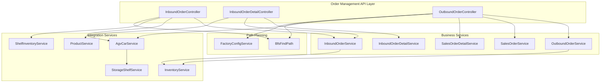
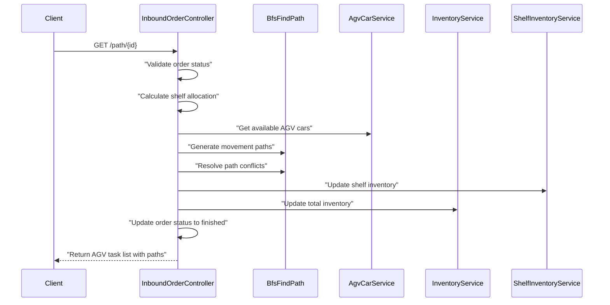
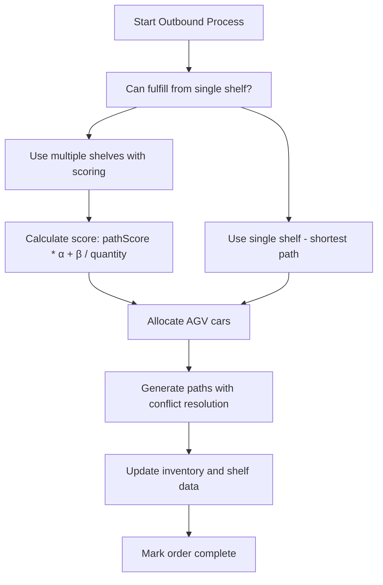
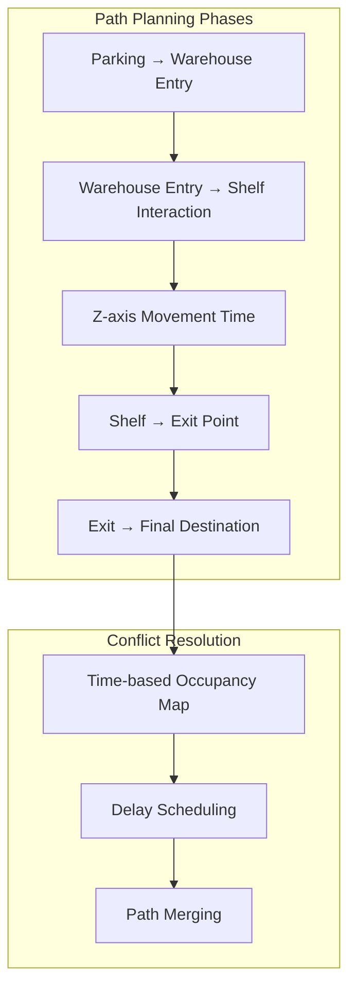

# Order Management APIs

> **Relevant source files**
> * [src/main/java/com/xhz/yuncang/controller/InboundOrderController.java](https://github.com/yanzhe-Xiao/yuncang/blob/a4a28616/src/main/java/com/xhz/yuncang/controller/InboundOrderController.java)
> * [src/main/java/com/xhz/yuncang/controller/InboundOrderDetailController.java](https://github.com/yanzhe-Xiao/yuncang/blob/a4a28616/src/main/java/com/xhz/yuncang/controller/InboundOrderDetailController.java)
> * [src/main/java/com/xhz/yuncang/controller/OutboundOrderController.java](https://github.com/yanzhe-Xiao/yuncang/blob/a4a28616/src/main/java/com/xhz/yuncang/controller/OutboundOrderController.java)

This document covers the REST API endpoints for managing inbound and outbound orders within the yuncang warehouse management system. These APIs handle the complete order lifecycle from creation to execution, including automated path planning for AGV operations.

For inventory-related operations see [Inventory APIs](/yanzhe-Xiao/yuncang/7.1-inventory-apis), and for AGV-specific controls see [AGV Management APIs](/yanzhe-Xiao/yuncang/7.3-agv-management-apis).

## Overview

The Order Management APIs consist of three main controller classes that handle different aspects of warehouse order processing:

* **InboundOrderController** - Manages incoming goods orders and warehouse storage operations
* **InboundOrderDetailController** - Handles detailed line items within inbound orders
* **OutboundOrderController** - Processes outgoing shipment orders and picking operations

All endpoints require authentication and appropriate role-based permissions (`管理员` or `操作员`).

## API Architecture



Sources: [src/main/java/com/xhz/yuncang/controller/InboundOrderController.java L50-L103](https://github.com/yanzhe-Xiao/yuncang/blob/a4a28616/src/main/java/com/xhz/yuncang/controller/InboundOrderController.java#L50-L103)

 [src/main/java/com/xhz/yuncang/controller/InboundOrderDetailController.java L48-L65](https://github.com/yanzhe-Xiao/yuncang/blob/a4a28616/src/main/java/com/xhz/yuncang/controller/InboundOrderDetailController.java#L48-L65)

 [src/main/java/com/xhz/yuncang/controller/OutboundOrderController.java L45-L81](https://github.com/yanzhe-Xiao/yuncang/blob/a4a28616/src/main/java/com/xhz/yuncang/controller/OutboundOrderController.java#L45-L81)

## Inbound Order Management

### Create Inbound Order

**Endpoint:** `POST /inbound`

Creates a new inbound order with validation and capacity checking.

**Request Body:**

```json
{
  "orderName": "string",
  "details": [
    {
      "name": "string",
      "sku": "string", 
      "quantity": "integer"
    }
  ]
}
```

**Process Flow:**

1. Validates order name uniqueness
2. Calculates total shelf capacity requirements
3. Validates product existence
4. Generates snowflake algorithm order number
5. Creates order and detail records

Sources: [src/main/java/com/xhz/yuncang/controller/InboundOrderController.java L160-L237](https://github.com/yanzhe-Xiao/yuncang/blob/a4a28616/src/main/java/com/xhz/yuncang/controller/InboundOrderController.java#L160-L237)

### Execute Inbound Operation

**Endpoint:** `GET /path/{id}`

Executes the inbound operation with automated AGV path planning and inventory updates.

**Algorithm Components:**

* Shelf allocation by shortest path
* AGV car assignment and load optimization
* Path planning with conflict resolution
* Database updates (inventory, shelf relationships, order status)



Sources: [src/main/java/com/xhz/yuncang/controller/InboundOrderController.java L377-L907](https://github.com/yanzhe-Xiao/yuncang/blob/a4a28616/src/main/java/com/xhz/yuncang/controller/InboundOrderController.java#L377-L907)

### List Inbound Orders

**Endpoint:** `GET /inbound`

**Parameters:**

* `current` (default: 1) - Current page number
* `pageSize` (default: 10) - Items per page
* `orderName` (default: "") - Order name filter

**Response:**

```
{
  "prev": "integer",
  "next": "integer", 
  "total": "integer",
  "list": [
    {
      "id": "integer",
      "orderName": "string",
      "orderNumber": "string",
      "createTime": "datetime",
      "userId": "string", 
      "status": "string",
      "details": [...]
    }
  ]
}
```

Sources: [src/main/java/com/xhz/yuncang/controller/InboundOrderController.java L301-L359](https://github.com/yanzhe-Xiao/yuncang/blob/a4a28616/src/main/java/com/xhz/yuncang/controller/InboundOrderController.java#L301-L359)

### Delete Inbound Order

**Endpoint:** `DELETE /inbound/{id}`

Deletes an inbound order and its associated details. Only allows deletion of orders not in "未开始" (not started) status.

Sources: [src/main/java/com/xhz/yuncang/controller/InboundOrderController.java L244-L275](https://github.com/yanzhe-Xiao/yuncang/blob/a4a28616/src/main/java/com/xhz/yuncang/controller/InboundOrderController.java#L244-L275)

## Inbound Order Detail Management

### Query Order Details

**Endpoint:** `POST /inboundOrderDetail/{pageNo}`

**Request Body:**

```json
{
  "orderNumber": "string"
}
```

Returns paginated order details for a specific order number.

Sources: [src/main/java/com/xhz/yuncang/controller/InboundOrderDetailController.java L98-L140](https://github.com/yanzhe-Xiao/yuncang/blob/a4a28616/src/main/java/com/xhz/yuncang/controller/InboundOrderDetailController.java#L98-L140)

### Add Order Detail

**Endpoint:** `POST /inboundOrderDetail/add`

**Request Body:**

```json
{
  "orderNumber": "string",
  "sku": "string",
  "quantity": "integer"
}
```

**Validation Rules:**

* Order number must exist
* SKU must be valid product
* Quantity must be non-negative integer
* No duplicate SKU per order

Sources: [src/main/java/com/xhz/yuncang/controller/InboundOrderDetailController.java L172-L209](https://github.com/yanzhe-Xiao/yuncang/blob/a4a28616/src/main/java/com/xhz/yuncang/controller/InboundOrderDetailController.java#L172-L209)

### Update Order Detail

**Endpoint:** `POST /inboundOrderDetail/update`

Updates quantity for existing order detail. Order number and SKU cannot be modified.

Sources: [src/main/java/com/xhz/yuncang/controller/InboundOrderDetailController.java L239-L276](https://github.com/yanzhe-Xiao/yuncang/blob/a4a28616/src/main/java/com/xhz/yuncang/controller/InboundOrderDetailController.java#L239-L276)

### Remove Order Detail

**Endpoint:** `POST /inboundOrderDetail/remove`

**Request Body:**

```json
{
  "orderNumber": "string",
  "sku": "string" 
}
```

Sources: [src/main/java/com/xhz/yuncang/controller/InboundOrderDetailController.java L295-L310](https://github.com/yanzhe-Xiao/yuncang/blob/a4a28616/src/main/java/com/xhz/yuncang/controller/InboundOrderDetailController.java#L295-L310)

## Outbound Order Management

### List Outbound Orders

**Endpoint:** `GET /outboundorder/{pageNo}`

Returns paginated list of outbound orders with basic information.

Sources: [src/main/java/com/xhz/yuncang/controller/OutboundOrderController.java L102-L146](https://github.com/yanzhe-Xiao/yuncang/blob/a4a28616/src/main/java/com/xhz/yuncang/controller/OutboundOrderController.java#L102-L146)

### Execute Outbound Operation

**Endpoint:** `PUT /out/{id}`

**Request Body:**

```json
{
  "orderNumber": "string",
  "status": "string"
}
```

Executes outbound operation with intelligent picking strategy and AGV automation.

**Picking Strategy Logic:**



**Strategy Parameters:**

* `system-judged` - Intelligent decision based on SKU count and quantities
* `short-path` - Prioritize shortest paths (α=2.0, β=500.0)
* `more-stock` - Prefer shelves with higher quantities (α=0.5, β=3000.0)
* `balanced` - Balanced approach (α=1.0, β=1000.0)

Sources: [src/main/java/com/xhz/yuncang/controller/OutboundOrderController.java L182-L795](https://github.com/yanzhe-Xiao/yuncang/blob/a4a28616/src/main/java/com/xhz/yuncang/controller/OutboundOrderController.java#L182-L795)

### Preview Outbound Path

**Endpoint:** `GET /out/{id}`

Returns the planned outbound path and AGV assignments without executing the operation or updating inventory.

Sources: [src/main/java/com/xhz/yuncang/controller/OutboundOrderController.java L803-L1393](https://github.com/yanzhe-Xiao/yuncang/blob/a4a28616/src/main/java/com/xhz/yuncang/controller/OutboundOrderController.java#L803-L1393)

## Path Planning Integration

Both inbound and outbound operations integrate with the `BfsFindPath` utility for AGV route optimization:



**Key Constants:**

* `MOVE_DIFFER_X`, `MOVE_DIFFER_Y`, `MOVE_DIFFER_Z` - Movement cost multipliers
* `INTERACTION` - Loading/unloading time constant
* `STATUS_ORDER_TOSTART`, `STATUS_ORDER_FINISHED` - Order status values

Sources: [src/main/java/com/xhz/yuncang/controller/InboundOrderController.java L630-L907](https://github.com/yanzhe-Xiao/yuncang/blob/a4a28616/src/main/java/com/xhz/yuncang/controller/InboundOrderController.java#L630-L907)

 [src/main/java/com/xhz/yuncang/controller/OutboundOrderController.java L535-L795](https://github.com/yanzhe-Xiao/yuncang/blob/a4a28616/src/main/java/com/xhz/yuncang/controller/OutboundOrderController.java#L535-L795)

## Error Handling

All endpoints implement comprehensive error handling with standardized `AjaxResult` responses:

| HTTP Status | Condition | Example Message |
| --- | --- | --- |
| 400 | Validation Error | "订单名称重复", "库存不足" |
| 400 | Business Rule Violation | "该出库单已出库或正在出库" |
| 404 | Resource Not Found | "没有该订单" |
| 500 | System Error | "状态更新失败" |

Sources: [src/main/java/com/xhz/yuncang/controller/InboundOrderController.java L164-L210](https://github.com/yanzhe-Xiao/yuncang/blob/a4a28616/src/main/java/com/xhz/yuncang/controller/InboundOrderController.java#L164-L210)

 [src/main/java/com/xhz/yuncang/controller/OutboundOrderController.java L185-L196](https://github.com/yanzhe-Xiao/yuncang/blob/a4a28616/src/main/java/com/xhz/yuncang/controller/OutboundOrderController.java#L185-L196)