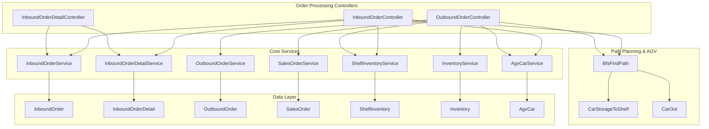
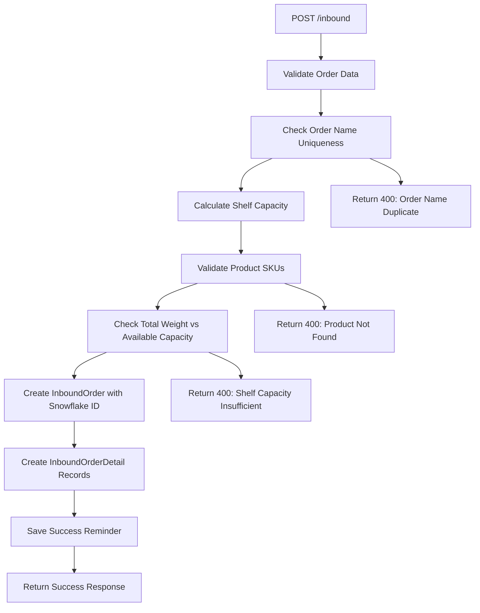
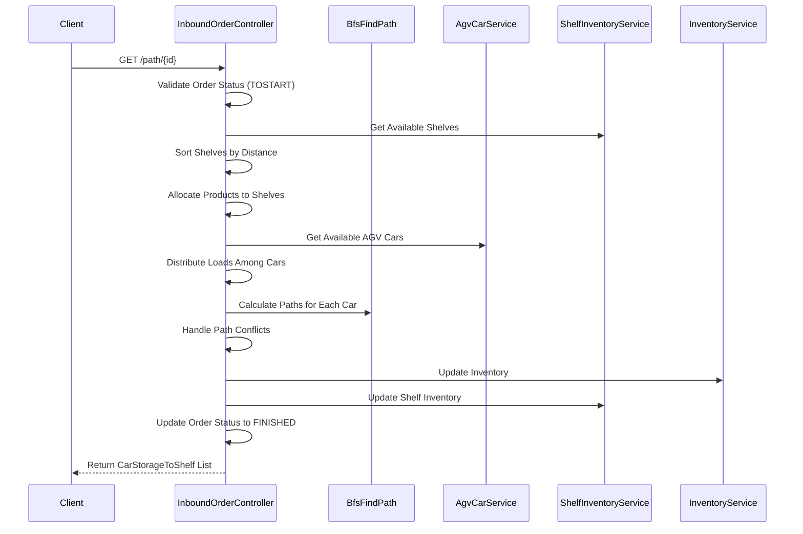
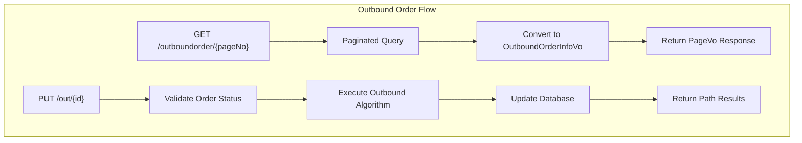
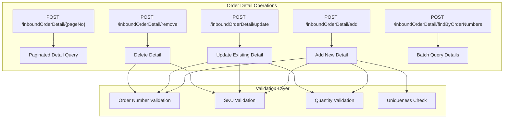
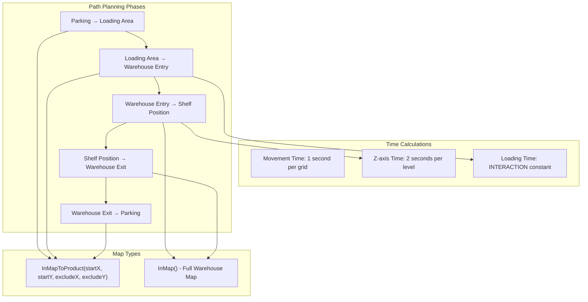
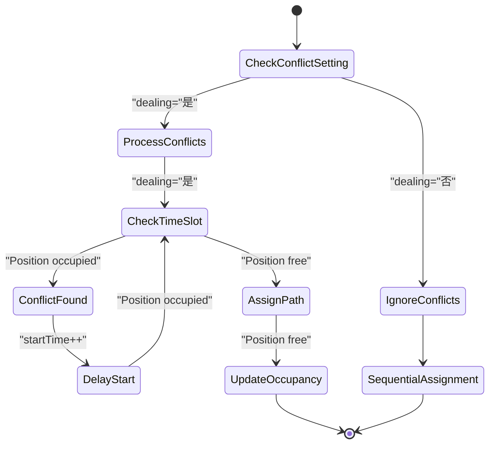
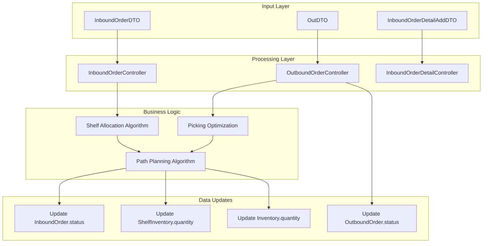

# Order Processing

> **Relevant source files**
> * [src/main/java/com/xhz/yuncang/controller/InboundOrderController.java](https://github.com/yanzhe-Xiao/yuncang/blob/a4a28616/src/main/java/com/xhz/yuncang/controller/InboundOrderController.java)
> * [src/main/java/com/xhz/yuncang/controller/InboundOrderDetailController.java](https://github.com/yanzhe-Xiao/yuncang/blob/a4a28616/src/main/java/com/xhz/yuncang/controller/InboundOrderDetailController.java)
> * [src/main/java/com/xhz/yuncang/controller/OutboundOrderController.java](https://github.com/yanzhe-Xiao/yuncang/blob/a4a28616/src/main/java/com/xhz/yuncang/controller/OutboundOrderController.java)

## Purpose and Scope

This document covers the order processing subsystem of the yuncang warehouse management system, which handles both inbound and outbound order workflows. Order processing encompasses order creation, validation, execution, and integration with the AGV automation system for physical warehouse operations.

For inventory tracking and storage management details, see [Inventory Management](/yanzhe-Xiao/yuncang/4.1-inventory-management). For AGV automation specifics, see [AGV Automation](/yanzhe-Xiao/yuncang/4.3-agv-automation). For complete API documentation, see [Order Management APIs](/yanzhe-Xiao/yuncang/7.2-order-management-apis).

## System Overview

The order processing system consists of three main controllers that handle the complete order lifecycle from creation to fulfillment:



Sources: [src/main/java/com/xhz/yuncang/controller/InboundOrderController.java L31-L53](https://github.com/yanzhe-Xiao/yuncang/blob/a4a28616/src/main/java/com/xhz/yuncang/controller/InboundOrderController.java#L31-L53)

 [src/main/java/com/xhz/yuncang/controller/InboundOrderDetailController.java L48-L65](https://github.com/yanzhe-Xiao/yuncang/blob/a4a28616/src/main/java/com/xhz/yuncang/controller/InboundOrderDetailController.java#L48-L65)

 [src/main/java/com/xhz/yuncang/controller/OutboundOrderController.java L45-L81](https://github.com/yanzhe-Xiao/yuncang/blob/a4a28616/src/main/java/com/xhz/yuncang/controller/OutboundOrderController.java#L45-L81)

## Inbound Order Processing

### Order Creation and Validation

The `InboundOrderController` manages the complete inbound order lifecycle through several key endpoints:



**Key validation steps implemented in `addInboundOrder`:**

| Validation | Implementation | Error Response |
| --- | --- | --- |
| Order Name Uniqueness | `inboundOrderService.getByOrderName()` | "订单名称重复" |
| Product Existence | `productService.findByName()` | "没有该物品" |
| Shelf Capacity | Weight calculation vs `maxWeight` | "货架容量不足" |
| Data Completeness | Null checks on DTO fields | "请填入正确信息" |

Sources: [src/main/java/com/xhz/yuncang/controller/InboundOrderController.java L160-L237](https://github.com/yanzhe-Xiao/yuncang/blob/a4a28616/src/main/java/com/xhz/yuncang/controller/InboundOrderController.java#L160-L237)

### Order Execution and Path Planning

The order execution process involves complex algorithms for shelf allocation and AGV path planning:



**Distance Calculation Formula:**

```
distance = |x - beginX| * MOVE_DIFFER_X + |y - beginY| * MOVE_DIFFER_Y + |z - beginZ + 1| * MOVE_DIFFER_Z
```

Sources: [src/main/java/com/xhz/yuncang/controller/InboundOrderController.java L377-L907](https://github.com/yanzhe-Xiao/yuncang/blob/a4a28616/src/main/java/com/xhz/yuncang/controller/InboundOrderController.java#L377-L907)

 [src/main/java/com/xhz/yuncang/controller/InboundOrderController.java L920-L1410](https://github.com/yanzhe-Xiao/yuncang/blob/a4a28616/src/main/java/com/xhz/yuncang/controller/InboundOrderController.java#L920-L1410)

## Outbound Order Processing

### Order Retrieval and Status Management

The `OutboundOrderController` provides paginated access to outbound orders and manages their execution:



**Outbound Order States:**

* `STATUS_ORDER_TOSTART`: Ready for execution
* `STATUS_ORDER_FINISHED`: Completed processing

Sources: [src/main/java/com/xhz/yuncang/controller/OutboundOrderController.java L102-L146](https://github.com/yanzhe-Xiao/yuncang/blob/a4a28616/src/main/java/com/xhz/yuncang/controller/OutboundOrderController.java#L102-L146)

 [src/main/java/com/xhz/yuncang/controller/OutboundOrderController.java L182-L795](https://github.com/yanzhe-Xiao/yuncang/blob/a4a28616/src/main/java/com/xhz/yuncang/controller/OutboundOrderController.java#L182-L795)

### Picking Strategy and Optimization

The outbound algorithm implements multiple optimization strategies configurable through `FactoryConfig`:

| Strategy | Alpha (Path Weight) | Beta (Quantity Weight) | Use Case |
| --- | --- | --- | --- |
| `system-judged` | Dynamic (0.8/2.0) | Dynamic (3000/500) | Adaptive based on order characteristics |
| `short-path` | 2.0 | 500.0 | Minimize travel distance |
| `more-stock` | 0.5 | 3000.0 | Prefer shelves with more inventory |
| `balanced` | 1.0 | 1000.0 | Balance between path and quantity |

**Optimization Score Formula:**

```
score = (pathScore * alpha) + (beta / availableQuantity)
```

Sources: [src/main/java/com/xhz/yuncang/controller/OutboundOrderController.java L210-L254](https://github.com/yanzhe-Xiao/yuncang/blob/a4a28616/src/main/java/com/xhz/yuncang/controller/OutboundOrderController.java#L210-L254)

 [src/main/java/com/xhz/yuncang/controller/OutboundOrderController.java L298-L333](https://github.com/yanzhe-Xiao/yuncang/blob/a4a28616/src/main/java/com/xhz/yuncang/controller/OutboundOrderController.java#L298-L333)

## Order Detail Management

The `InboundOrderDetailController` provides comprehensive CRUD operations for order line items:



**Validation Rules:**

* Order Number: Must exist in `InboundOrder` table
* SKU: Must exist in `Product` table
* Quantity: Must be non-negative integer matching regex `^[0-9]+$`
* Uniqueness: No duplicate `orderNumber` + `sku` combinations

Sources: [src/main/java/com/xhz/yuncang/controller/InboundOrderDetailController.java L172-L209](https://github.com/yanzhe-Xiao/yuncang/blob/a4a28616/src/main/java/com/xhz/yuncang/controller/InboundOrderDetailController.java#L172-L209)

 [src/main/java/com/xhz/yuncang/controller/InboundOrderDetailController.java L239-L276](https://github.com/yanzhe-Xiao/yuncang/blob/a4a28616/src/main/java/com/xhz/yuncang/controller/InboundOrderDetailController.java#L239-L276)

## AGV Integration and Path Planning

### Path Generation Algorithm

The system uses BFS (Breadth-First Search) pathfinding with multiple map configurations:



**Key Path Planning Constants:**

* `beginX = 11, beginY = 24, beginZ = 1`: Entry point coordinates
* `endX = 11, endY = 12, endZ = 1`: Exit point coordinates
* `maxBordX = 48, maxBordY = 34`: Warehouse boundaries
* `INTERACTION`: Loading/unloading time constant

Sources: [src/main/java/com/xhz/yuncang/controller/InboundOrderController.java L361-L369](https://github.com/yanzhe-Xiao/yuncang/blob/a4a28616/src/main/java/com/xhz/yuncang/controller/InboundOrderController.java#L361-L369)

 [src/main/java/com/xhz/yuncang/controller/InboundOrderController.java L642-L729](https://github.com/yanzhe-Xiao/yuncang/blob/a4a28616/src/main/java/com/xhz/yuncang/controller/InboundOrderController.java#L642-L729)

### Conflict Resolution

The system implements configurable conflict resolution for multiple AGV cars:



**Conflict Resolution Data Structures:**

* `Map<String, Integer> carLastEndTime`: Tracks when each car finishes
* `Map<Integer, Set<String>> occupied`: Maps time slots to occupied positions
* Position encoding: `"x,y"` string format

Sources: [src/main/java/com/xhz/yuncang/controller/InboundOrderController.java L758-L832](https://github.com/yanzhe-Xiao/yuncang/blob/a4a28616/src/main/java/com/xhz/yuncang/controller/InboundOrderController.java#L758-L832)

 [src/main/java/com/xhz/yuncang/controller/OutboundOrderController.java L646-L714](https://github.com/yanzhe-Xiao/yuncang/blob/a4a28616/src/main/java/com/xhz/yuncang/controller/OutboundOrderController.java#L646-L714)

## Data Flow and State Management

### Order Processing Data Flow



**Status Constants:**

* `Constants.STATUS_ORDER_TOSTART`: "未开始"
* `Constants.STATUS_ORDER_FINISHED`: "已完成"

Sources: [src/main/java/com/xhz/yuncang/controller/InboundOrderController.java L844-L900](https://github.com/yanzhe-Xiao/yuncang/blob/a4a28616/src/main/java/com/xhz/yuncang/controller/InboundOrderController.java#L844-L900)

 [src/main/java/com/xhz/yuncang/controller/OutboundOrderController.java L725-L747](https://github.com/yanzhe-Xiao/yuncang/blob/a4a28616/src/main/java/com/xhz/yuncang/controller/OutboundOrderController.java#L725-L747)

## API Endpoints Summary

### Inbound Order Endpoints

| Method | Endpoint | Purpose | Key Response Objects |
| --- | --- | --- | --- |
| POST | `/inbound` | Create inbound order | `AjaxResult` |
| DELETE | `/inbound/{id}` | Delete inbound order | `AjaxResult` |
| GET | `/inbound` | List orders (paginated) | `PageVo<InboundOrderVo>` |
| GET | `/path/{id}` | Execute inbound with DB updates | `List<CarStorageToShelf>` |
| GET | `/in/{id}` | Preview inbound paths | `List<CarStorageToShelf>` |

### Outbound Order Endpoints

| Method | Endpoint | Purpose | Key Response Objects |
| --- | --- | --- | --- |
| GET | `/outboundorder/{pageNo}` | List outbound orders | `PageVo<OutboundOrderInfoVo>` |
| PUT | `/out/{id}` | Execute outbound with DB updates | `List<CarOut>` |
| GET | `/out/{id}` | Preview outbound paths | `List<CarOut>` |

### Order Detail Endpoints

| Method | Endpoint | Purpose | Key Response Objects |
| --- | --- | --- | --- |
| POST | `/inboundOrderDetail/{pageNo}` | List order details | `PageVo<InboundOrderDetailInfoVo>` |
| POST | `/inboundOrderDetail/add` | Add order detail | `AjaxResult` |
| POST | `/inboundOrderDetail/update` | Update order detail | `AjaxResult` |
| POST | `/inboundOrderDetail/remove` | Remove order detail | `AjaxResult` |
| POST | `/inboundOrderDetail/findByOrderNumbers` | Batch query details | `List<InboundOrderDetailInfoVo>` |

Sources: [src/main/java/com/xhz/yuncang/controller/InboundOrderController.java L160-L274](https://github.com/yanzhe-Xiao/yuncang/blob/a4a28616/src/main/java/com/xhz/yuncang/controller/InboundOrderController.java#L160-L274)

 [src/main/java/com/xhz/yuncang/controller/OutboundOrderController.java L102-L795](https://github.com/yanzhe-Xiao/yuncang/blob/a4a28616/src/main/java/com/xhz/yuncang/controller/OutboundOrderController.java#L102-L795)

 [src/main/java/com/xhz/yuncang/controller/InboundOrderDetailController.java L98-L354](https://github.com/yanzhe-Xiao/yuncang/blob/a4a28616/src/main/java/com/xhz/yuncang/controller/InboundOrderDetailController.java#L98-L354)