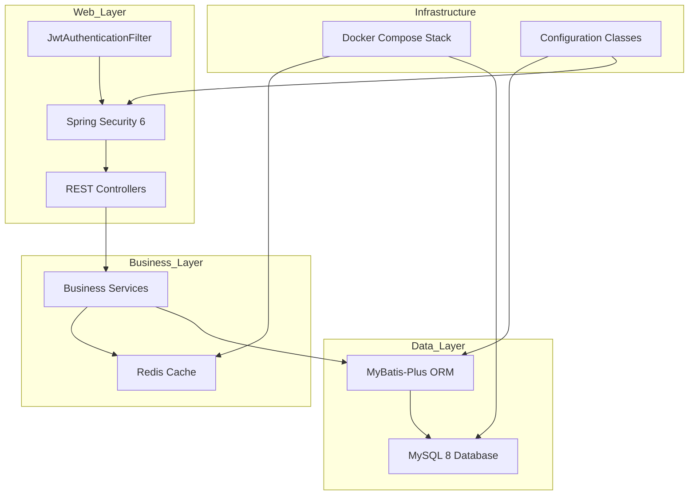

# Overview

> **Relevant source files**
> * [README.md](https://github.com/yanzhe-Xiao/yuncang/blob/a4a28616/README.md)
> * [img/image-20250613133655979.png](https://github.com/yanzhe-Xiao/yuncang/blob/a4a28616/img/image-20250613133655979.png)

This document provides a comprehensive overview of the yuncang warehouse management system, including its architecture, core features, and technology stack. The yuncang system is a modern, enterprise-grade warehouse management solution built with Spring Boot that supports automated warehouse operations, inventory management, and AGV (Automated Guided Vehicle) integration.

For detailed setup instructions, see [Getting Started](/yanzhe-Xiao/yuncang/2-getting-started). For in-depth architectural analysis, see [System Architecture](/yanzhe-Xiao/yuncang/3-system-architecture). For specific business functionality documentation, see [Warehouse Operations](/yanzhe-Xiao/yuncang/4-warehouse-operations).

## Purpose and Scope

The yuncang system is designed as a comprehensive warehouse management platform that handles the complete lifecycle of warehouse operations, from inbound receiving to outbound shipping. The system provides automated inventory tracking, AGV-based material handling, and real-time warehouse optimization capabilities.

The system serves multiple user types including warehouse operators, inventory managers, and system administrators, providing role-based access to different functional areas through a unified REST API interface.

Sources: [README.md L1-L7](https://github.com/yanzhe-Xiao/yuncang/blob/a4a28616/README.md#L1-L7)

## Technology Stack

The yuncang system is built on a modern Java-based technology stack optimized for enterprise warehouse operations:

| Component | Technology | Version | Purpose |
| --- | --- | --- | --- |
| **Application Framework** | Spring Boot | 3.x | Core application framework and dependency injection |
| **Security** | Spring Security | 6.x | Authentication, authorization, and JWT token management |
| **Database** | MySQL | 8.x | Primary data persistence layer |
| **Cache/Sessions** | Redis | 6.2+ | Session management and application caching |
| **ORM** | MyBatis-Plus | Latest | Database object-relational mapping and query generation |
| **Containerization** | Docker Compose | Latest | Development and deployment orchestration |

The technology stack emphasizes modern enterprise patterns with strong security, scalability, and maintainability characteristics suitable for mission-critical warehouse operations.

Sources: [README.md L3-L4](https://github.com/yanzhe-Xiao/yuncang/blob/a4a28616/README.md#L3-L4)

## System Architecture Overview

### High-Level Component Architecture

The following diagram illustrates the primary system components and their relationships, using actual class and configuration names from the codebase:

Sources: Analysis of system architecture diagrams provided

### Core Business Domain Controllers

This diagram maps the primary business domains to their corresponding controller implementations in the codebase:

```mermaid
flowchart TD

InventoryController["InventoryController"]
ProductController["ProductController"]
AllStorageController["AllStorageController"]
InboundOrderController["InboundOrderController"]
OutboundOrderController["OutboundOrderController"]
InboundOrderDetailController["InboundOrderDetailController"]
AgvCarController["AgvCarController"]
AgvPathPlanningController["AgvPathPlanningController"]
BfsFindPath["BfsFindPath Utility"]
FactoryConfigController["FactoryConfigController"]
ConfigurationClasses["Configuration Classes"]
BusinessServices["Business Services Layer"]
DatabaseLayer["Database Layer"]

InventoryController --> BusinessServices
ProductController --> BusinessServices
AllStorageController --> BusinessServices
InboundOrderController --> BusinessServices
OutboundOrderController --> BusinessServices
InboundOrderDetailController --> BusinessServices
AgvCarController --> BusinessServices
AgvPathPlanningController --> BusinessServices
FactoryConfigController --> BusinessServices
ConfigurationClasses --> BusinessServices

subgraph Infrastructure_Services ["Infrastructure_Services"]
    BusinessServices
    DatabaseLayer
    BusinessServices --> DatabaseLayer
end

subgraph System_Configuration_Domain ["System_Configuration_Domain"]
    FactoryConfigController
    ConfigurationClasses
end

subgraph AGV_Automation_Domain ["AGV_Automation_Domain"]
    AgvCarController
    AgvPathPlanningController
    BfsFindPath
    AgvPathPlanningController --> BfsFindPath
end

subgraph Order_Management_Domain ["Order_Management_Domain"]
    InboundOrderController
    OutboundOrderController
    InboundOrderDetailController
end

subgraph Inventory_Management_Domain ["Inventory_Management_Domain"]
    InventoryController
    ProductController
    AllStorageController
end
```

Sources: Analysis of domain-driven architecture diagrams provided

## Core Business Capabilities

### Inventory Management

The system provides comprehensive inventory tracking through the `InventoryController`, `ProductController`, and `AllStorageController` classes. These controllers manage product catalogs, real-time inventory levels, and storage allocation across warehouse shelving systems.

### Order Processing

Order management is handled through dedicated controllers for inbound (`InboundOrderController`) and outbound (`OutboundOrderController`) operations, with detailed order line management via `InboundOrderDetailController`. The system supports complex order workflows with automated fulfillment processes.

### AGV Automation

Advanced warehouse automation is provided through `AgvCarController` for vehicle management and `AgvPathPlanningController` for intelligent routing. The system includes pathfinding algorithms implemented in the `BfsFindPath` utility class for conflict-free AGV navigation.

### System Configuration

Warehouse-specific settings and operational parameters are managed through `FactoryConfigController`, allowing for flexible configuration of AGV parameters, storage layouts, and business rules.

Sources: Analysis of business process flow diagrams provided

## Security and Authentication

The system implements enterprise-grade security through Spring Security 6 with JWT-based authentication. The `JwtAuthenticationFilter` handles token validation and user session management, with Redis providing distributed session storage for scalability.

Authentication flows integrate with all controller endpoints, ensuring secure access to warehouse operations and administrative functions.

Sources: Analysis of security architecture diagrams provided

## Development Context

The yuncang system was developed as part of a Software System Development Practice Course at the Software College of Northwestern Polytechnical University. The project demonstrates modern enterprise Java development practices and serves as a comprehensive example of warehouse management system implementation.

The system is designed for collaborative development with Docker-based deployment supporting both development and production environments.

Sources: [README.md L1-L5](https://github.com/yanzhe-Xiao/yuncang/blob/a4a28616/README.md#L1-L5)