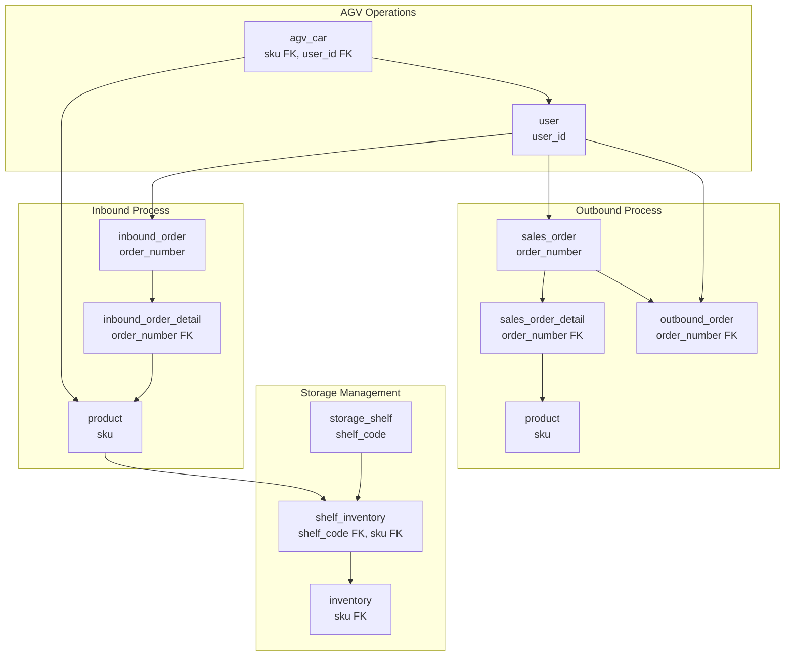
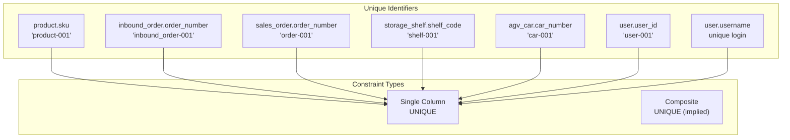
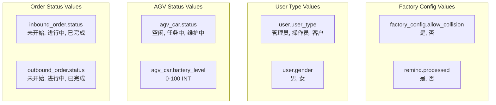
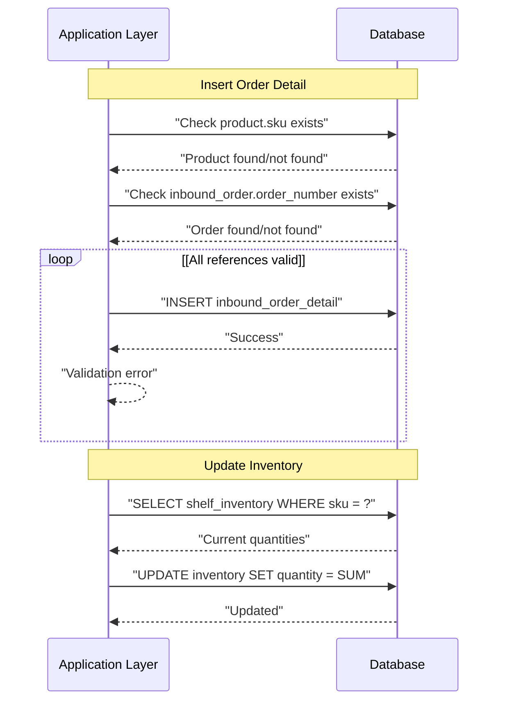

# Relationships and Constraints

> **Relevant source files**
> * [docker/mysql/init.sql](https://github.com/yanzhe-Xiao/yuncang/blob/a4a28616/docker/mysql/init.sql)

This document covers the database relationships, foreign key constraints, and business rules enforced at the data layer in the yuncang warehouse management system. It focuses on how entities relate to each other and the integrity constraints that maintain data consistency across the system.

For information about the individual entity structures and fields, see [Core Entities](/yanzhe-Xiao/yuncang/5.1-core-entities). For system configuration and administrative constraints, see [System Administration](/yanzhe-Xiao/yuncang/6-system-administration).

## Entity Relationship Overview

The yuncang database implements a comprehensive set of relationships that model warehouse operations, from product management through order processing to AGV automation.

```css
#mermaid-imx4u0pbuqi{font-family:ui-sans-serif,-apple-system,system-ui,Segoe UI,Helvetica;font-size:16px;fill:#333;}@keyframes edge-animation-frame{from{stroke-dashoffset:0;}}@keyframes dash{to{stroke-dashoffset:0;}}#mermaid-imx4u0pbuqi .edge-animation-slow{stroke-dasharray:9,5!important;stroke-dashoffset:900;animation:dash 50s linear infinite;stroke-linecap:round;}#mermaid-imx4u0pbuqi .edge-animation-fast{stroke-dasharray:9,5!important;stroke-dashoffset:900;animation:dash 20s linear infinite;stroke-linecap:round;}#mermaid-imx4u0pbuqi .error-icon{fill:#dddddd;}#mermaid-imx4u0pbuqi .error-text{fill:#222222;stroke:#222222;}#mermaid-imx4u0pbuqi .edge-thickness-normal{stroke-width:1px;}#mermaid-imx4u0pbuqi .edge-thickness-thick{stroke-width:3.5px;}#mermaid-imx4u0pbuqi .edge-pattern-solid{stroke-dasharray:0;}#mermaid-imx4u0pbuqi .edge-thickness-invisible{stroke-width:0;fill:none;}#mermaid-imx4u0pbuqi .edge-pattern-dashed{stroke-dasharray:3;}#mermaid-imx4u0pbuqi .edge-pattern-dotted{stroke-dasharray:2;}#mermaid-imx4u0pbuqi .marker{fill:#999;stroke:#999;}#mermaid-imx4u0pbuqi .marker.cross{stroke:#999;}#mermaid-imx4u0pbuqi svg{font-family:ui-sans-serif,-apple-system,system-ui,Segoe UI,Helvetica;font-size:16px;}#mermaid-imx4u0pbuqi p{margin:0;}#mermaid-imx4u0pbuqi .entityBox{fill:#ffffff;stroke:#dddddd;}#mermaid-imx4u0pbuqi .relationshipLabelBox{fill:#dddddd;opacity:0.7;background-color:#dddddd;}#mermaid-imx4u0pbuqi .relationshipLabelBox rect{opacity:0.5;}#mermaid-imx4u0pbuqi .labelBkg{background-color:rgba(221, 221, 221, 0.5);}#mermaid-imx4u0pbuqi .edgeLabel .label{fill:#dddddd;font-size:14px;}#mermaid-imx4u0pbuqi .label{font-family:ui-sans-serif,-apple-system,system-ui,Segoe UI,Helvetica;color:#333;}#mermaid-imx4u0pbuqi .edge-pattern-dashed{stroke-dasharray:8,8;}#mermaid-imx4u0pbuqi .node rect,#mermaid-imx4u0pbuqi .node circle,#mermaid-imx4u0pbuqi .node ellipse,#mermaid-imx4u0pbuqi .node polygon{fill:#ffffff;stroke:#dddddd;stroke-width:1px;}#mermaid-imx4u0pbuqi .relationshipLine{stroke:#999;stroke-width:1;fill:none;}#mermaid-imx4u0pbuqi .marker{fill:none!important;stroke:#999!important;stroke-width:1;}#mermaid-imx4u0pbuqi :root{--mermaid-font-family:"trebuchet ms",verdana,arial,sans-serif;}skuskuskuskuskuorder_numberorder_numberorder_numbershelf_codeuser_iduser_iduser_iduser_idproductBIGINTidPKVARCHARskuUKproduct-001VARCHARnameVARCHARdescriptionDECIMALweightDECIMALlengthDECIMALwidthDECIMALheightinbound_orderBIGINTidPKVARCHARorder_numberUKinbound_order-001VARCHARorder_nameDATETIMEcreate_timeVARCHARuser_idFKVARCHARstatusinbound_order_detailBIGINTidPKVARCHARorder_numberFKVARCHARskuFKBIGINTquantitystorage_shelfBIGINTidPKVARCHARshelf_codeUKshelf-001DECIMALmax_weightDECIMALlengthDECIMALwidthDECIMALheightDECIMALlocation_xDECIMALlocation_yDECIMALlocation_zshelf_inventoryBIGINTidPKVARCHARshelf_codeFKVARCHARskuFKBIGINTquantitysales_orderBIGINTidPKVARCHARorder_numberUKorder-001VARCHARuser_idFKDATETIMEcreate_timesales_order_detailBIGINTidPKVARCHARorder_numberFKVARCHARskuFKBIGINTquantityoutbound_orderBIGINTidPKVARCHARorder_numberFKDATEplanned_dateVARCHARuser_idFKVARCHARstatusinventoryBIGINTidPKVARCHARskuFKBIGINTquantityagv_carBIGINTidPKVARCHARcar_numberUKcar-001VARCHARstatusINTbattery_levelVARCHARskuFKBIGINTquantityDECIMALstart_xDECIMALstart_yDECIMALend_xDECIMALend_yDECIMALend_zDECIMALlocation_xDECIMALlocation_yVARCHARuser_idFKDECIMALmax_weightDATETIMEcreate_timeDATETIMEupdate_timeuserBIGINTidPKVARCHARuser_idUKuser-001VARCHARusernameUKVARCHARuser_typeVARCHARpasswordVARCHARnicknameVARCHARphoneVARCHARgenderremindBIGINTidPKVARCHARstatusVARCHARmessageVARCHARcontextDATETIMEcreate_timeVARCHARprocessedfactory_configBIGINTidPKVARCHARallow_collisionVARCHARweight_ratioVARCHARpath_strategyINTmax_layerDECIMALmax_layer_weightBIGINTmax_shelf_numberDECIMALmax_car_weightINTin_and_out_timeDECIMALcar_speed
```

Sources: [docker/mysql/init.sql L1-L182](https://github.com/yanzhe-Xiao/yuncang/blob/a4a28616/docker/mysql/init.sql#L1-L182)

## Core Business Relationships

The system implements several key relationship patterns that reflect warehouse management workflows:

### Order Processing Chain



Sources: [docker/mysql/init.sql L17-L92](https://github.com/yanzhe-Xiao/yuncang/blob/a4a28616/docker/mysql/init.sql#L17-L92)

 [docker/mysql/init.sql L103-L119](https://github.com/yanzhe-Xiao/yuncang/blob/a4a28616/docker/mysql/init.sql#L103-L119)

## Foreign Key Relationships

The system uses logical foreign key relationships implemented through naming conventions rather than explicit database constraints:

| Child Table | Child Column | Parent Table | Parent Column | Relationship Type |
| --- | --- | --- | --- | --- |
| `inbound_order_detail` | `order_number` | `inbound_order` | `order_number` | One-to-Many |
| `inbound_order_detail` | `sku` | `product` | `sku` | Many-to-One |
| `sales_order_detail` | `order_number` | `sales_order` | `order_number` | One-to-Many |
| `sales_order_detail` | `sku` | `product` | `sku` | Many-to-One |
| `outbound_order` | `order_number` | `sales_order` | `order_number` | One-to-One |
| `shelf_inventory` | `shelf_code` | `storage_shelf` | `shelf_code` | Many-to-One |
| `shelf_inventory` | `sku` | `product` | `sku` | Many-to-One |
| `inventory` | `sku` | `product` | `sku` | One-to-One |
| `agv_car` | `sku` | `product` | `sku` | Many-to-One |
| `inbound_order` | `user_id` | `user` | `user_id` | Many-to-One |
| `sales_order` | `user_id` | `user` | `user_id` | Many-to-One |
| `outbound_order` | `user_id` | `user` | `user_id` | Many-to-One |
| `agv_car` | `user_id` | `user` | `user_id` | Many-to-One |

Sources: [docker/mysql/init.sql L28-L36](https://github.com/yanzhe-Xiao/yuncang/blob/a4a28616/docker/mysql/init.sql#L28-L36)

 [docker/mysql/init.sql L54-L61](https://github.com/yanzhe-Xiao/yuncang/blob/a4a28616/docker/mysql/init.sql#L54-L61)

 [docker/mysql/init.sql L74-L81](https://github.com/yanzhe-Xiao/yuncang/blob/a4a28616/docker/mysql/init.sql#L74-L81)

## Unique Constraints

The system enforces uniqueness through several key constraints:

### Business Entity Identifiers



Sources: [docker/mysql/init.sql L7](https://github.com/yanzhe-Xiao/yuncang/blob/a4a28616/docker/mysql/init.sql#L7-L7)

 [docker/mysql/init.sql L21](https://github.com/yanzhe-Xiao/yuncang/blob/a4a28616/docker/mysql/init.sql#L21-L21)

 [docker/mysql/init.sql L42](https://github.com/yanzhe-Xiao/yuncang/blob/a4a28616/docker/mysql/init.sql#L42-L42)

 [docker/mysql/init.sql L67](https://github.com/yanzhe-Xiao/yuncang/blob/a4a28616/docker/mysql/init.sql#L67-L67)

 [docker/mysql/init.sql L107](https://github.com/yanzhe-Xiao/yuncang/blob/a4a28616/docker/mysql/init.sql#L107-L107)

 [docker/mysql/init.sql L143-L144](https://github.com/yanzhe-Xiao/yuncang/blob/a4a28616/docker/mysql/init.sql#L143-L144)

## Business Rule Constraints

### Inventory Consistency Rules

The system maintains inventory consistency through several implicit business rules:

1. **Total Inventory Aggregation**: `inventory.quantity` should equal the sum of `shelf_inventory.quantity` for the same `sku`
2. **Order Detail Validation**: `inbound_order_detail.quantity` and `sales_order_detail.quantity` must be positive integers
3. **AGV Capacity Constraints**: `agv_car.quantity * product.weight` must not exceed `agv_car.max_weight`
4. **Shelf Capacity Constraints**: Total weight on `storage_shelf` must not exceed `storage_shelf.max_weight`

### Status Enumeration Constraints



Sources: [docker/mysql/init.sql L24](https://github.com/yanzhe-Xiao/yuncang/blob/a4a28616/docker/mysql/init.sql#L24-L24)

 [docker/mysql/init.sql L90](https://github.com/yanzhe-Xiao/yuncang/blob/a4a28616/docker/mysql/init.sql#L90-L90)

 [docker/mysql/init.sql L108-L109](https://github.com/yanzhe-Xiao/yuncang/blob/a4a28616/docker/mysql/init.sql#L108-L109)

 [docker/mysql/init.sql L145](https://github.com/yanzhe-Xiao/yuncang/blob/a4a28616/docker/mysql/init.sql#L145-L145)

 [docker/mysql/init.sql L149](https://github.com/yanzhe-Xiao/yuncang/blob/a4a28616/docker/mysql/init.sql#L149-L149)

 [docker/mysql/init.sql L169](https://github.com/yanzhe-Xiao/yuncang/blob/a4a28616/docker/mysql/init.sql#L169-L169)

## Data Integrity Patterns

### Referential Integrity Implementation

The system implements referential integrity through application-level constraints rather than database foreign keys:



Sources: [docker/mysql/init.sql L28-L36](https://github.com/yanzhe-Xiao/yuncang/blob/a4a28616/docker/mysql/init.sql#L28-L36)

 [docker/mysql/init.sql L74-L81](https://github.com/yanzhe-Xiao/yuncang/blob/a4a28616/docker/mysql/init.sql#L74-L81)

### Cascade Operations

The system handles cascade operations through business logic:

1. **Product Deletion**: Must check references in `inbound_order_detail`, `sales_order_detail`, `shelf_inventory`, `inventory`, and `agv_car`
2. **Order Deletion**: Must handle related `inbound_order_detail` or `sales_order_detail` records
3. **Shelf Deletion**: Must relocate or remove related `shelf_inventory` records
4. **User Deletion**: Must reassign or nullify related orders and AGV assignments

### Temporal Constraints

The system maintains temporal consistency through timestamp fields:

| Table | Timestamp Fields | Purpose |
| --- | --- | --- |
| `inbound_order` | `create_time` | Order creation tracking |
| `sales_order` | `create_time` | Order creation tracking |
| `outbound_order` | `planned_date` | Scheduling constraint |
| `agv_car` | `create_time`, `update_time` | State change tracking |
| `remind` | `create_time` | Notification timing |

Sources: [docker/mysql/init.sql L22](https://github.com/yanzhe-Xiao/yuncang/blob/a4a28616/docker/mysql/init.sql#L22-L22)

 [docker/mysql/init.sql L69](https://github.com/yanzhe-Xiao/yuncang/blob/a4a28616/docker/mysql/init.sql#L69-L69)

 [docker/mysql/init.sql L88](https://github.com/yanzhe-Xiao/yuncang/blob/a4a28616/docker/mysql/init.sql#L88-L88)

 [docker/mysql/init.sql L122](https://github.com/yanzhe-Xiao/yuncang/blob/a4a28616/docker/mysql/init.sql#L122-L122)

 [docker/mysql/init.sql L125](https://github.com/yanzhe-Xiao/yuncang/blob/a4a28616/docker/mysql/init.sql#L125-L125)

 [docker/mysql/init.sql L160](https://github.com/yanzhe-Xiao/yuncang/blob/a4a28616/docker/mysql/init.sql#L160-L160)

## Configuration Constraints

The `factory_config` table enforces system-wide operational constraints:

```mermaid
flowchart TD

max_layer["max_layer: 10<br>Maximum shelf layers"]
max_layer_weight["max_layer_weight: 3000kg<br>Weight per layer"]
max_shelf_number["max_shelf_number: 540<br>Total shelves"]
max_car_weight["max_car_weight: 1000kg<br>AGV capacity"]
allow_collision["allow_collision: 否<br>AGV collision rules"]
weight_ratio["weight_ratio: 1/1/2<br>Load balancing"]
path_strategy["path_strategy: balanced<br>Routing algorithm"]
car_speed["car_speed: 1<br>Movement speed"]
in_and_out_time["in_and_out_time: 2<br>Operation duration"]
agv_car["agv_car"]
storage_shelf["storage_shelf"]
inbound_order["inbound_order"]

max_layer --> agv_car
max_layer_weight --> storage_shelf
max_shelf_number --> storage_shelf
max_car_weight --> agv_car
allow_collision --> agv_car
weight_ratio --> agv_car
path_strategy --> agv_car
car_speed --> agv_car
in_and_out_time --> inbound_order

subgraph subGraph1 ["Operational Constraints"]
    allow_collision
    weight_ratio
    path_strategy
    car_speed
    in_and_out_time
end

subgraph subGraph0 ["Physical Constraints"]
    max_layer
    max_layer_weight
    max_shelf_number
    max_car_weight
end
```



Sources: [docker/mysql/init.sql L166-L179](https://github.com/yanzhe-Xiao/yuncang/blob/a4a28616/docker/mysql/init.sql#L166-L179)