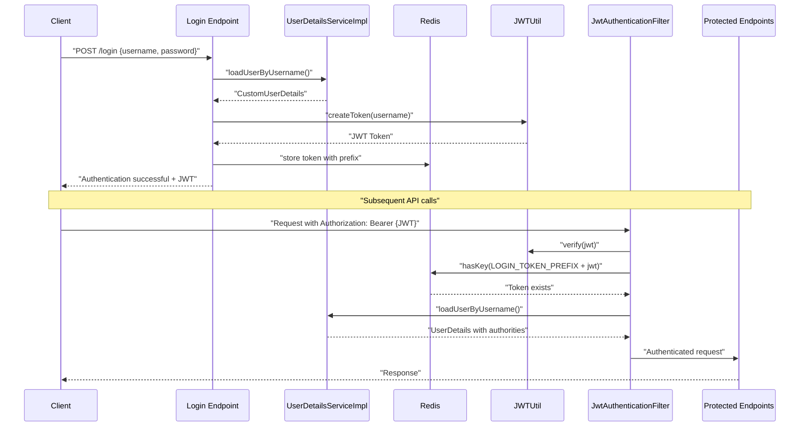
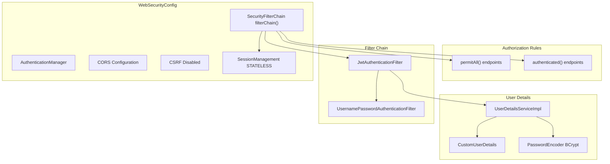
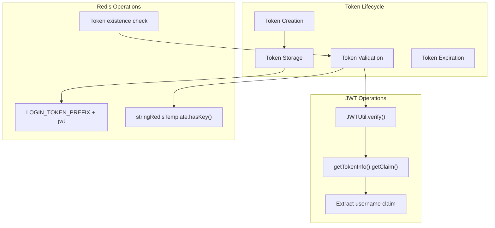
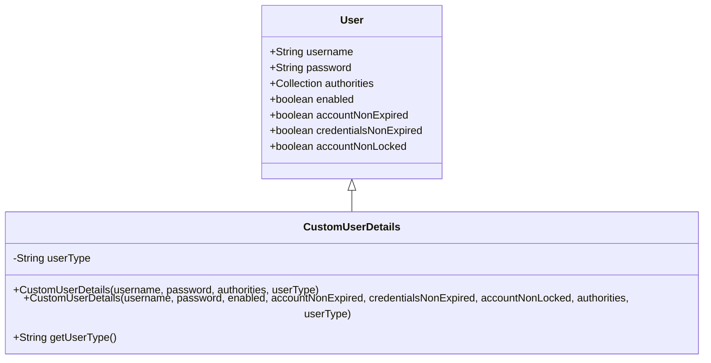
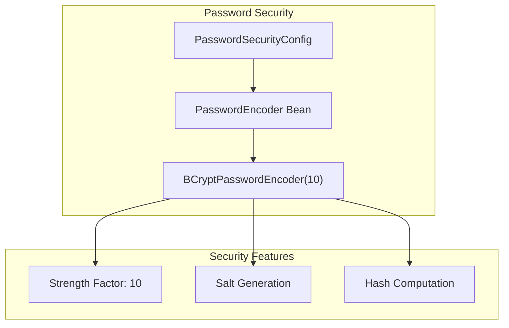

# Security Architecture

> **Relevant source files**
> * [src/main/java/com/xhz/yuncang/config/CustomUserDetails.java](https://github.com/yanzhe-Xiao/yuncang/blob/a4a28616/src/main/java/com/xhz/yuncang/config/CustomUserDetails.java)
> * [src/main/java/com/xhz/yuncang/config/JwtAuthenticationFilter.java](https://github.com/yanzhe-Xiao/yuncang/blob/a4a28616/src/main/java/com/xhz/yuncang/config/JwtAuthenticationFilter.java)
> * [src/main/java/com/xhz/yuncang/config/PasswordSecurityConfig.java](https://github.com/yanzhe-Xiao/yuncang/blob/a4a28616/src/main/java/com/xhz/yuncang/config/PasswordSecurityConfig.java)
> * [src/main/java/com/xhz/yuncang/config/WebSecurityConfig.java](https://github.com/yanzhe-Xiao/yuncang/blob/a4a28616/src/main/java/com/xhz/yuncang/config/WebSecurityConfig.java)

## Purpose and Scope

This document describes the security architecture of the yuncang warehouse management system, covering authentication, authorization, JWT token management, and security configuration. The system implements a stateless, JWT-based security model using Spring Security 6 with Redis for token storage and session management.

For information about user management and roles, see [User Management](/yanzhe-Xiao/yuncang/6.2-user-management). For API endpoint security details, see [API Reference](/yanzhe-Xiao/yuncang/7-api-reference).

## Authentication Flow

The yuncang system implements a stateless JWT-based authentication mechanism that eliminates traditional session management in favor of token-based security.

### Authentication Process Flow

Sources: [src/main/java/com/xhz/yuncang/config/JwtAuthenticationFilter.java L50-L109](https://github.com/yanzhe-Xiao/yuncang/blob/a4a28616/src/main/java/com/xhz/yuncang/config/JwtAuthenticationFilter.java#L50-L109)

### JWT Authentication Filter

The `JwtAuthenticationFilter` serves as the core authentication component, extending `OncePerRequestFilter` to process every HTTP request:

| Component | Responsibility | Implementation |
| --- | --- | --- |
| Token Extraction | Extract JWT from Authorization header | [JwtAuthenticationFilter L116-L122](https://github.com/yanzhe-Xiao/yuncang/blob/a4a28616/JwtAuthenticationFilter#L116-L122) |
| Token Validation | Verify JWT signature and Redis storage | [JwtAuthenticationFilter L69-L88](https://github.com/yanzhe-Xiao/yuncang/blob/a4a28616/JwtAuthenticationFilter#L69-L88) |
| Context Setting | Set Spring Security authentication context | [JwtAuthenticationFilter L79-L83](https://github.com/yanzhe-Xiao/yuncang/blob/a4a28616/JwtAuthenticationFilter#L79-L83) |
| Error Handling | Return 401 for invalid tokens | [JwtAuthenticationFilter L91-L109](https://github.com/yanzhe-Xiao/yuncang/blob/a4a28616/JwtAuthenticationFilter#L91-L109) |

The filter implements the following validation logic:

* Bypasses authentication for `/login` endpoint
* Extracts Bearer token from Authorization header
* Validates JWT signature using `JWTUtil.verify()`
* Confirms token existence in Redis with key prefix `LOGIN_TOKEN_PREFIX`
* Loads complete user details and authorities
* Sets authentication context for downstream processing

Sources: [src/main/java/com/xhz/yuncang/config/JwtAuthenticationFilter.java L38-L123](https://github.com/yanzhe-Xiao/yuncang/blob/a4a28616/src/main/java/com/xhz/yuncang/config/JwtAuthenticationFilter.java#L38-L123)

## Authorization Architecture

### Security Configuration Structure

Sources: [src/main/java/com/xhz/yuncang/config/WebSecurityConfig.java L43-L104](https://github.com/yanzhe-Xiao/yuncang/blob/a4a28616/src/main/java/com/xhz/yuncang/config/WebSecurityConfig.java#L43-L104)

### Endpoint Authorization Rules

The system defines two main authorization categories:

**Public Endpoints** (no authentication required):

* `/login` - User authentication endpoint
* `/register` - User registration endpoint
* `/api/email/send-password-reset-code` - Password reset code generation
* `/user/find-password` - Password recovery endpoint

**Protected Endpoints** (authentication required):

* All other endpoints require valid JWT authentication

Sources: [src/main/java/com/xhz/yuncang/config/WebSecurityConfig.java L71-L75](https://github.com/yanzhe-Xiao/yuncang/blob/a4a28616/src/main/java/com/xhz/yuncang/config/WebSecurityConfig.java#L71-L75)

## JWT Token Management

### Token Storage and Validation

The system uses Redis for centralized token management with the following key characteristics:

Sources: [src/main/java/com/xhz/yuncang/config/JwtAuthenticationFilter.java L69-L88](https://github.com/yanzhe-Xiao/yuncang/blob/a4a28616/src/main/java/com/xhz/yuncang/config/JwtAuthenticationFilter.java#L69-L88)

 [src/main/java/com/xhz/yuncang/utils/Constants.java](https://github.com/yanzhe-Xiao/yuncang/blob/a4a28616/src/main/java/com/xhz/yuncang/utils/Constants.java)

### Token Validation Process

The authentication filter implements a two-tier validation approach:

1. **JWT Signature Validation**: Using `JWTUtil.verify(jwt)` to ensure token integrity
2. **Redis Existence Check**: Confirming token validity in centralized storage using key `Constants.LOGIN_TOKEN_PREFIX + jwt`

This dual validation ensures both cryptographic security and centralized session control.

Sources: [src/main/java/com/xhz/yuncang/config/JwtAuthenticationFilter.java L69-L72](https://github.com/yanzhe-Xiao/yuncang/blob/a4a28616/src/main/java/com/xhz/yuncang/config/JwtAuthenticationFilter.java#L69-L72)

## User Details and Authentication

### Custom User Details Implementation

The system extends Spring Security's default `User` class with `CustomUserDetails` to support additional user attributes:

Sources: [src/main/java/com/xhz/yuncang/config/CustomUserDetails.java L11-L54](https://github.com/yanzhe-Xiao/yuncang/blob/a4a28616/src/main/java/com/xhz/yuncang/config/CustomUserDetails.java#L11-L54)

### User Type Classification

The `CustomUserDetails` class supports user type classification through the `userType` field, enabling role-based access control:

| Constructor | Parameters | Use Case |
| --- | --- | --- |
| Default Status | username, password, authorities, userType | Standard user creation |
| Custom Status | username, password, enabled, accountNonExpired, credentialsNonExpired, accountNonLocked, authorities, userType | Advanced user state management |

Sources: [src/main/java/com/xhz/yuncang/config/CustomUserDetails.java L22-L45](https://github.com/yanzhe-Xiao/yuncang/blob/a4a28616/src/main/java/com/xhz/yuncang/config/CustomUserDetails.java#L22-L45)

## Password Security

### Password Encoding Configuration

The system implements BCrypt password hashing through `PasswordSecurityConfig`:

The BCrypt implementation uses a strength factor of 10, balancing security and performance for password hashing operations.

Sources: [src/main/java/com/xhz/yuncang/config/PasswordSecurityConfig.java L12-L24](https://github.com/yanzhe-Xiao/yuncang/blob/a4a28616/src/main/java/com/xhz/yuncang/config/PasswordSecurityConfig.java#L12-L24)

## Security Configuration Details

### Stateless Session Management

The security configuration explicitly disables traditional session management in favor of stateless JWT authentication:

**Key Configuration Elements:**

* `SessionCreationPolicy.STATELESS` - Disables HttpSession creation
* CSRF protection disabled for API-first architecture
* CORS enabled with default configuration
* Form login and HTTP Basic authentication disabled

**Filter Chain Order:**

1. `JwtAuthenticationFilter` - Custom JWT processing
2. `UsernamePasswordAuthenticationFilter` - Spring Security default (bypassed)

Sources: [src/main/java/com/xhz/yuncang/config/WebSecurityConfig.java L60-L89](https://github.com/yanzhe-Xiao/yuncang/blob/a4a28616/src/main/java/com/xhz/yuncang/config/WebSecurityConfig.java#L60-L89)

### Method Security

The configuration enables method-level security through `@EnableMethodSecurity`, supporting annotations like `@PreAuthorize` for fine-grained access control.

Sources: [src/main/java/com/xhz/yuncang/config/WebSecurityConfig.java L45](https://github.com/yanzhe-Xiao/yuncang/blob/a4a28616/src/main/java/com/xhz/yuncang/config/WebSecurityConfig.java#L45-L45)