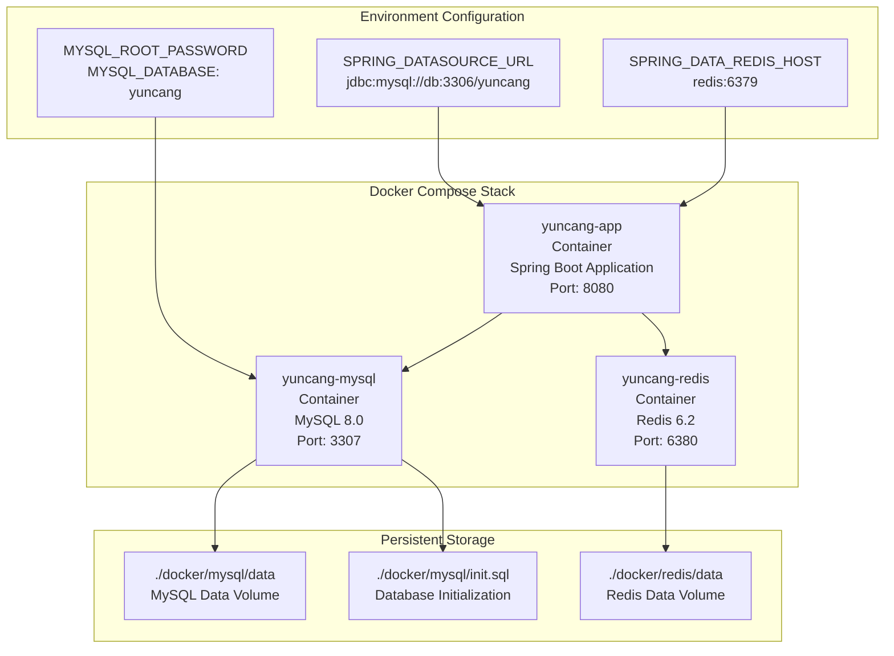
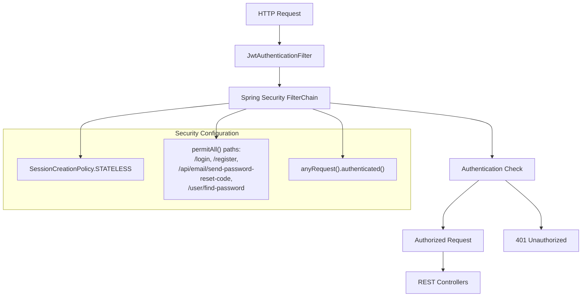
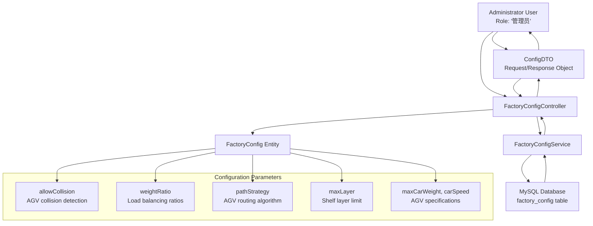

# System Administration

> **Relevant source files**
> * [docker-compose.yml](https://github.com/yanzhe-Xiao/yuncang/blob/a4a28616/docker-compose.yml)
> * [src/main/java/com/xhz/yuncang/config/WebSecurityConfig.java](https://github.com/yanzhe-Xiao/yuncang/blob/a4a28616/src/main/java/com/xhz/yuncang/config/WebSecurityConfig.java)
> * [src/main/java/com/xhz/yuncang/controller/FactoryConfigController.java](https://github.com/yanzhe-Xiao/yuncang/blob/a4a28616/src/main/java/com/xhz/yuncang/controller/FactoryConfigController.java)

This document covers the administrative aspects of the yuncang warehouse management system, including system deployment configuration, security administration, and factory operational settings. It provides guidance for system administrators responsible for configuring, securing, and maintaining the system infrastructure.

For information about specific warehouse operations and business processes, see [Warehouse Operations](/yanzhe-Xiao/yuncang/4-warehouse-operations). For database schema and entity management, see [Database Schema](/yanzhe-Xiao/yuncang/5-database-schema). For factory-specific configuration details, see [Factory Configuration](/yanzhe-Xiao/yuncang/6.1-factory-configuration).

## System Deployment Configuration

The yuncang system uses Docker Compose for containerized deployment, orchestrating three core services: the Spring Boot application, MySQL database, and Redis cache.

### Docker Services Architecture

The deployment configuration defines service dependencies where the `app` service depends on both `db` and `redis` services, ensuring proper startup order. Database and cache data persist through volume mounts to prevent data loss during container restarts.

**Sources:** [docker-compose.yml L1-L55](https://github.com/yanzhe-Xiao/yuncang/blob/a4a28616/docker-compose.yml#L1-L55)

### Service Configuration Parameters

| Service | Container Name | Port Mapping | Key Environment Variables |
| --- | --- | --- | --- |
| Application | `yuncang-app` | `8080:8080` | `SPRING_DATASOURCE_URL`, `SPRING_DATA_REDIS_HOST` |
| Database | `yuncang-mysql` | `3307:3306` | `MYSQL_ROOT_PASSWORD`, `MYSQL_DATABASE` |
| Cache | `yuncang-redis` | `6380:6379` | None (default Redis configuration) |

The application service overrides default Spring Boot configuration through environment variables, enabling connection to containerized database and cache services using service names as hostnames in the Docker network.

**Sources:** [docker-compose.yml L34-L55](https://github.com/yanzhe-Xiao/yuncang/blob/a4a28616/docker-compose.yml#L34-L55)

## Security Administration

The system implements JWT-based authentication with stateless session management through Spring Security 6. Security configuration centers around the `WebSecurityConfig` class, which defines authentication filters, authorization rules, and session policies.

### Security Filter Chain Configuration

The security configuration employs a stateless approach, completely disabling HTTP sessions and relying on JWT tokens for authentication state. The `JwtAuthenticationFilter` intercepts requests before the standard `UsernamePasswordAuthenticationFilter` to validate JWT tokens.

**Sources:** [src/main/java/com/xhz/yuncang/config/WebSecurityConfig.java L59-L89](https://github.com/yanzhe-Xiao/yuncang/blob/a4a28616/src/main/java/com/xhz/yuncang/config/WebSecurityConfig.java#L59-L89)

### Authentication Manager Configuration

The system configures an `AuthenticationManager` bean through Spring's `AuthenticationConfiguration`, enabling programmatic authentication for login operations and token validation processes.

**Sources:** [src/main/java/com/xhz/yuncang/config/WebSecurityConfig.java L97-L100](https://github.com/yanzhe-Xiao/yuncang/blob/a4a28616/src/main/java/com/xhz/yuncang/config/WebSecurityConfig.java#L97-L100)

### Access Control Rules

| Path Pattern | Access Level | Description |
| --- | --- | --- |
| `/login` | `permitAll()` | User authentication endpoint |
| `/register` | `permitAll()` | User registration endpoint |
| `/api/email/send-password-reset-code` | `permitAll()` | Password reset initiation |
| `/user/find-password` | `permitAll()` | Password recovery endpoint |
| All other paths | `authenticated()` | Requires valid JWT token |

**Sources:** [src/main/java/com/xhz/yuncang/config/WebSecurityConfig.java L71-L75](https://github.com/yanzhe-Xiao/yuncang/blob/a4a28616/src/main/java/com/xhz/yuncang/config/WebSecurityConfig.java#L71-L75)

## Factory Configuration Management

The `FactoryConfigController` provides administrative interfaces for managing warehouse operational parameters, AGV settings, and system-wide configuration values. Access to factory configuration requires administrator role privileges.

### Factory Configuration Data Flow

The controller transforms between `ConfigDTO` objects used for API communication and `FactoryConfig` entities for database persistence. Configuration updates follow an upsert pattern - creating new records if none exist, otherwise updating the existing configuration.

**Sources:** [src/main/java/com/xhz/yuncang/controller/FactoryConfigController.java L23-L58](https://github.com/yanzhe-Xiao/yuncang/blob/a4a28616/src/main/java/com/xhz/yuncang/controller/FactoryConfigController.java#L23-L58)

### Configuration Parameters

| Parameter | Data Type | Default Value | Description |
| --- | --- | --- | --- |
| `allowCollision` | String | "否" | AGV collision detection enable/disable |
| `weightRatio` | String | "1/1/2" | Load distribution ratios |
| `pathStrategy` | String | "balanced" | AGV path planning algorithm |
| `maxLayer` | Integer | 10 | Maximum shelf layers |
| `maxLayerWeight` | Double | 3000.0 | Maximum weight per layer |
| `maxShelfNumber` | Long | 540 | Maximum shelf capacity |
| `maxCarWeight` | Double | 1000.0 | AGV maximum load capacity |
| `inAndOutTime` | Integer | 2 | Processing time for operations |
| `carSpeed` | Double | 1.0 | AGV movement speed |

**Sources:** [src/main/java/com/xhz/yuncang/controller/FactoryConfigController.java L29-L45](https://github.com/yanzhe-Xiao/yuncang/blob/a4a28616/src/main/java/com/xhz/yuncang/controller/FactoryConfigController.java#L29-L45)

### Configuration Retrieval and Transformation

The system retrieves configuration through the `getConfig()` endpoint, performing data transformations between internal storage format and API response format. Boolean values convert between Chinese text ("是"/"否") and string boolean values ("true"/"false"), while weight ratios parse from delimited strings into object arrays.

**Sources:** [src/main/java/com/xhz/yuncang/controller/FactoryConfigController.java L61-L87](https://github.com/yanzhe-Xiao/yuncang/blob/a4a28616/src/main/java/com/xhz/yuncang/controller/FactoryConfigController.java#L61-L87)

## Administrative Access Controls

The system enforces role-based access control through Spring Security's method-level security annotations. The `FactoryConfigController` class restricts all operations to users with administrator role privileges through the `@PreAuthorize("hasRole('管理员')")` annotation.

Administrative functions include:

* Factory configuration updates via `PUT /factory/config`
* Configuration retrieval via `GET /factory/config`
* AGV operational parameter management
* Warehouse capacity and layout settings

The security framework validates user roles before method execution, ensuring only authorized personnel can modify critical system parameters that affect warehouse operations and AGV behavior.

**Sources:** [src/main/java/com/xhz/yuncang/controller/FactoryConfigController.java L17-L18](https://github.com/yanzhe-Xiao/yuncang/blob/a4a28616/src/main/java/com/xhz/yuncang/controller/FactoryConfigController.java#L17-L18)