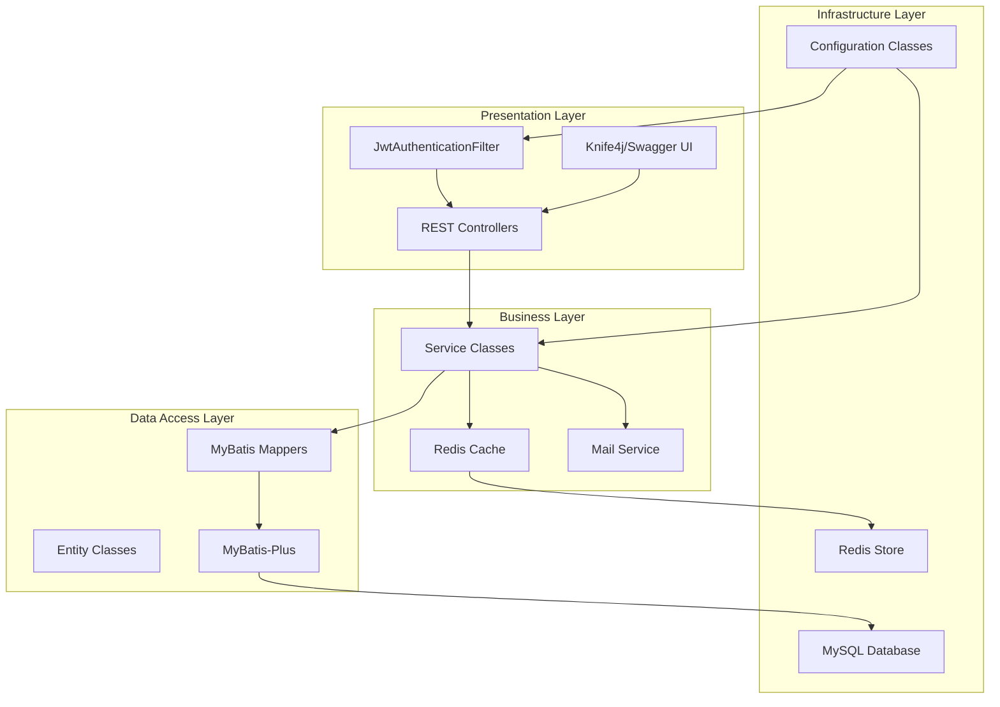
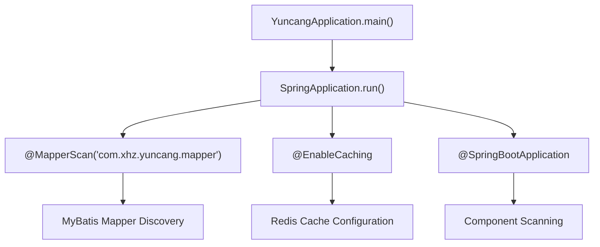
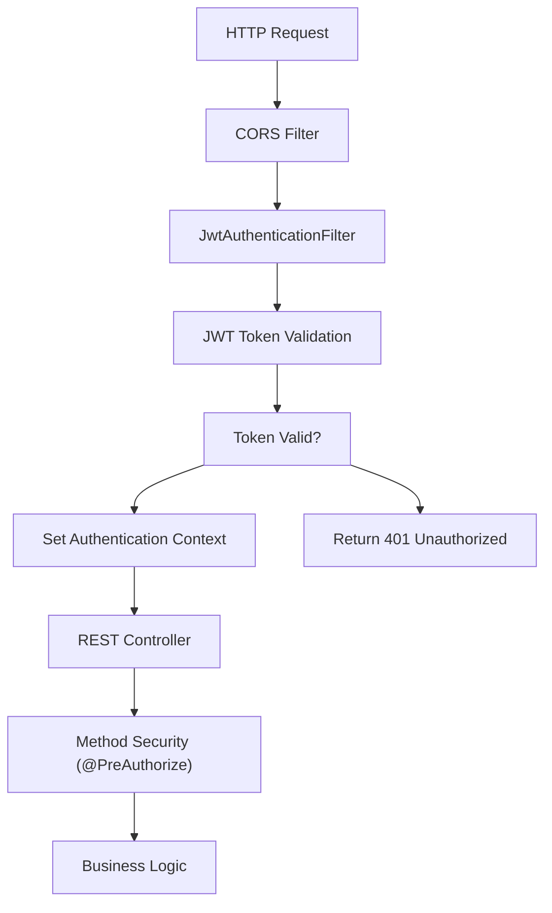
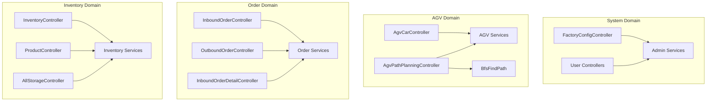
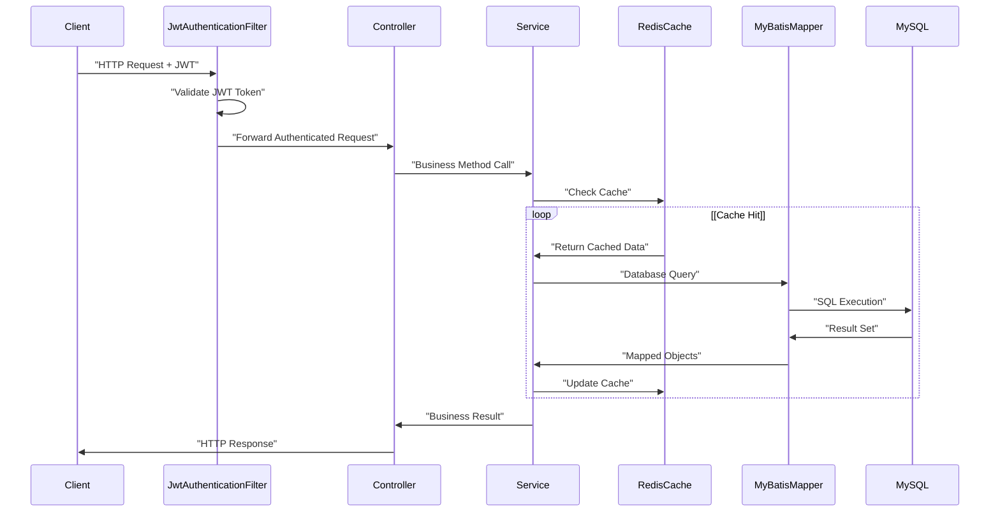
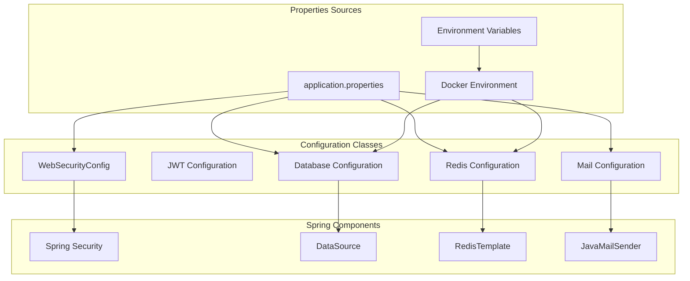
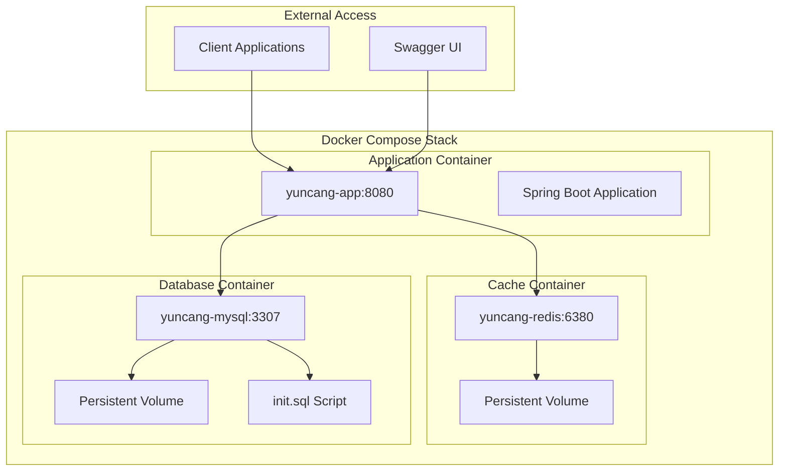

# System Architecture

> **Relevant source files**
> * [pom.xml](https://github.com/yanzhe-Xiao/yuncang/blob/a4a28616/pom.xml)
> * [src/main/java/com/xhz/yuncang/YuncangApplication.java](https://github.com/yanzhe-Xiao/yuncang/blob/a4a28616/src/main/java/com/xhz/yuncang/YuncangApplication.java)
> * [src/main/java/com/xhz/yuncang/config/WebSecurityConfig.java](https://github.com/yanzhe-Xiao/yuncang/blob/a4a28616/src/main/java/com/xhz/yuncang/config/WebSecurityConfig.java)

This document provides a comprehensive overview of the yuncang warehouse management system architecture, including its layered design, core components, technology stack, and architectural patterns. It covers the high-level system structure, component interactions, and design decisions that shape the application.

For detailed information about specific subsystems, see [Application Structure](/yanzhe-Xiao/yuncang/3.1-application-structure), [Security Architecture](/yanzhe-Xiao/yuncang/3.2-security-architecture), and [Data Layer Architecture](/yanzhe-Xiao/yuncang/3.3-data-layer-architecture). For business domain functionality, refer to [Warehouse Operations](/yanzhe-Xiao/yuncang/4-warehouse-operations).

## Overview

The yuncang system follows a traditional three-tier layered architecture built on Spring Boot 3, implementing modern enterprise patterns for warehouse management operations. The system supports automated guided vehicle (AGV) management, order processing, inventory tracking, and comprehensive warehouse operations through REST APIs.

## Technology Stack

| Component | Technology | Version | Purpose |
| --- | --- | --- | --- |
| Application Framework | Spring Boot | 3.4.4 | Core application framework |
| Runtime | Java | 21 | Application runtime environment |
| Security | Spring Security | 6.x | Authentication and authorization |
| ORM | MyBatis-Plus | 3.5.12 | Database access and mapping |
| Database | MySQL | 8.0 | Primary data storage |
| Cache | Redis | 6.2 | Session storage and caching |
| Authentication | JWT | 4.3.0 | Stateless token-based auth |
| API Documentation | Knife4j | 4.1.0 | OpenAPI/Swagger integration |
| Build Tool | Maven | - | Dependency management and build |

Sources: [pom.xml L1-L153](https://github.com/yanzhe-Xiao/yuncang/blob/a4a28616/pom.xml#L1-L153)

## Layered Architecture

The system implements a clean layered architecture with clear separation of concerns:

### System Layers

Sources: [src/main/java/com/xhz/yuncang/YuncangApplication.java L1-L18](https://github.com/yanzhe-Xiao/yuncang/blob/a4a28616/src/main/java/com/xhz/yuncang/YuncangApplication.java#L1-L18)

 [src/main/java/com/xhz/yuncang/config/WebSecurityConfig.java L1-L104](https://github.com/yanzhe-Xiao/yuncang/blob/a4a28616/src/main/java/com/xhz/yuncang/config/WebSecurityConfig.java#L1-L104)

## Core Application Structure

The main application follows Spring Boot conventions with specific configurations for warehouse management:

### Application Bootstrap

The `YuncangApplication` class serves as the entry point with key annotations:

* `@MapperScan("com.xhz.yuncang.mapper")` - Enables MyBatis mapper scanning
* `@EnableCaching` - Activates Redis-based caching
* `@SpringBootApplication` - Standard Spring Boot configuration

Sources: [src/main/java/com/xhz/yuncang/YuncangApplication.java L8-L16](https://github.com/yanzhe-Xiao/yuncang/blob/a4a28616/src/main/java/com/xhz/yuncang/YuncangApplication.java#L8-L16)

## Security Architecture Overview

The system implements JWT-based stateless authentication with Spring Security 6:

### Security Filter Chain

Key security components:

* `JwtAuthenticationFilter` - Custom JWT token processing
* `SessionCreationPolicy.STATELESS` - Completely stateless session management
* `WebSecurityConfig` - Central security configuration
* Method-level security with `@EnableMethodSecurity`

Sources: [src/main/java/com/xhz/yuncang/config/WebSecurityConfig.java L59-L89](https://github.com/yanzhe-Xiao/yuncang/blob/a4a28616/src/main/java/com/xhz/yuncang/config/WebSecurityConfig.java#L59-L89)

## Domain Architecture

The system is organized around warehouse management domains with dedicated controllers and services:

### Domain Components

Sources: Based on controller structure inferred from the overall architecture diagrams

## Data Flow Architecture

The system processes data through well-defined layers with caching and persistence:

### Request Processing Flow

Sources: [src/main/java/com/xhz/yuncang/config/WebSecurityConfig.java L60-L89](https://github.com/yanzhe-Xiao/yuncang/blob/a4a28616/src/main/java/com/xhz/yuncang/config/WebSecurityConfig.java#L60-L89)

 [src/main/java/com/xhz/yuncang/YuncangApplication.java L9-L10](https://github.com/yanzhe-Xiao/yuncang/blob/a4a28616/src/main/java/com/xhz/yuncang/YuncangApplication.java#L9-L10)

## Configuration Architecture

The system uses Spring Boot's configuration management with profiles and external configuration:

### Configuration Components

Key configuration features:

* `@Configuration` classes for modular setup
* Environment-specific profiles
* Docker container integration
* External configuration support

Sources: [src/main/java/com/xhz/yuncang/config/WebSecurityConfig.java L43-L46](https://github.com/yanzhe-Xiao/yuncang/blob/a4a28616/src/main/java/com/xhz/yuncang/config/WebSecurityConfig.java#L43-L46)

 [pom.xml L33-L132](https://github.com/yanzhe-Xiao/yuncang/blob/a4a28616/pom.xml#L33-L132)

## Deployment Architecture

The system is designed for containerized deployment with Docker Compose orchestration:

### Container Architecture

Deployment characteristics:

* Multi-container orchestration with Docker Compose
* Persistent data volumes for database and cache
* Port mapping for external access
* Environment-based configuration
* Database initialization scripts

Sources: Based on Docker deployment architecture from the provided diagrams

## Integration Points

The system provides multiple integration interfaces:

| Integration Type | Technology | Purpose | Endpoints |
| --- | --- | --- | --- |
| REST API | Spring Web MVC | External system integration | `/api/*` |
| Database | MySQL JDBC | Data persistence | Direct connection |
| Caching | Redis | Performance optimization | Redis protocol |
| Email | Spring Mail | Notifications | SMTP |
| Documentation | Knife4j | API documentation | `/doc.html` |

The architecture supports both synchronous REST API interactions and asynchronous processing through the caching layer, enabling scalable warehouse management operations.

Sources: [pom.xml L39-L40](https://github.com/yanzhe-Xiao/yuncang/blob/a4a28616/pom.xml#L39-L40)

 [pom.xml L35-L36](https://github.com/yanzhe-Xiao/yuncang/blob/a4a28616/pom.xml#L35-L36)

 [pom.xml L129-L131](https://github.com/yanzhe-Xiao/yuncang/blob/a4a28616/pom.xml#L129-L131)

 [pom.xml L115-L119](https://github.com/yanzhe-Xiao/yuncang/blob/a4a28616/pom.xml#L115-L119)