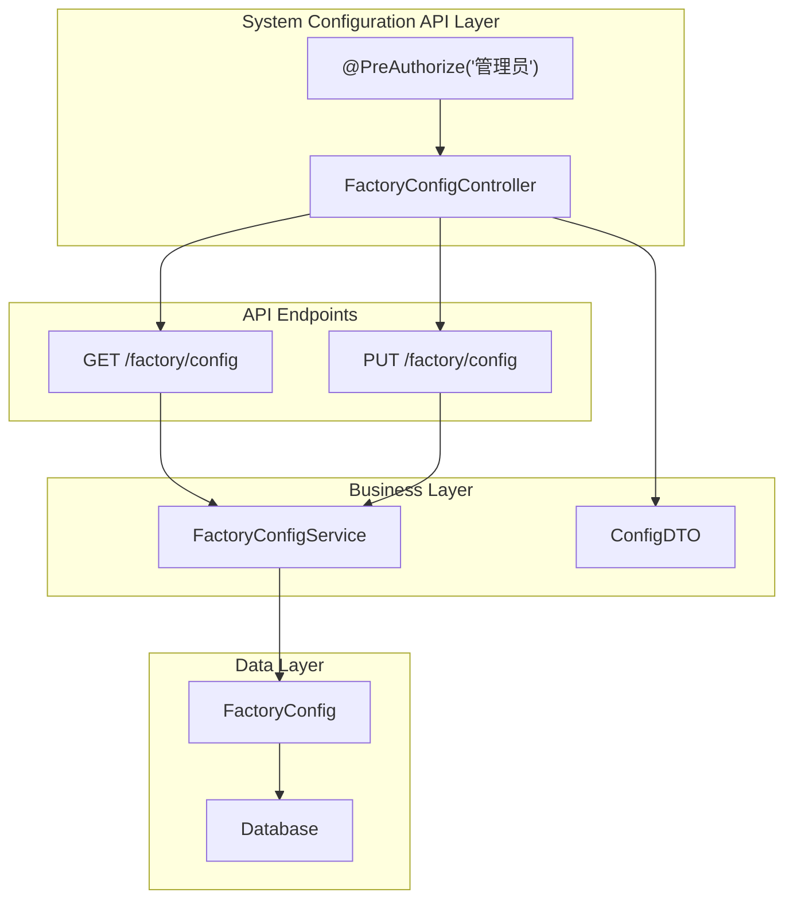
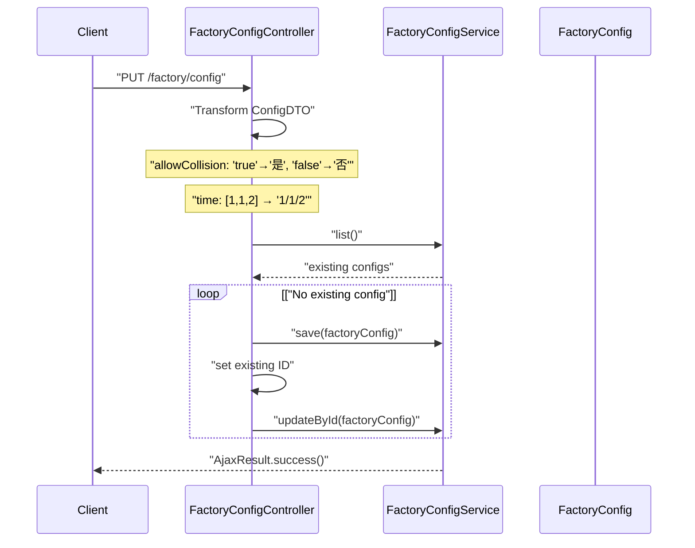
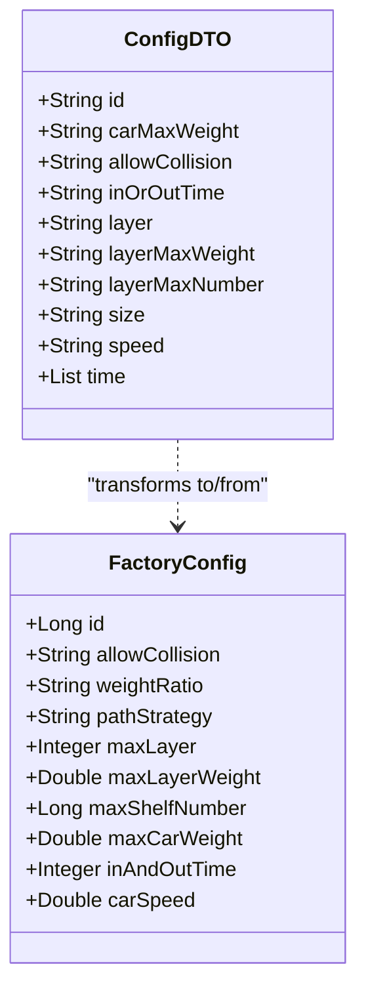

# System Configuration APIs

> **Relevant source files**
> * [src/main/java/com/xhz/yuncang/controller/FactoryConfigController.java](https://github.com/yanzhe-Xiao/yuncang/blob/a4a28616/src/main/java/com/xhz/yuncang/controller/FactoryConfigController.java)

## Purpose and Scope

This document covers the REST API endpoints for system administration and factory configuration in the yuncang warehouse management system. These APIs allow administrators to configure operational parameters such as AGV settings, warehouse layout constraints, and automation behavior.

For information about user management and access control, see [User Management](/yanzhe-Xiao/yuncang/6.2-user-management). For general factory configuration concepts, see [Factory Configuration](/yanzhe-Xiao/yuncang/6.1-factory-configuration).

## API Overview

The system configuration APIs provide centralized management of factory-wide operational parameters through REST endpoints. All configuration APIs require administrative privileges and operate on a singleton configuration model.



**Sources:** [src/main/java/com/xhz/yuncang/controller/FactoryConfigController.java L16-L88](https://github.com/yanzhe-Xiao/yuncang/blob/a4a28616/src/main/java/com/xhz/yuncang/controller/FactoryConfigController.java#L16-L88)

## Configuration Update API

### PUT /factory/config

Updates the factory configuration settings. The system maintains a singleton configuration record that is either created or updated based on existing data.

#### Request Format

| Parameter | Type | Description | Default |
| --- | --- | --- | --- |
| `allowCollision` | String | AGV collision permission ("true"/"false") | "false" |
| `carMaxWeight` | String | Maximum AGV carrying weight (kg) | "1000.0" |
| `time` | List | Weight ratio timing parameters | [1,1,2] |
| `size` | String | Path planning strategy | "balanced" |
| `layer` | String | Maximum warehouse layers | "10" |
| `layerMaxWeight` | String | Maximum weight per layer (kg) | "3000.0" |
| `layerMaxNumber` | String | Maximum shelf number per layer | "540" |
| `inOrOutTime` | String | Inbound/outbound operation time | "2" |
| `speed` | String | AGV movement speed | "1.0" |

#### Processing Logic

The endpoint performs several data transformations:



**Sources:** [src/main/java/com/xhz/yuncang/controller/FactoryConfigController.java L23-L58](https://github.com/yanzhe-Xiao/yuncang/blob/a4a28616/src/main/java/com/xhz/yuncang/controller/FactoryConfigController.java#L23-L58)

## Configuration Retrieval API

### GET /factory/config

Retrieves the current factory configuration settings, transforming internal data format to client-friendly format.

#### Response Format

Returns a `ConfigDTO` object with the following structure:

| Field | Type | Description |
| --- | --- | --- |
| `id` | String | Configuration record ID |
| `carMaxWeight` | String | Maximum AGV weight capacity |
| `allowCollision` | String | Collision permission flag |
| `inOrOutTime` | String | Operation timing parameter |
| `layer` | String | Maximum warehouse layers |
| `layerMaxWeight` | String | Layer weight limit |
| `layerMaxNumber` | String | Maximum shelves per layer |
| `size` | String | Path planning strategy |
| `speed` | String | AGV movement speed |
| `time` | List | Parsed weight ratio parameters |

#### Data Transformation

The API performs reverse transformations from internal storage format:

* `allowCollision`: "是" → "true", "否" → "false"
* `weightRatio`: "1/1/2" → [1, 1, 2] list
* Numeric values converted to string format

**Sources:** [src/main/java/com/xhz/yuncang/controller/FactoryConfigController.java L61-L87](https://github.com/yanzhe-Xiao/yuncang/blob/a4a28616/src/main/java/com/xhz/yuncang/controller/FactoryConfigController.java#L61-L87)

## Configuration Parameters

### AGV Configuration

| Parameter | Internal Field | Purpose |
| --- | --- | --- |
| Car Max Weight | `maxCarWeight` | Defines maximum payload capacity for AGVs |
| Car Speed | `carSpeed` | Sets standard AGV movement velocity |
| Allow Collision | `allowCollision` | Controls AGV collision avoidance behavior |

### Warehouse Layout

| Parameter | Internal Field | Purpose |
| --- | --- | --- |
| Max Layer | `maxLayer` | Vertical warehouse capacity constraint |
| Layer Max Weight | `maxLayerWeight` | Weight limit per warehouse level |
| Max Shelf Number | `maxShelfNumber` | Storage unit capacity per layer |

### Operational Timing

| Parameter | Internal Field | Purpose |
| --- | --- | --- |
| Weight Ratio | `weightRatio` | Time allocation for different operations |
| In/Out Time | `inAndOutTime` | Standard duration for warehouse operations |
| Path Strategy | `pathStrategy` | Algorithm selection for AGV routing |

**Sources:** [src/main/java/com/xhz/yuncang/controller/FactoryConfigController.java L29-L44](https://github.com/yanzhe-Xiao/yuncang/blob/a4a28616/src/main/java/com/xhz/yuncang/controller/FactoryConfigController.java#L29-L44)

## Data Transfer Objects

### ConfigDTO Structure

The `ConfigDTO` class serves as the data transfer interface between the API layer and client applications, providing a simplified view of configuration parameters.



**Sources:** [src/main/java/com/xhz/yuncang/controller/FactoryConfigController.java L3](https://github.com/yanzhe-Xiao/yuncang/blob/a4a28616/src/main/java/com/xhz/yuncang/controller/FactoryConfigController.java#L3-L3)

 [src/main/java/com/xhz/yuncang/controller/FactoryConfigController.java L83-L85](https://github.com/yanzhe-Xiao/yuncang/blob/a4a28616/src/main/java/com/xhz/yuncang/controller/FactoryConfigController.java#L83-L85)

## Security and Access Control

All configuration endpoints require administrative privileges through Spring Security's method-level authorization:

```
@PreAuthorize("hasRole('管理员')")
```

This annotation ensures that only users with the "管理员" (Administrator) role can access configuration management functions. Unauthorized requests will receive a 403 Forbidden response.

The security model follows the principle of least privilege, restricting sensitive system configuration operations to administrative users only.

**Sources:** [src/main/java/com/xhz/yuncang/controller/FactoryConfigController.java L17](https://github.com/yanzhe-Xiao/yuncang/blob/a4a28616/src/main/java/com/xhz/yuncang/controller/FactoryConfigController.java#L17-L17)

## Error Handling

The APIs use the standard `AjaxResult` response wrapper for consistent error reporting and success indication across the system. All successful operations return `AjaxResult.success()` with optional data payload.

**Sources:** [src/main/java/com/xhz/yuncang/controller/FactoryConfigController.java L7](https://github.com/yanzhe-Xiao/yuncang/blob/a4a28616/src/main/java/com/xhz/yuncang/controller/FactoryConfigController.java#L7-L7)

 [src/main/java/com/xhz/yuncang/controller/FactoryConfigController.java L55](https://github.com/yanzhe-Xiao/yuncang/blob/a4a28616/src/main/java/com/xhz/yuncang/controller/FactoryConfigController.java#L55-L55)