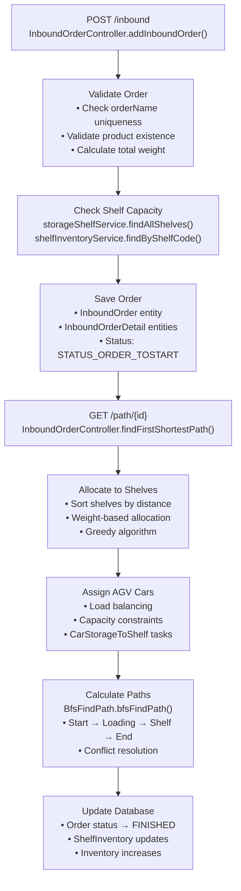
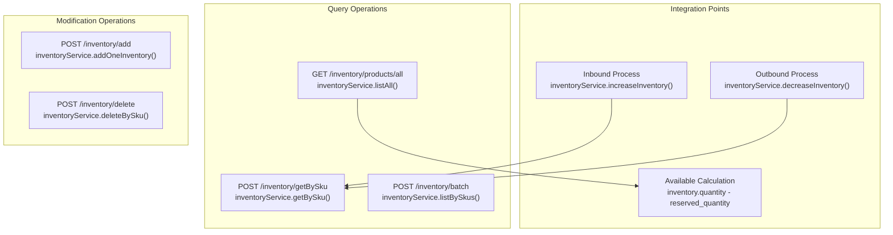
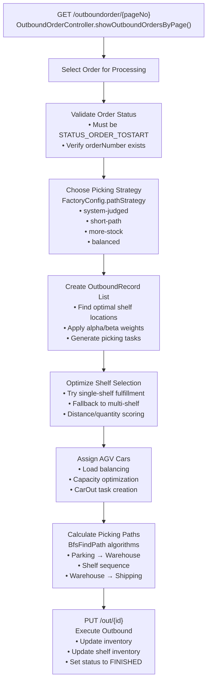
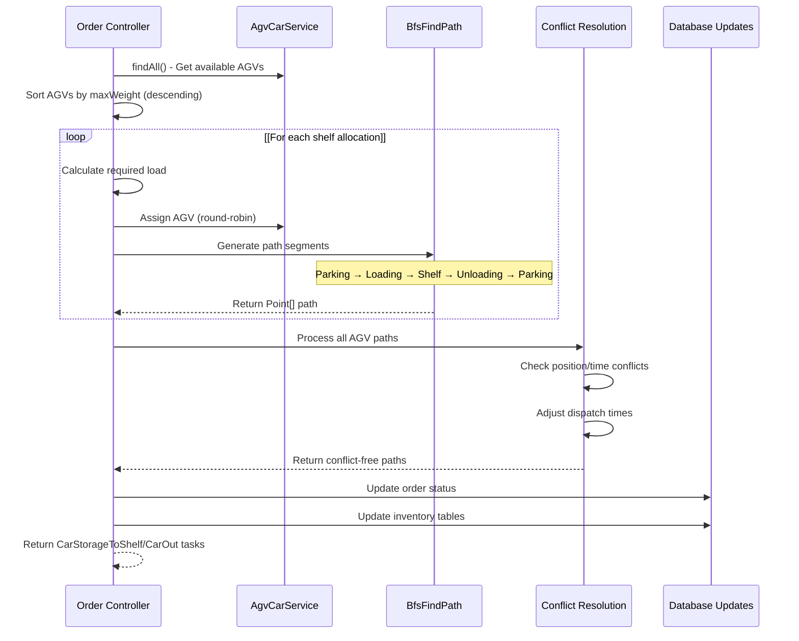
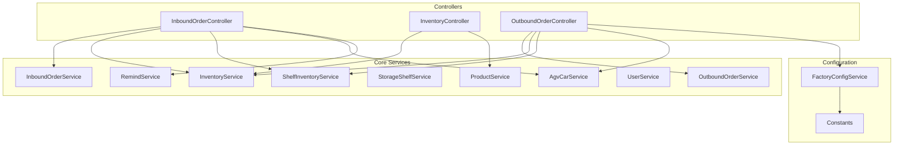

# Warehouse Operations

> **Relevant source files**
> * [src/main/java/com/xhz/yuncang/controller/InboundOrderController.java](https://github.com/yanzhe-Xiao/yuncang/blob/a4a28616/src/main/java/com/xhz/yuncang/controller/InboundOrderController.java)
> * [src/main/java/com/xhz/yuncang/controller/InventoryController.java](https://github.com/yanzhe-Xiao/yuncang/blob/a4a28616/src/main/java/com/xhz/yuncang/controller/InventoryController.java)
> * [src/main/java/com/xhz/yuncang/controller/OutboundOrderController.java](https://github.com/yanzhe-Xiao/yuncang/blob/a4a28616/src/main/java/com/xhz/yuncang/controller/OutboundOrderController.java)

This document covers the core warehouse operations functionality in the yuncang system, including inbound processing, inventory management, and outbound fulfillment. These operations are orchestrated through REST controllers that integrate with AGV automation systems for optimized warehouse workflows.

For information about the underlying database entities and relationships, see [Core Entities](/yanzhe-Xiao/yuncang/5.1-core-entities). For details about AGV path planning algorithms and automation workflows, see [AGV Automation](/yanzhe-Xiao/yuncang/4.3-agv-automation). For comprehensive API documentation of these operations, see [API Reference](/yanzhe-Xiao/yuncang/7-api-reference).

## Inbound Operations

Inbound operations handle the receipt of goods into the warehouse through the `InboundOrderController` class. The process involves order creation, shelf allocation based on capacity and distance optimization, AGV path planning, and inventory updates.

### Inbound Order Lifecycle

Sources: [src/main/java/com/xhz/yuncang/controller/InboundOrderController.java L160-L237](https://github.com/yanzhe-Xiao/yuncang/blob/a4a28616/src/main/java/com/xhz/yuncang/controller/InboundOrderController.java#L160-L237)

 [src/main/java/com/xhz/yuncang/controller/InboundOrderController.java L377-L907](https://github.com/yanzhe-Xiao/yuncang/blob/a4a28616/src/main/java/com/xhz/yuncang/controller/InboundOrderController.java#L377-L907)

### Shelf Allocation Algorithm

The inbound system uses a greedy allocation algorithm that prioritizes shelves based on distance from the inbound point and available capacity:

| Priority Factor | Weight | Formula |
| --- | --- | --- |
| X-axis distance | `Constants.MOVE_DIFFER_X` | `Math.abs(x - beginX) * MOVE_DIFFER_X` |
| Y-axis distance | `Constants.MOVE_DIFFER_Y` | `Math.abs(y - beginY) * MOVE_DIFFER_Y` |
| Z-axis distance | `Constants.MOVE_DIFFER_Z` | `Math.abs(z - beginZ + 1) * MOVE_DIFFER_Z` |

The algorithm iterates through `InboundOrderDetail` records and allocates quantities to the nearest available shelves while respecting `StorageShelf.maxWeight` constraints.

Sources: [src/main/java/com/xhz/yuncang/controller/InboundOrderController.java L409-L417](https://github.com/yanzhe-Xiao/yuncang/blob/a4a28616/src/main/java/com/xhz/yuncang/controller/InboundOrderController.java#L409-L417)

 [src/main/java/com/xhz/yuncang/controller/InboundOrderController.java L452-L491](https://github.com/yanzhe-Xiao/yuncang/blob/a4a28616/src/main/java/com/xhz/yuncang/controller/InboundOrderController.java#L452-L491)

## Inventory Management

The `InventoryController` provides centralized inventory tracking and management capabilities across the warehouse system. It maintains real-time inventory counts and integrates with both inbound and outbound operations.

### Inventory Operations Flow

Sources: [src/main/java/com/xhz/yuncang/controller/InventoryController.java L60-L69](https://github.com/yanzhe-Xiao/yuncang/blob/a4a28616/src/main/java/com/xhz/yuncang/controller/InventoryController.java#L60-L69)

 [src/main/java/com/xhz/yuncang/controller/InventoryController.java L86-L92](https://github.com/yanzhe-Xiao/yuncang/blob/a4a28616/src/main/java/com/xhz/yuncang/controller/InventoryController.java#L86-L92)

 [src/main/java/com/xhz/yuncang/controller/InventoryController.java L191-L207](https://github.com/yanzhe-Xiao/yuncang/blob/a4a28616/src/main/java/com/xhz/yuncang/controller/InventoryController.java#L191-L207)

### Available Inventory Calculation

The system calculates available inventory by considering pending outbound orders. The `getAllProducts()` method performs real-time availability calculation:

1. Retrieves base inventory quantities from `Inventory` entities
2. Calculates reserved quantities from `SalesOrderDetail` records with `STATUS_ORDER_TOSTART`
3. Returns `inventory.quantity - reserved_quantity` as available stock

Sources: [src/main/java/com/xhz/yuncang/controller/InventoryController.java L120-L135](https://github.com/yanzhe-Xiao/yuncang/blob/a4a28616/src/main/java/com/xhz/yuncang/controller/InventoryController.java#L120-L135)

## Outbound Operations

Outbound operations handle order fulfillment through the `OutboundOrderController`, which implements sophisticated picking strategies and AGV coordination for efficient order processing.

### Outbound Processing Architecture

Sources: [src/main/java/com/xhz/yuncang/controller/OutboundOrderController.java L102-L146](https://github.com/yanzhe-Xiao/yuncang/blob/a4a28616/src/main/java/com/xhz/yuncang/controller/OutboundOrderController.java#L102-L146)

 [src/main/java/com/xhz/yuncang/controller/OutboundOrderController.java L182-L795](https://github.com/yanzhe-Xiao/yuncang/blob/a4a28616/src/main/java/com/xhz/yuncang/controller/OutboundOrderController.java#L182-L795)

### Picking Strategy Configuration

The outbound system supports multiple picking strategies with configurable weights:

| Strategy | Alpha (Path Weight) | Beta (Quantity Weight) | Use Case |
| --- | --- | --- | --- |
| `system-judged` | 0.8/2.0 (adaptive) | 3000.0/500.0 (adaptive) | Automatically optimizes based on order characteristics |
| `short-path` | 2.0 | 500.0 | Minimize travel distance |
| `more-stock` | 0.5 | 3000.0 | Prefer shelves with higher quantities |
| `balanced` | 1.0 | 1000.0 | Balance between distance and quantity |

The scoring formula is: `distanceScore * alpha + (beta / quantity)`, where lower scores indicate better shelf selection.

Sources: [src/main/java/com/xhz/yuncang/controller/OutboundOrderController.java L222-L254](https://github.com/yanzhe-Xiao/yuncang/blob/a4a28616/src/main/java/com/xhz/yuncang/controller/OutboundOrderController.java#L222-L254)

 [src/main/java/com/xhz/yuncang/controller/OutboundOrderController.java L298-L312](https://github.com/yanzhe-Xiao/yuncang/blob/a4a28616/src/main/java/com/xhz/yuncang/controller/OutboundOrderController.java#L298-L312)

## AGV Integration Workflow

Both inbound and outbound operations integrate with AGV automation through standardized path planning and conflict resolution mechanisms.

### AGV Task Coordination

Sources: [src/main/java/com/xhz/yuncang/controller/InboundOrderController.java L527-L833](https://github.com/yanzhe-Xiao/yuncang/blob/a4a28616/src/main/java/com/xhz/yuncang/controller/InboundOrderController.java#L527-L833)

 [src/main/java/com/xhz/yuncang/controller/OutboundOrderController.java L401-L714](https://github.com/yanzhe-Xiao/yuncang/blob/a4a28616/src/main/java/com/xhz/yuncang/controller/OutboundOrderController.java#L401-L714)

### Path Planning Integration

The AGV path planning system uses several coordinated components:

* **BfsFindPath**: Breadth-first search algorithm for optimal pathfinding
* **Conflict Resolution**: Time-based coordination to prevent AGV collisions
* **Load Balancing**: Distributes tasks across available AGVs based on capacity
* **Multi-segment Paths**: Handles complex routing (parking → loading → multiple shelves → unloading → parking)

Each AGV task includes `dispatchTime` for coordination and `Point[]` arrays representing the complete movement sequence with time stamps.

Sources: [src/main/java/com/xhz/yuncang/controller/InboundOrderController.java L642-L729](https://github.com/yanzhe-Xiao/yuncang/blob/a4a28616/src/main/java/com/xhz/yuncang/controller/InboundOrderController.java#L642-L729)

 [src/main/java/com/xhz/yuncang/controller/OutboundOrderController.java L536-L617](https://github.com/yanzhe-Xiao/yuncang/blob/a4a28616/src/main/java/com/xhz/yuncang/controller/OutboundOrderController.java#L536-L617)

## Business Logic Integration

Warehouse operations integrate with several key business services to maintain data consistency and operational efficiency.

### Service Dependencies

Sources: [src/main/java/com/xhz/yuncang/controller/InboundOrderController.java L57-L103](https://github.com/yanzhe-Xiao/yuncang/blob/a4a28616/src/main/java/com/xhz/yuncang/controller/InboundOrderController.java#L57-L103)

 [src/main/java/com/xhz/yuncang/controller/InventoryController.java L52-L56](https://github.com/yanzhe-Xiao/yuncang/blob/a4a28616/src/main/java/com/xhz/yuncang/controller/InventoryController.java#L52-L56)

 [src/main/java/com/xhz/yuncang/controller/OutboundOrderController.java L51-L81](https://github.com/yanzhe-Xiao/yuncang/blob/a4a28616/src/main/java/com/xhz/yuncang/controller/OutboundOrderController.java#L51-L81)

The warehouse operations maintain transactional integrity through coordinated updates across multiple entities: `InboundOrder`, `OutboundOrder`, `Inventory`, `ShelfInventory`, and `AgvCar`. The system uses Spring's `@Transactional` annotations and includes comprehensive error handling with `RemindService` notifications for operational alerts.

Sources: [src/main/java/com/xhz/yuncang/controller/InboundOrderController.java L245](https://github.com/yanzhe-Xiao/yuncang/blob/a4a28616/src/main/java/com/xhz/yuncang/controller/InboundOrderController.java#L245-L245)

 [src/main/java/com/xhz/yuncang/controller/InboundOrderController.java L901-L904](https://github.com/yanzhe-Xiao/yuncang/blob/a4a28616/src/main/java/com/xhz/yuncang/controller/InboundOrderController.java#L901-L904)